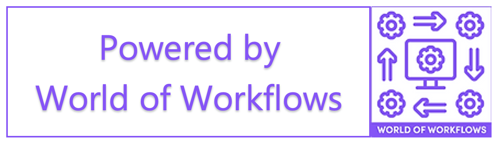

# Adding our 'Powered By' logo to your web pages

Our **Powered By** logo gives users confidence in the system you have written that it based on the award-winning World Of Workflows software.




We have designed this logo to appear to float over the background, and disappear if it gets in the way of the user experience, so you can be confident to deploy it anywhere.


You can add this javascript to the bottom of any HTML page, between the `</body>` and the `</html>` tags.

```html
</body>
<style>
.powered-by {
    position: fixed;
    display: block;
    border-width: medium;
    border-color: purple;
    bottom: 10px;
    left: 10px;
    width: 200px; /* Adjust width as needed */
    visibility: visible;
    pointer-events: auto;
    transition: visibility 0s, opacity 0.3s ease, box-shadow 0.3s ease; /* Smooth transition */
    box-shadow: 0 4px 15px rgba(0, 0, 0, 0.5); /* Initial shadow */
}

.powered-by:hover {
    box-shadow: 0 8px 25px rgba(0, 0, 0, 0.7); /* Shadow on hover for floating effect */
}

.powered-by.hidden {
    visibility: hidden; /* Hide the element */
    opacity: 0; /* Ensure it's invisible */
    pointer-events: none; /* Allow clicks to pass through */
}
</style>
    <div>
    <!-- PoweredBy Image -->
        
    </div>

    <script>
        document.addEventListener('DOMContentLoaded', function() {
            var poweredByImage = document.querySelector('.powered-by');

            poweredByImage.addEventListener('mouseover', function() {
                this.classList.add('hidden');

                // Remove the 'hidden' class after 3 seconds
                setTimeout(() => {
                    this.classList.remove('hidden');
                }, 3000); // 3000 milliseconds = 3 seconds
            });
        });
    </script>
</html>
```

## Using a Variable 

You can also set this entire text as the value of a variable, for example `PoweredBy` and use Liquid or Javascript to put this variable on the form.

### Set the variable
Use the `Set Variable` activity and give the variable `PoweredBy` the above text. 

### Use Liquid on your form
If you are using Liqiid to specify your form, use this example:
```html
</body>
{{Variables.PoweredBy | raw }}
</html>
```

### Use JavaScript on your form
If you are using JavaScript to specify your form, use this example:
```html
</body>
`+getVariable("PoweredBy")+`
</html>
```

## Using Settings to set your PoweredBy variable

If you plan to use the PoweredBy logo on many pages, it makes sense to take a moment to set up a Settings object to hold your PoweredBy Logo.

See [The Settings Table](../18_patterns_and_practices/SettingsType.html) for details.


