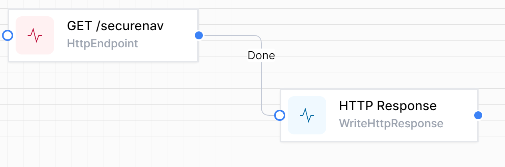

# Custom HTML and Forms

World of Workflows gives us, as you would have seen, a significant number of tools to view and edit data. However, we have found it very common that a custom user interface is required, whether this be a form for the public to complete, to custom and interactive interfaces, World of Workflows is capable of this too.

Using the HTTP activities, one can design interfaces to do whatever you want.

This chapter takes you through from creating initial navigation to more complex interfaces and interactions.

Examine the following workflow:

## Benefits of Using This Method to Create Custom UI

1. **Seamless Integration**: Using workflows to generate custom UI elements allows seamless integration with backend processes. The workflows can handle business logic and data processing while dynamically generating the necessary UI.

2. **Flexibility and Adaptability**: By defining UI components within workflows, you can easily modify and adapt the UI based on changing requirements. This is particularly useful in environments where UI needs to be frequently updated or customised based on user roles or other dynamic factors.

3. **Consistency**: Workflows ensure that the UI generation process is consistent and standardised. This helps maintain a uniform look and feel across different parts of the application, enhancing the user experience.

4. **Simplified Development**: Using a workflow designer like World of Workflows simplifies the development process. Non-developers or those with limited coding skills can create and modify workflows, enabling faster iteration and deployment.

5. **Centralised Management**: Workflows centralise the management of UI logic and content. Changes can be made in one place and propagated throughout the application, reducing the risk of errors and inconsistencies.

6. **Security**: Workflows can incorporate authentication and authorisation mechanisms to ensure that only authorised users can access certain UI components. This adds an additional layer of security to your application.

In the following sections, we'll discuss the various types of User interface you can create, how to create it and how it works.