# Using AI as a Workflow Developer

Whilst World of Workflows is a low code/no code solution, there are many occasions where some JavaScript or Liquid code will improve the functionality.  But what if you are not a strong JavaScript developer?  Never fear: AI is here to help you.

This chapter will take you through some common scenarios, and show you how large language models such as ChatGPT can make you significantly more productive.  The examples here use ChatGPT.  You may be familiar with another LLM: use that instead.

Your fist step is to think of your problem as small, defined steps.  
ChatGPT prompts can include requests to build a web page, or how to fix a single line of JavaScript code, or even how to think about solving your problem.

## Website examples

When you want to build a website, we have used the ChatGPT Grimoire GPT with great success.  Open ChatPGT, select Explore GPTs and find **Grimoire**.

Here is a prompt we used recently

``` sh
I want another page on my site.  

I want to
1.  allow user to download a csv template file 
2.  allow user to upload file based on the template
3.  user will specify the PropertyType when uploading file as a dropdown with choices of 'Strata' or 'Commercial'

use Tailwind CSS for formatting.
```

**Grimoire** will produce all of the elements for your web page.  Now you just need to copy and paste them into the appropriate activitities in your workflow.  

### HTML structure

The first part produced by Grimoire is the HTML.  Here is an example output:

```js
<!DOCTYPE html>
<html lang="en">
<head>
    <meta charset="UTF-8">
    <meta name="viewport" content="width=device-width, initial-scale=1.0">
    <title>Upload Page</title>
    <link href="https://cdn.jsdelivr.net/npm/tailwindcss@2.2.19/dist/tailwind.min.css" rel="stylesheet">
</head>
<body class="bg-gray-100 p-10">

    <div class="max-w-md mx-auto bg-white p-6 rounded-lg shadow-lg">
        <h2 class="text-2xl font-bold mb-4">Upload CSV File</h2>
        
        <button id="download-template" class="bg-blue-500 text-white px-4 py-2 rounded mb-4">Download CSV Template</button>
        
        <div class="mb-4">
            <label for="property-type" class="block text-gray-700">Property Type</label>
            <select id="property-type" class="mt-1 block w-full bg-gray-100 border border-gray-300 rounded-md shadow-sm">
                <option value="Strata">Strata</option>
                <option value="Commercial">Commercial</option>
            </select>
        </div>
        
        <div class="mb-4">
            <label for="file-upload" class="block text-gray-700">Upload CSV File</label>
            <input id="file-upload" type="file" accept=".csv" class="mt-1 block w-full bg-gray-100 border border-gray-300 rounded-md shadow-sm">
        </div>
        
        <button id="submit-button" class="bg-green-500 text-white px-4 py-2 rounded">Upload</button>
        
        <div id="result" class="mt-4 text-red-500"></div>
    </div>

    <script>
        document.getElementById('download-template').addEventListener('click', function () {
            const csvContent = "data:text/csv;charset=utf-8,Column1,Column2,Column3\n";
            const encodedUri = encodeURI(csvContent);
            const link = document.createElement('a');
            link.setAttribute('href', encodedUri);
            link.setAttribute('download', 'template.csv');
            document.body.appendChild(link);
            link.click();
            document.body.removeChild(link);
        });

        document.getElementById('submit-button').addEventListener('click', function () {
            const propertyType = document.getElementById('property-type').value;
            const fileUpload = document.getElementById('file-upload').files[0];
            const resultDiv = document.getElementById('result');

            if (!fileUpload) {
                resultDiv.textContent = "Please upload a file.";
                return;
            }

            const reader = new FileReader();
            reader.onload = function (event) {
                const csvContent = event.target.result;
                console.log('Property Type:', propertyType);
                console.log('CSV Content:', csvContent);
                resultDiv.textContent = "File uploaded successfully!";
            };
            reader.onerror = function () {
                resultDiv.textContent = "Error reading file.";
            };
            reader.readAsText(fileUpload);
        });
    </script>

</body>
</html>
```

You will put this code directly into your **HTTP Response** activity:

Edit the activity, set the Content to **Liquid**, and paste the HTML:

Select the Content Type as HTML, and set the activity name as usual under the Common tab.

Create another activity, HTTP Endpoint, like this:

and use an appropriate path.  In this case we use /uploadTest.  It can be anything logical, just make it unique.
Join the two activities, like this:

Now you can run the workflow and see your web page, as built by **Grimoire**
Go to another browswer window, and go to http://localhost:7063/uploadTest or whatever endpoint name you used.


### Changing the template file

The Grimoire gave you a very simple example template.  Here is the line of code provided for you:

``` js
const csvContent = "data:text/csv;charset=utf-8,Column1,Column2,Column3\n";
```

You will doubtless have a template with your own fields, and a row of example data.  Instead of doing the work to alter code yourself (and perhaps making a typo along the way), let's use ChatGPT:

Upload your template direct to ChatGPT Grimoire, with a prompt like this:

The **Grimoire** responds like this:


### Receiving the file into your Workflow

So now you have a way of collecting data and sending it to your World of Workflows enbironment.  Let's ask ChatGPT what to do next:

## Creating a dropdown HTML field 
This example shows how to ask ChatGPT for some Liquid code to use within a Liquid HTML page.
As you know from the Liquid reference, you can access a Variable from your workflow using ```{{Variables.<VariableName>}}```

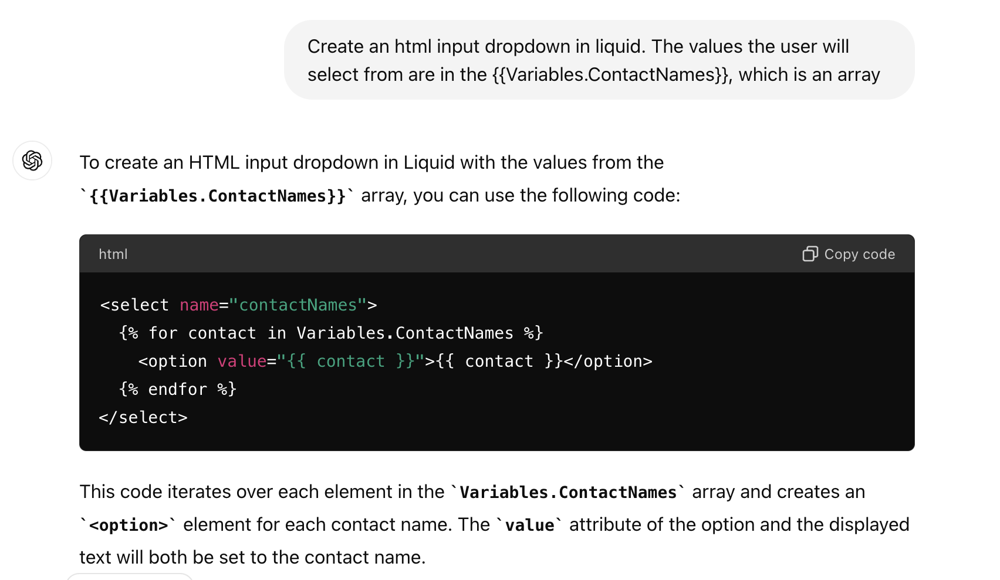

Perhaps you want to know how to make a value pre-selected:


When the user selects a name, you want it to do something:
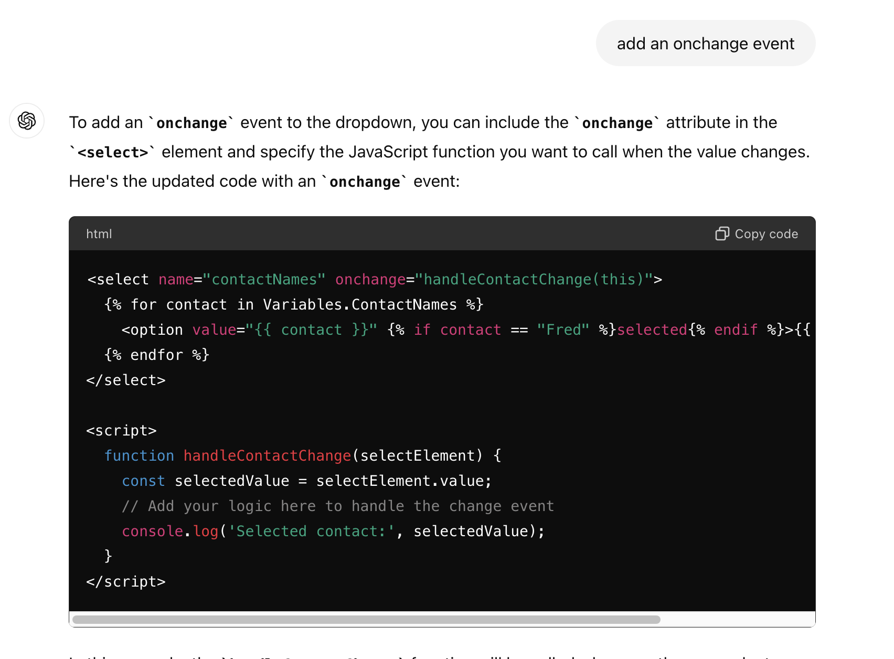

If you want a tooltip to display, but don't know how to do it, just ask:
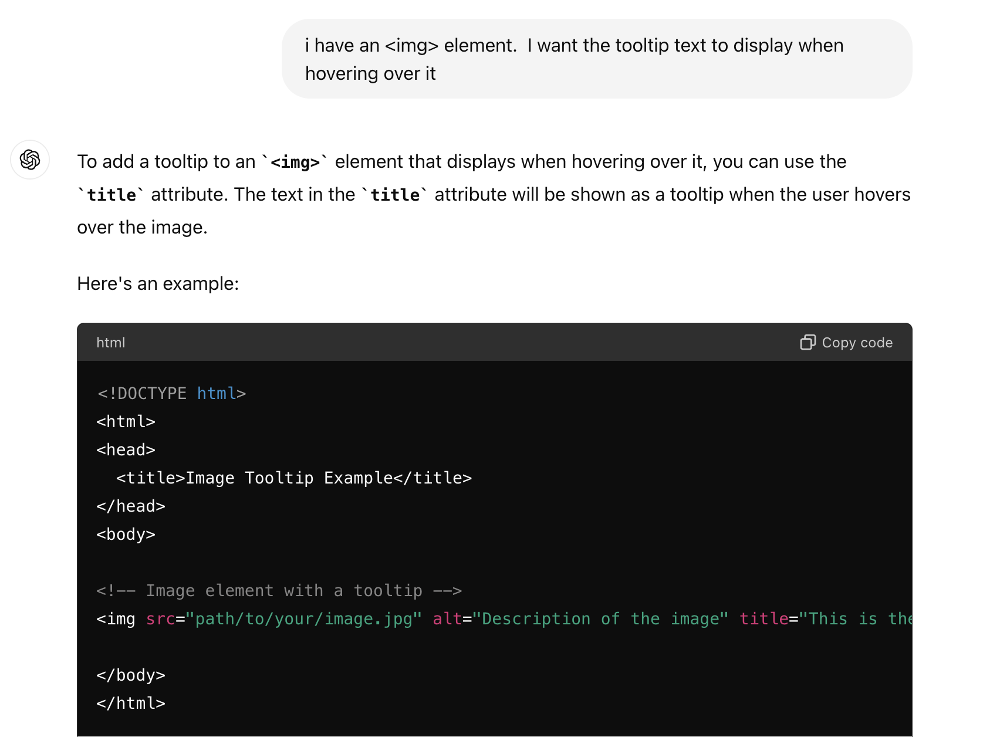

Or enabling and disabling a control:
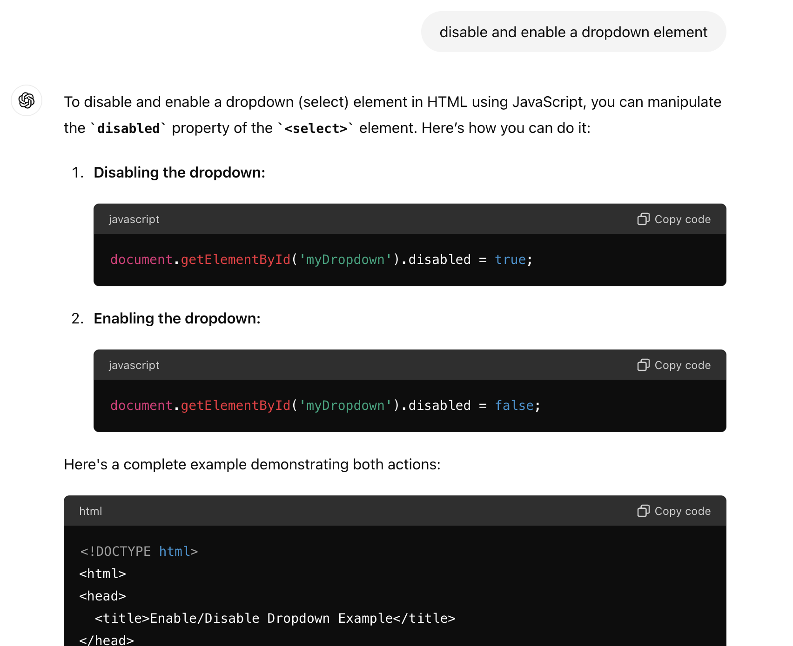

## Resolving logic and syntax problems

This example shows how to ask a question related to a specific line of code to see if in fact does what you think it should do.  


You can paste a line of code into ChatGPT to find out what it does.  If there is a logic error in the code, ChatGPT will correct it for you:
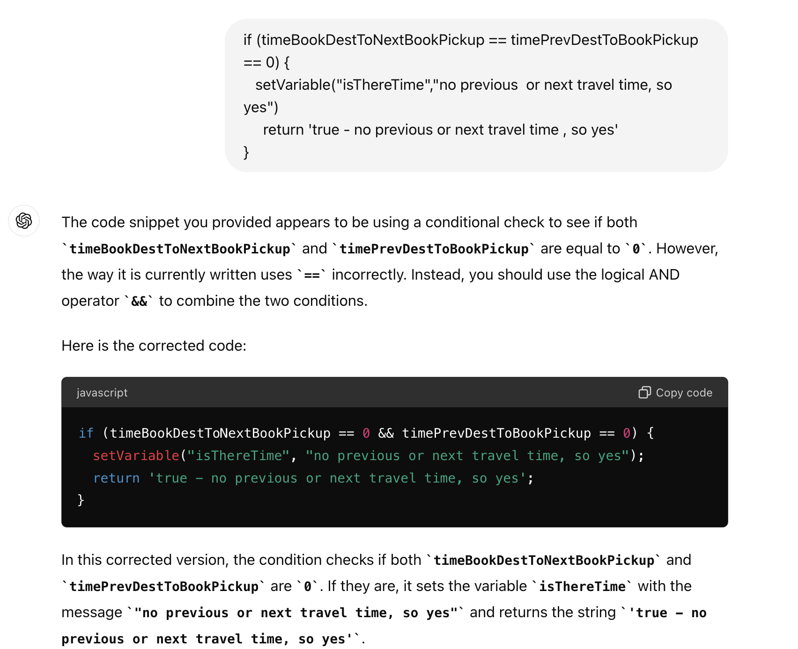

(By the way, this example also shows the use of ```setVariable()``` as a debugging tool in World of Workflows JavaScript.  The variable will be displayed in the Instance Log on the Variables page.)

## Write code to work with your data

You can very easily create a routine to use your World of Workflows data.
In this example, we wanted to use 2 fields on a form to determine the value of a third field.  Here is the form we wanted to change:
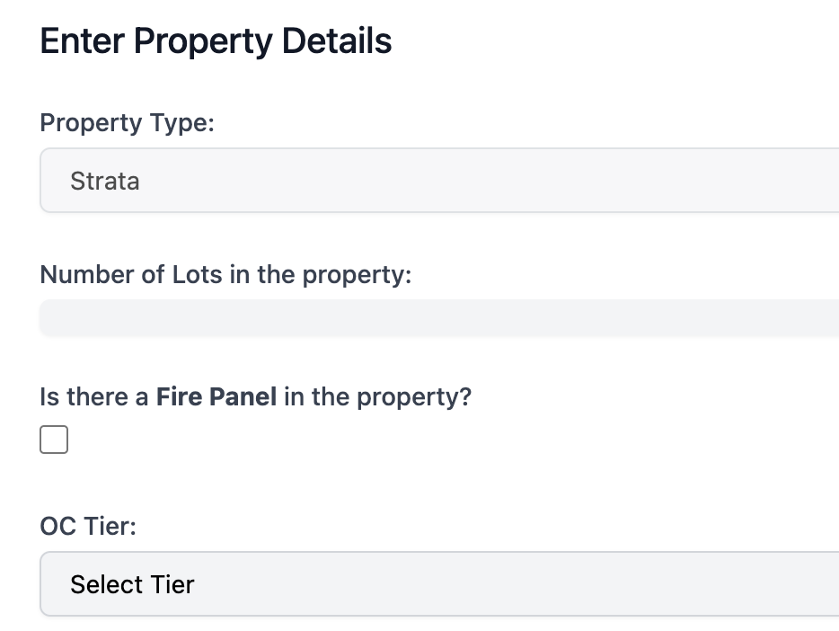
We want the *OC Tier* field to be set based on the value of the *Lots* field and the *FirePanel* field.  
Here is the data in the World of Workflows Type:


Export the data from World of Workflows so we can upload it to ChatGPT.
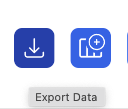
Upload this to ChatGPT and tell it what you want done:
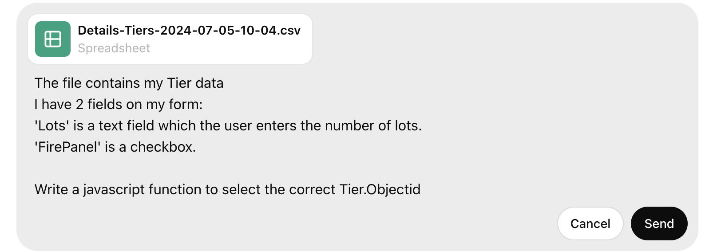
Here is the function that ChapGPT produced:
```html
<!DOCTYPE html>
<html>
<head>
  <title>Select Tier Objectid</title>
</head>
<body>

<form id="tierForm">
  <label for="lots">Lots:</label>
  <input type="text" id="lots" name="lots"><br><br>

  <label for="firePanel">Fire Panel:</label>
  <input type="checkbox" id="firePanel" name="firePanel"><br><br>

  <button type="button" onclick="selectTierObjectid()">Submit</button>
</form>

<script>
  const tiersData = [
    { "ObjectId": 38, "LotsMin": 101, "LotsMax": 9999, "FirePanel": true },
    { "ObjectId": 124, "LotsMin": 2, "LotsMax": 2, "FirePanel": false },
    { "ObjectId": 125, "LotsMin": 3, "LotsMax": 9, "FirePanel": false },
    { "ObjectId": 126, "LotsMin": 10, "LotsMax": 50, "FirePanel": false },
    { "ObjectId": 127, "LotsMin": 51, "LotsMax": 100, "FirePanel": true }
    // Add more entries from your data as needed
  ];

  function selectTierObjectid() {
    const lots = parseInt(document.getElementById('lots').value);
    const firePanel = document.getElementById('firePanel').checked;
    
    if (isNaN(lots)) {
      alert('Please enter a valid number of lots.');
      return;
    }

    const selectedTier = tiersData.find(tier => 
      lots >= tier.LotsMin && lots <= tier.LotsMax && tier.FirePanel === firePanel
    );

    if (selectedTier) {
      alert('Selected Tier Objectid: ' + selectedTier.ObjectId);
    } else {
      alert('No matching tier found.');
    }
  }
</script>

</body>
</html>

```

We can paste this function ```selectTierObjectId``` into the HTTP Response activity in our workflow.  Note how the function uses the tiersData variable.  We can use this as-is, but it would be better to have the data dynamically retrieved from the World of Workflows database.  So we will create 2 activities to achieve this: ListObjectInstances and Set Variable.

First, create the ListObjectInstances activity, and set the Object Type to Tier, sorting it too:

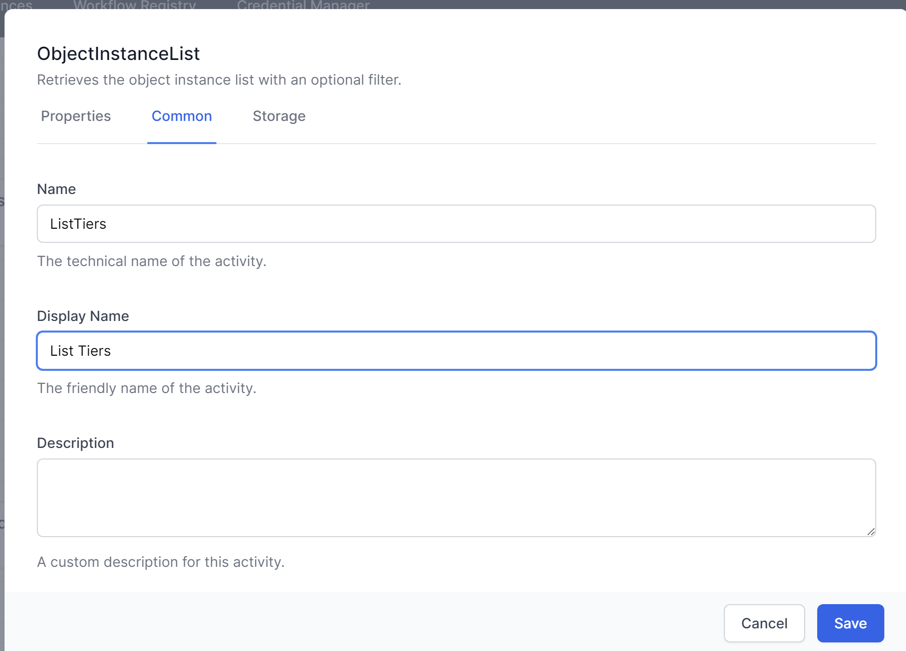

Then set a variable called Tiers to collect the data so we can use it ion the HTTP Response.  Set the Value to JavaScript and use the inteliscript to fill in the value.  Because we want to use the data as a Liquid string,, not a Javascript Object, we will use a built-in function to turn it into a string. Both `JSON.stringify()` and `jsonEncode()` will do the trick.  The full formula will be 
```js
// JSON.stringify(activities.ListTiers.Output())
// or
jsonEncode(activities.ListTiers.Output())
```

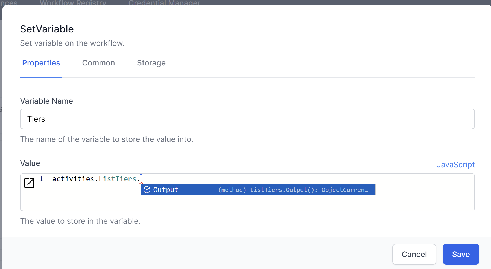

` Pro tip: use this formula to get the first entry in the list.  Very helpful if your filter is deisagned to produce just 1 entry
`

```js
activities.ListTiers.Output()[0]
```

` Pro tip: use this formula to get the ObjectId of in the list.  Use this in the instanceId of the GetObject activity if your filter is deisagned to produce just 1 entry
`

```js
activities.ListTiers.Output()[0].ObjectId
```


Here is the updated workflow:


Now change the ```selectTierObjectId``` in the HTTP Response to use this Tiers variable.
Replace this:
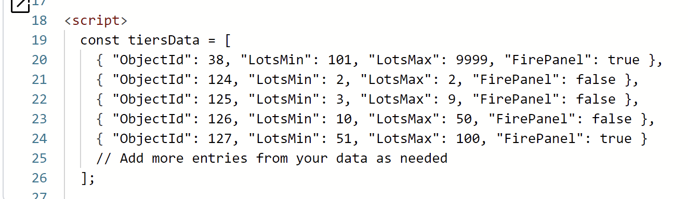
with this Liquid. The `| raw` filter removes the html formattting.
.png)

Now test it using 
https://localhost:7063/ThreeFieldsTest

Let's now have the Tier field displayed, instead of the alert.

Back to ChatGPT. Remember we changed the const Tiers data for our variable, so tell ChatGPT:
```sh
now set a dropdown field for Tier.  use this code to get the tiersData:

  const tiersData = {{Variables.Tiers | raw}}

The value will be the ObjectId.  The text displayed will be the tier description.  Use Tailwinds CSS and instead of a submit button, set the Tier when either field is changed
```
Here is the HTML, to replace the whole HTTP Response:   

```html
<!DOCTYPE html>
<html lang="en">
<head>
  <meta charset="UTF-8">
  <meta name="viewport" content="width=device-width, initial-scale=1.0">
  <title>Select Tier Objectid</title>
  <link href="https://cdn.jsdelivr.net/npm/tailwindcss@2.2.19/dist/tailwind.min.css" rel="stylesheet">
</head>
<body class="bg-gray-100 p-6">

  <form id="tierForm" class="bg-white p-6 rounded shadow-md">
    <div class="mb-4">
      <label for="lots" class="block text-gray-700 font-bold mb-2">Lots:</label>
      <input type="text" id="lots" name="lots" class="shadow appearance-none border rounded w-full py-2 px-3 text-gray-700 leading-tight focus:outline-none focus:shadow-outline">
    </div>

    <div class="mb-4">
      <label for="firePanel" class="block text-gray-700 font-bold mb-2">Fire Panel:</label>
      <input type="checkbox" id="firePanel" name="firePanel" class="mr-2 leading-tight">
      <span class="text-sm">Check if Fire Panel is present</span>
    </div>

    <div class="mb-4">
      <label for="tier" class="block text-gray-700 font-bold mb-2">Tier:</label>
      <select id="tier" name="tier" class="block appearance-none w-full bg-white border border-gray-400 hover:border-gray-500 px-4 py-2 pr-8 rounded shadow leading-tight focus:outline-none focus:shadow-outline">
        <option value="" selected disabled>Select a Tier</option>
      </select>
    </div>
  </form>

  <script>
    const tiersData = {{ Variables.Tiers | raw }};

    const lotsInput = document.getElementById('lots');
    const firePanelCheckbox = document.getElementById('firePanel');
    const tierSelect = document.getElementById('tier');

    function populateTiers() {
      tierSelect.innerHTML = '<option value="" selected disabled>Select a Tier</option>';
      tiersData.forEach(tier => {
        const option = document.createElement('option');
        option.value = tier.ObjectId;
        option.textContent = tier.TierDescription;
        tierSelect.appendChild(option);
      });
    }

    function updateTier() {
      const lots = parseInt(lotsInput.value);
      const firePanel = firePanelCheckbox.checked;

      if (isNaN(lots)) {
        alert('Please enter a valid number of lots.');
        return;
      }

      const selectedTier = tiersData.find(tier => 
        lots >= tier.LotsMin && lots <= tier.LotsMax && tier.FirePanel === firePanel
      );

      if (selectedTier) {
        tierSelect.value = selectedTier.ObjectId;
      } else {
        tierSelect.value = "";
      }
    }

    // Populate the tier dropdown initially
    populateTiers();

    // Add event listeners to the input fields to update the tier
    lotsInput.addEventListener('input', updateTier);
    firePanelCheckbox.addEventListener('change', updateTier);
  </script>

</body>
</html>

Here is the working page:
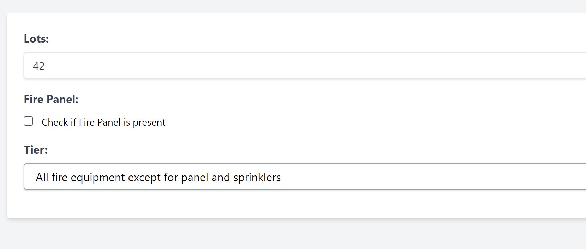
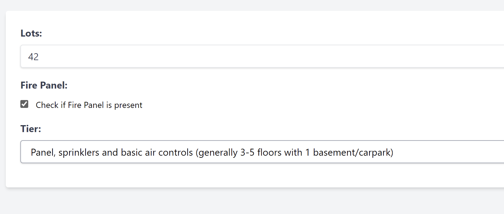

```
### ChatGPT 