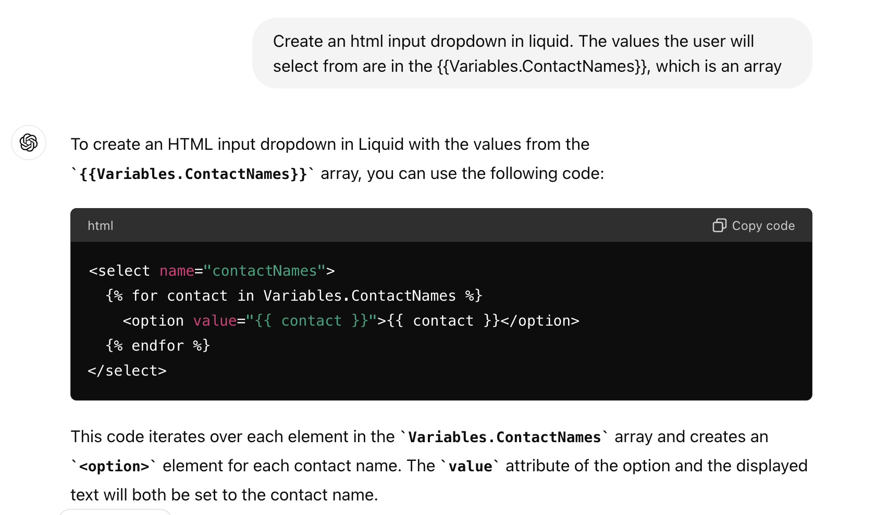
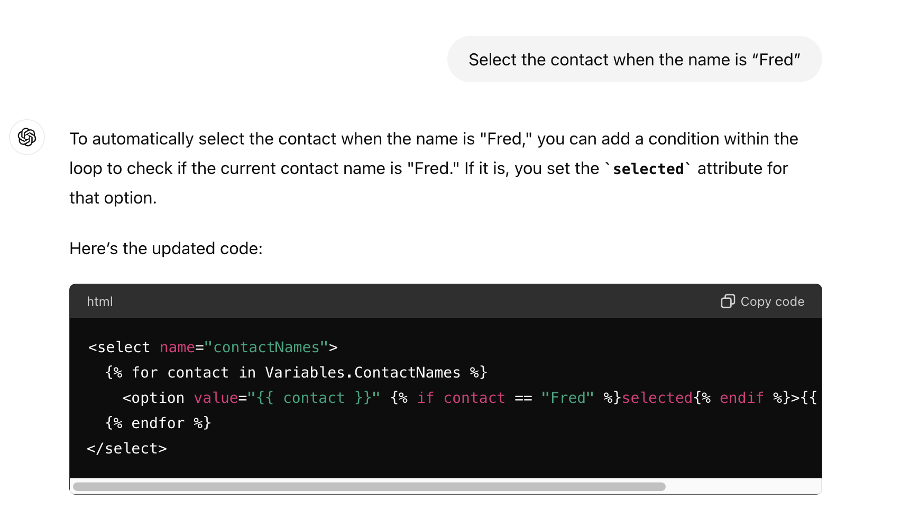
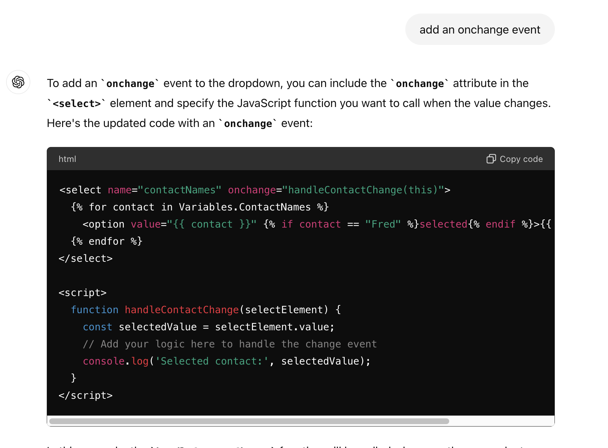
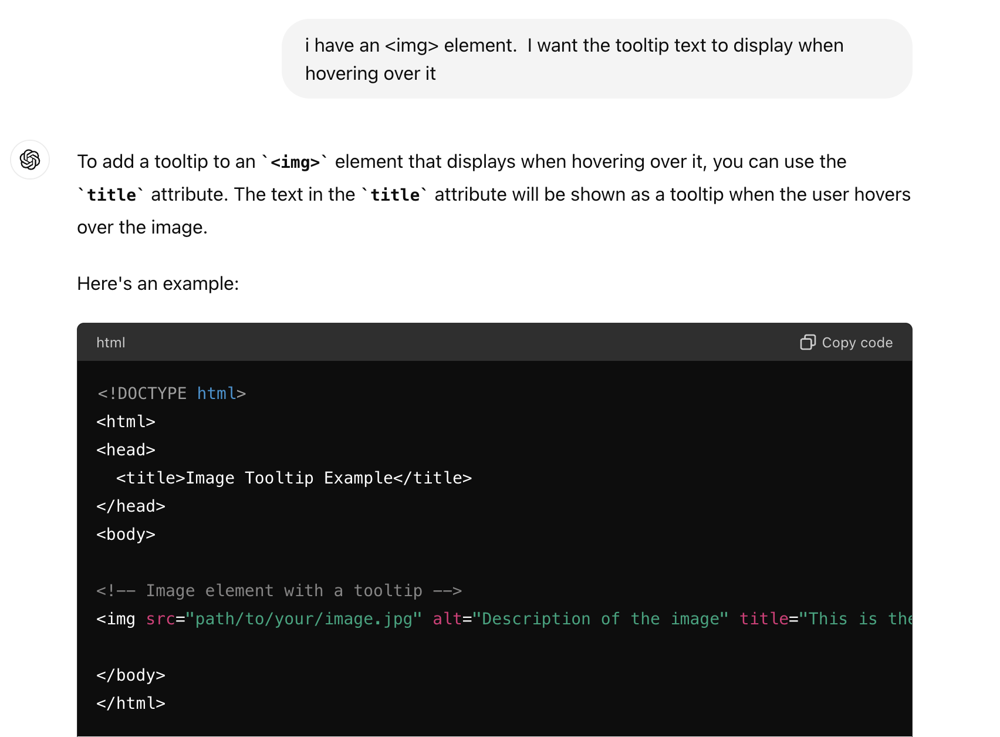
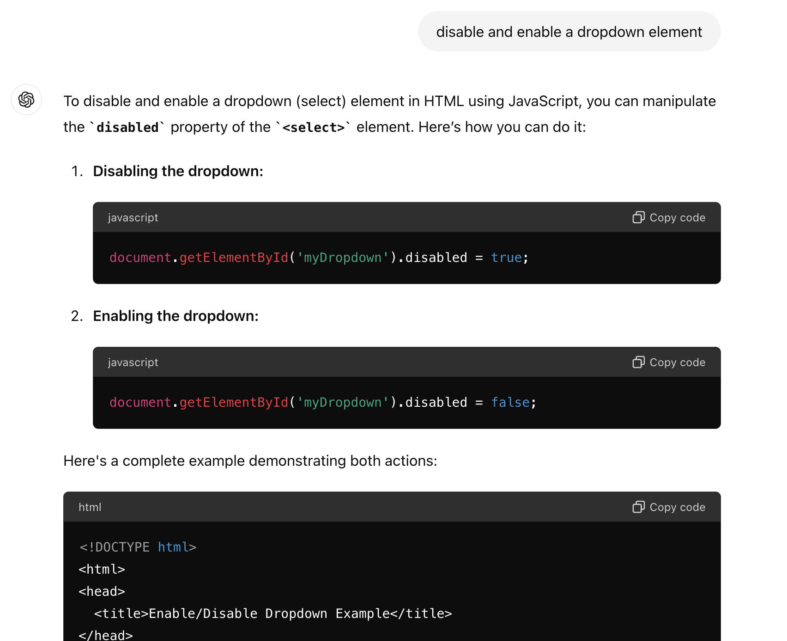

## Creating a dropdown HTML field 
This example shows how to ask ChatGPT for some Liquid code to use within a Liquid HTML page.
As you know from the Liquid reference, you can access a Variable from your workflow using 
```
{{Variables.<VariableName>}}
```

{: .key }
Ask ChatGPT to build you a dropdown element for your HTML form, telling it to use your variable as the data source:



Perhaps you want to know how to make a value pre-selected:


When the user selects a name, you want it to do something:


If you want a tooltip to display, but don't know how to do it, just ask:


Or enabling and disabling a control:

