### Extended example: use AI to write code to work with your data

You can very easily create a routine to use your World of Workflows data.
In this example, we wanted to use 2 fields on a form to determine the value of a third field.  Here is the form we wanted to change:
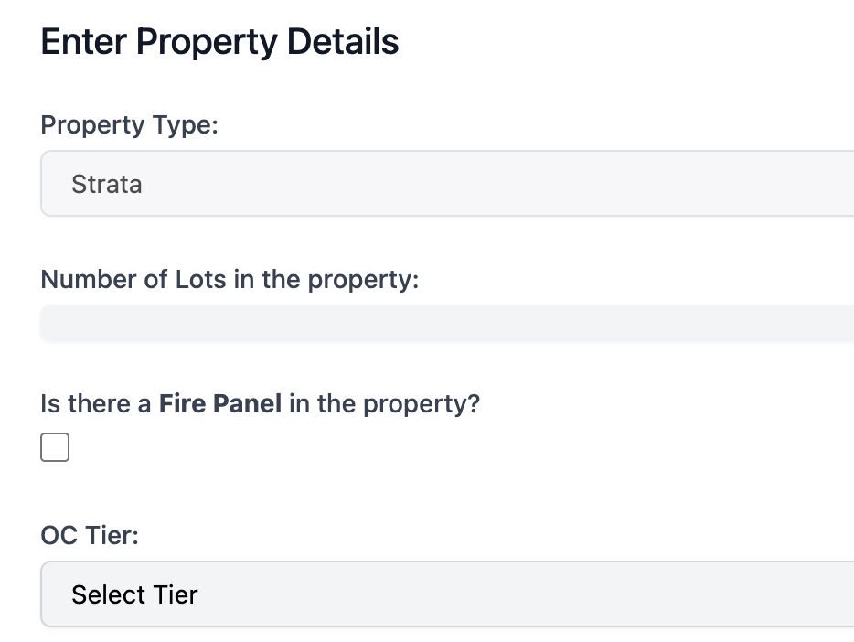
We want the *OC Tier* field to be set based on the value of the *Lots* field and the *FirePanel* field.  
Here is the data in the World of Workflows Type:
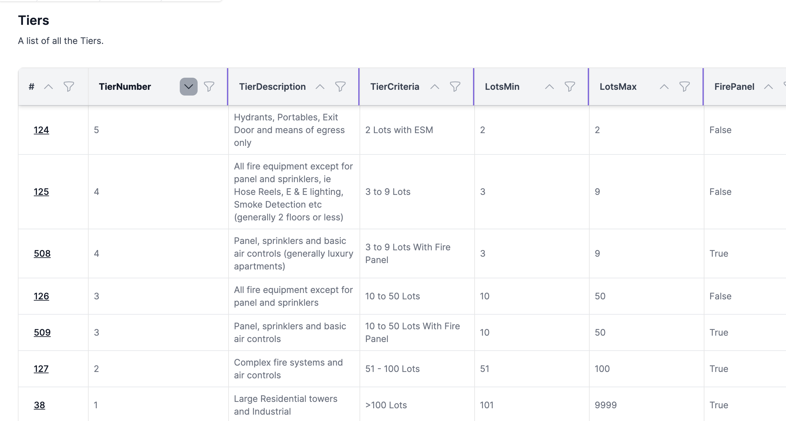

Export the data from World of Workflows so we can upload it to ChatGPT.
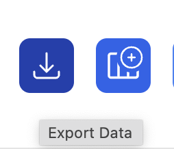

Upload this to ChatGPT and tell it what you want done:
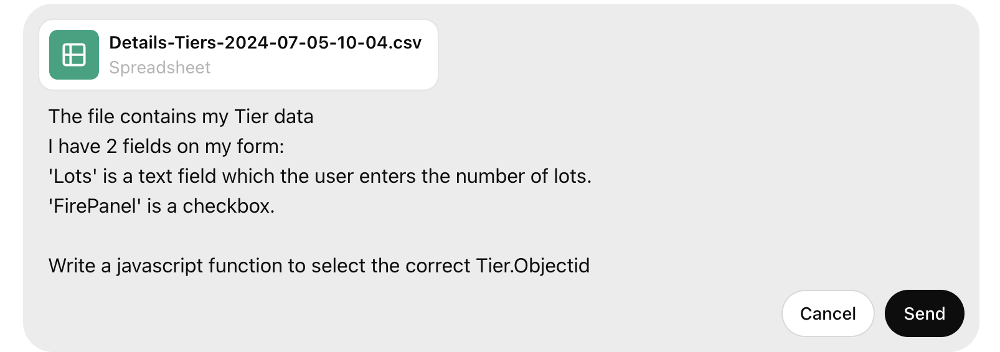
Here is the function that ChapGPT produced:
```html
<!DOCTYPE html>
<html>
<head>
  <title>Select Tier Objectid</title>
</head>
<body>

<form id="tierForm">
  <label for="lots">Lots:</label>
  <input type="text" id="lots" name="lots"><br><br>

  <label for="firePanel">Fire Panel:</label>
  <input type="checkbox" id="firePanel" name="firePanel"><br><br>

  <button type="button" onclick="selectTierObjectid()">Submit</button>
</form>

<script>
  const tiersData = [
    { "ObjectId": 38, "LotsMin": 101, "LotsMax": 9999, "FirePanel": true },
    { "ObjectId": 124, "LotsMin": 2, "LotsMax": 2, "FirePanel": false },
    { "ObjectId": 125, "LotsMin": 3, "LotsMax": 9, "FirePanel": false },
    { "ObjectId": 126, "LotsMin": 10, "LotsMax": 50, "FirePanel": false },
    { "ObjectId": 127, "LotsMin": 51, "LotsMax": 100, "FirePanel": true }
    // Add more entries from your data as needed
  ];

  function selectTierObjectid() {
    const lots = parseInt(document.getElementById('lots').value);
    const firePanel = document.getElementById('firePanel').checked;
    
    if (isNaN(lots)) {
      alert('Please enter a valid number of lots.');
      return;
    }

    const selectedTier = tiersData.find(tier => 
      lots >= tier.LotsMin && lots <= tier.LotsMax && tier.FirePanel === firePanel
    );

    if (selectedTier) {
      alert('Selected Tier Objectid: ' + selectedTier.ObjectId);
    } else {
      alert('No matching tier found.');
    }
  }
</script>

</body>
</html>

```

We can paste this function ```selectTierObjectId``` into the HTTP Response activity in our workflow.  Note how the function uses the `tiersData` variable.  We can use this as-is, but it would be better to have the data dynamically retrieved from the World of Workflows database.  So we will create 2 activities to achieve this: ListObjectInstances and Set Variable.

First, create the ListObjectInstances activity, and set the Object Type to Tier, sorting it too:
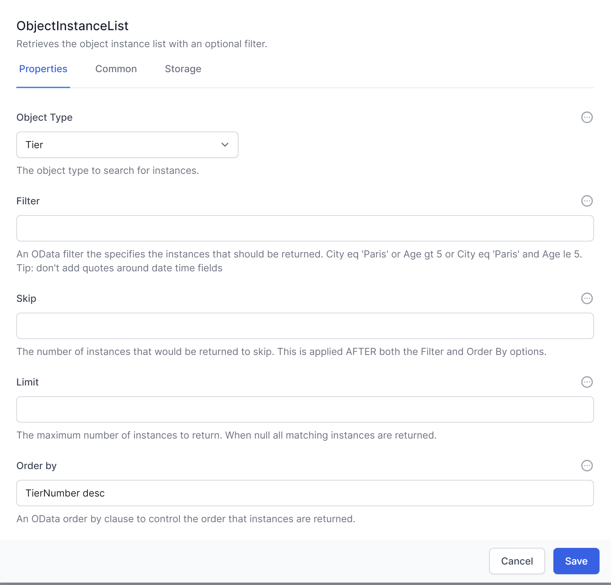


We set a variable called `Tiers` to collect the data so we can use it ion the HTTP Response.  Set the Value to JavaScript and use the inteliscript to fill in the value.  

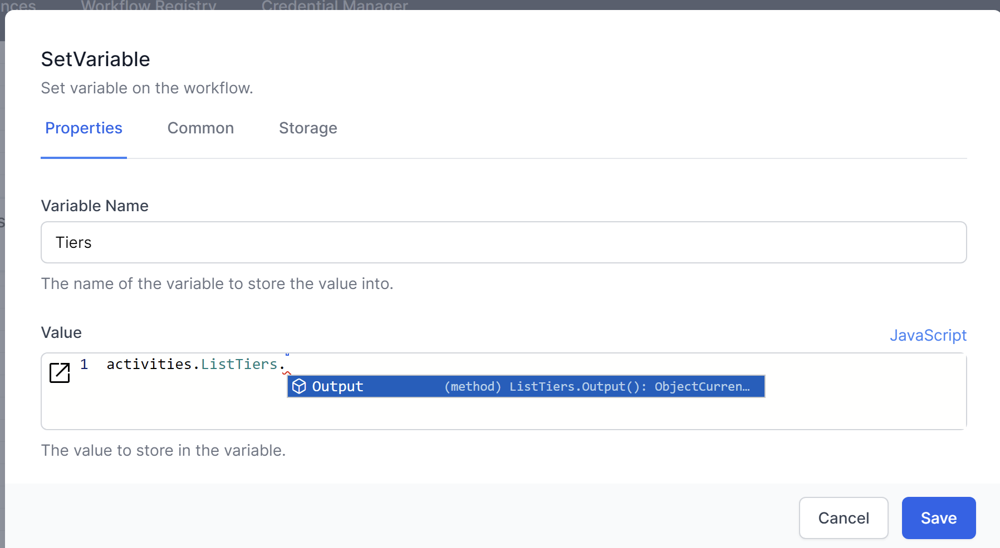

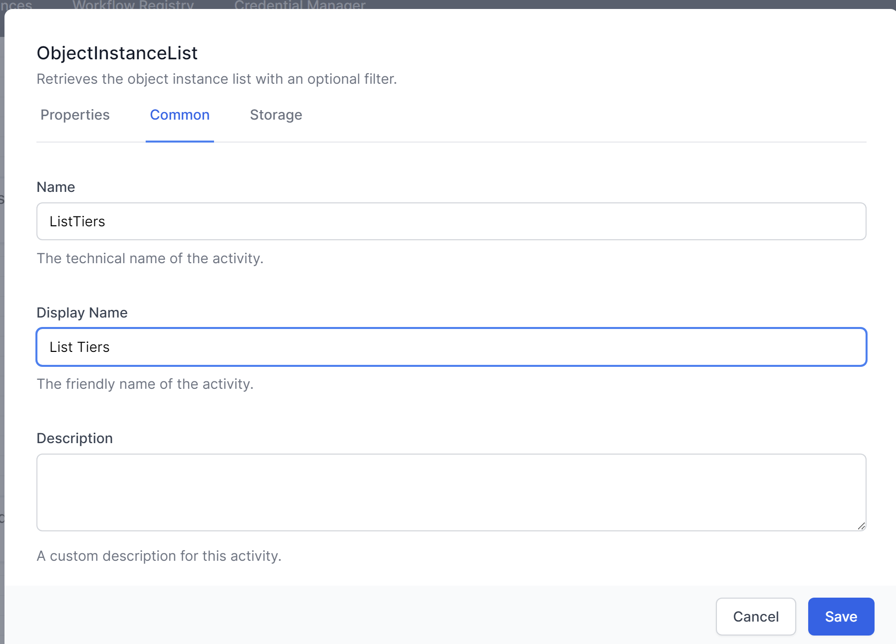

Because we want to use the data as a Liquid string,, not a Javascript Object, we will use a built-in function to turn it into a string. Both `JSON.stringify()` and `jsonEncode()` will do the trick.  The full formula will be 

```js
// JSON.stringify(activities.ListTiers.Output())
// or
jsonEncode(activities.ListTiers.Output())
```


> **Pro Tip** ` use this formula to get the first entry in the list.  Very helpful if your filter is deiagned to produce just 1 entry
`

```js
activities.ListTiers.Output()[0]
```

> **Pro Tip** ` use this formula to get the ObjectId of the first entry in the list.  Use this in the instanceId of the ` *GetObject* ` activity if your filter is designed to produce just 1 entry
`

```js
activities.ListTiers.Output()[0].ObjectId
```


Here is the updated workflow:
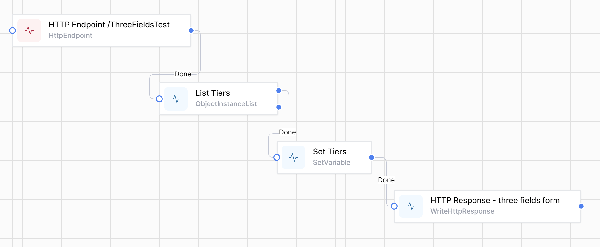

Now change the ```selectTierObjectId``` in the HTTP Response to use this Tiers variable.
Replace this:
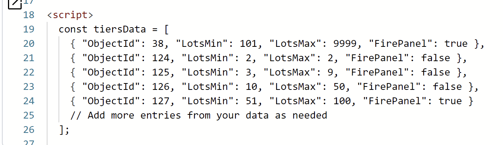
with this Liquid. The `| raw ` filter removes the html formattting.
.png)

Test your work using https://localhost:7063/ThreeFieldsTest

Let's now have the `Tier` field displayed, instead of the alert, and get it to select the correct value of `Tier` based on the 2 other fields.

Back to ChatGPT. Remember we changed the const Tiers data for our variable, so tell ChatGPT:
```sh
now set a dropdown field for Tier.  use this code to get the tiersData:

  const tiersData = {{Variables.Tiers | raw}}

The value will be the ObjectId.  The text displayed will be the tier description.  Use Tailwinds CSS and instead of a submit button, set the Tier when either field is changed
```
Here is the HTML, to replace the existing HTTP Response:   

```html
<!DOCTYPE html>
<html lang="en">
<head>
  <meta charset="UTF-8">
  <meta name="viewport" content="width=device-width, initial-scale=1.0">
  <title>Select Tier Objectid</title>
  <link href="https://cdn.jsdelivr.net/npm/tailwindcss@2.2.19/dist/tailwind.min.css" rel="stylesheet">
</head>
<body class="bg-gray-100 p-6">

  <form id="tierForm" class="bg-white p-6 rounded shadow-md">
    <div class="mb-4">
      <label for="lots" class="block text-gray-700 font-bold mb-2">Lots:</label>
      <input type="text" id="lots" name="lots" class="shadow appearance-none border rounded w-full py-2 px-3 text-gray-700 leading-tight focus:outline-none focus:shadow-outline">
    </div>

    <div class="mb-4">
      <label for="firePanel" class="block text-gray-700 font-bold mb-2">Fire Panel:</label>
      <input type="checkbox" id="firePanel" name="firePanel" class="mr-2 leading-tight">
      <span class="text-sm">Check if Fire Panel is present</span>
    </div>

    <div class="mb-4">
      <label for="tier" class="block text-gray-700 font-bold mb-2">Tier:</label>
      <select id="tier" name="tier" class="block appearance-none w-full bg-white border border-gray-400 hover:border-gray-500 px-4 py-2 pr-8 rounded shadow leading-tight focus:outline-none focus:shadow-outline">
        <option value="" selected disabled>Select a Tier</option>
      </select>
    </div>
  </form>

  <script>
    const tiersData = {{ Variables.Tiers | raw }};

    const lotsInput = document.getElementById('lots');
    const firePanelCheckbox = document.getElementById('firePanel');
    const tierSelect = document.getElementById('tier');

    function populateTiers() {
      tierSelect.innerHTML = '<option value="" selected disabled>Select a Tier</option>';
      tiersData.forEach(tier => {
        const option = document.createElement('option');
        option.value = tier.ObjectId;
        option.textContent = tier.TierDescription;
        tierSelect.appendChild(option);
      });
    }

    function updateTier() {
      const lots = parseInt(lotsInput.value);
      const firePanel = firePanelCheckbox.checked;

      if (isNaN(lots)) {
        alert('Please enter a valid number of lots.');
        return;
      }

      const selectedTier = tiersData.find(tier => 
        lots >= tier.LotsMin && lots <= tier.LotsMax && tier.FirePanel === firePanel
      );

      if (selectedTier) {
        tierSelect.value = selectedTier.ObjectId;
      } else {
        tierSelect.value = "";
      }
    }

    // Populate the tier dropdown initially
    populateTiers();

    // Add event listeners to the input fields to update the tier
    lotsInput.addEventListener('input', updateTier);
    firePanelCheckbox.addEventListener('change', updateTier);
  </script>

</body>
</html>

Here is the working page:
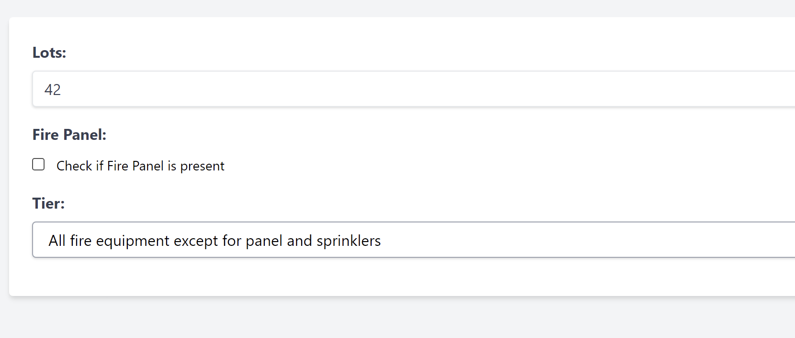
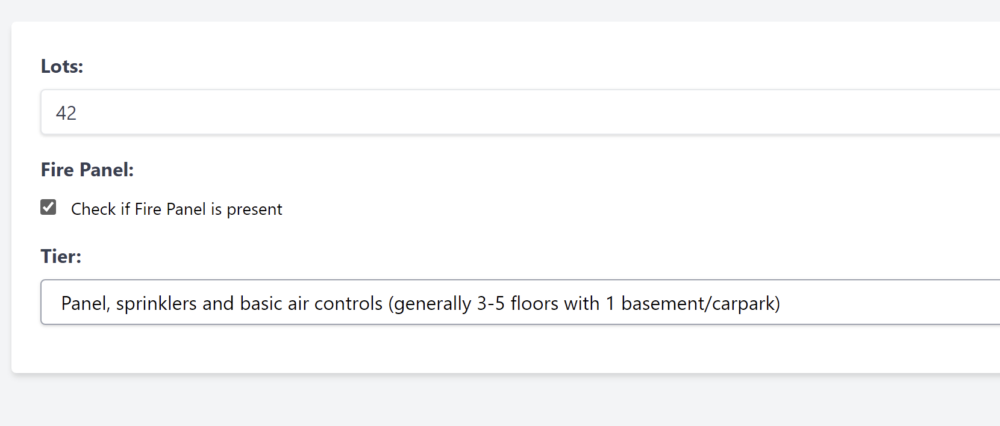

```

This demonstrates how we can build sophisticated World of Workflows workflows with little or no programming skills by leveraging ChatGPT. The ChatGPT responses build on each other and your workflows become more useful.
