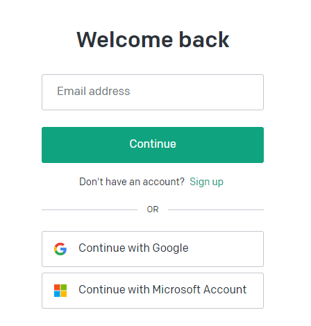
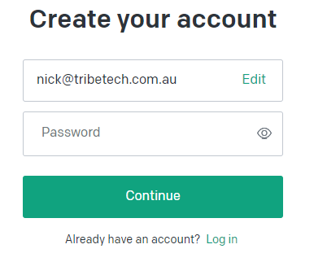
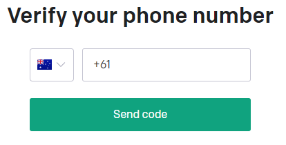
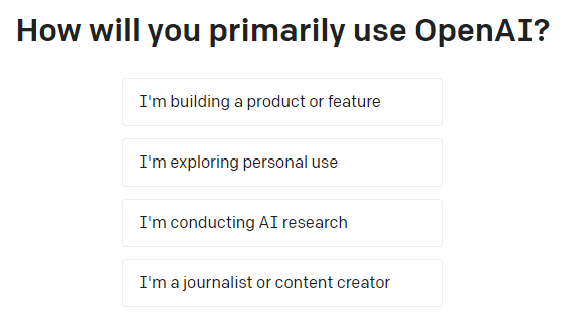
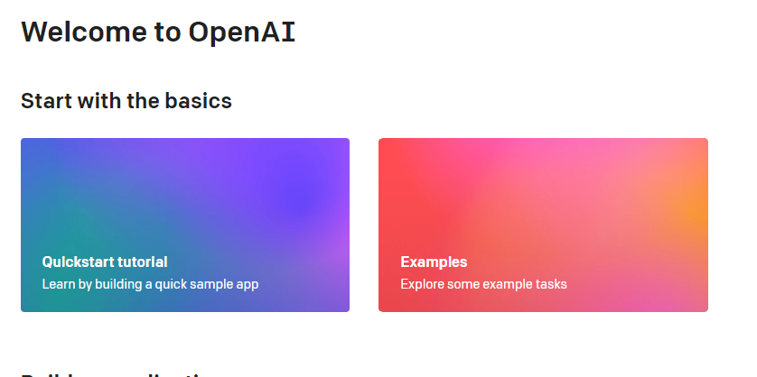

# Sign up for OpenAI

OpenAI has several licencing models, which are subject to change.  To use it effectively in World of Workflows development you might consider signing up.  

> *Note: this is a 3rd party website and its processes and screenshots are subject to change*

1. Navigate to [platform.openai.com](https://platform.openai.com/docs/overview){:target="_blank"} and click **Sign Up**  
   
2. Enter your email address and click **Continue**  
   
3. Enter your password and click **Continue**  
4. Open your email inbox and verify the email from OpenAI
5. Once your email has been verfiied, enter your details and click **Continue**  
   
6. Enter your phone number and click **Send Code**  
   
7. Enter the code you receieve on your phone and click **Continue**  
8. Answer the questions  
   
9. Congratulations, you have an OpenAI Account.  
   

You can now use ChatGPT interactively.

## API access

In order to use the OpenAPI plugin, you will also need a ChatGPT API Key. (These are now called Project Keys, with more granular control over your resources).

Navigate to [api-keys](https://platform.openai.com/api-keys){:target="_blank"} to create a key.  Use it [here](../19_plugins//OpenAIPlugin.html).