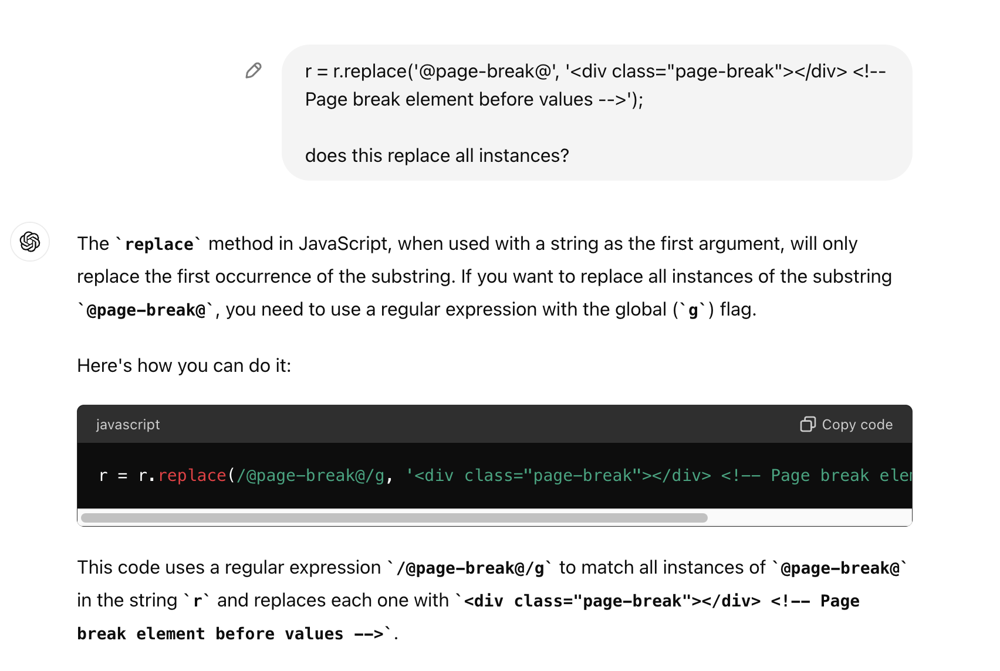
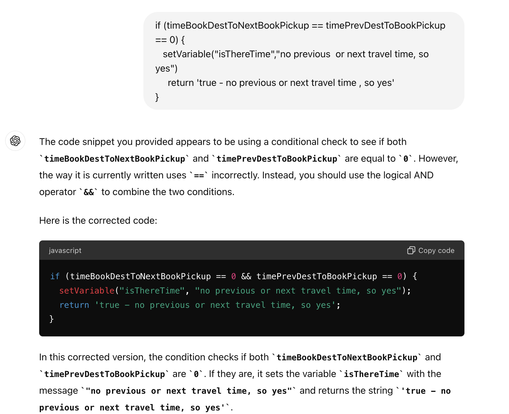

## Resolving logic and syntax problems

This example shows how to ask a question related to a specific line of code to see if in fact does what you think it should do.  


You can paste a line of code into ChatGPT to find out what it does.  If there is a logic error in the code, ChatGPT will correct it for you:


(By the way, this example also shows the use of ```setVariable()``` as a debugging tool in World of Workflows JavaScript.  The variable will be displayed in the Instance Log on the Variables page.)