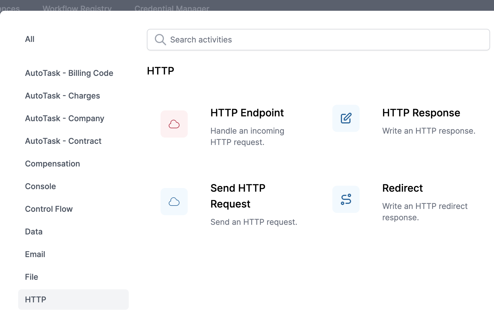
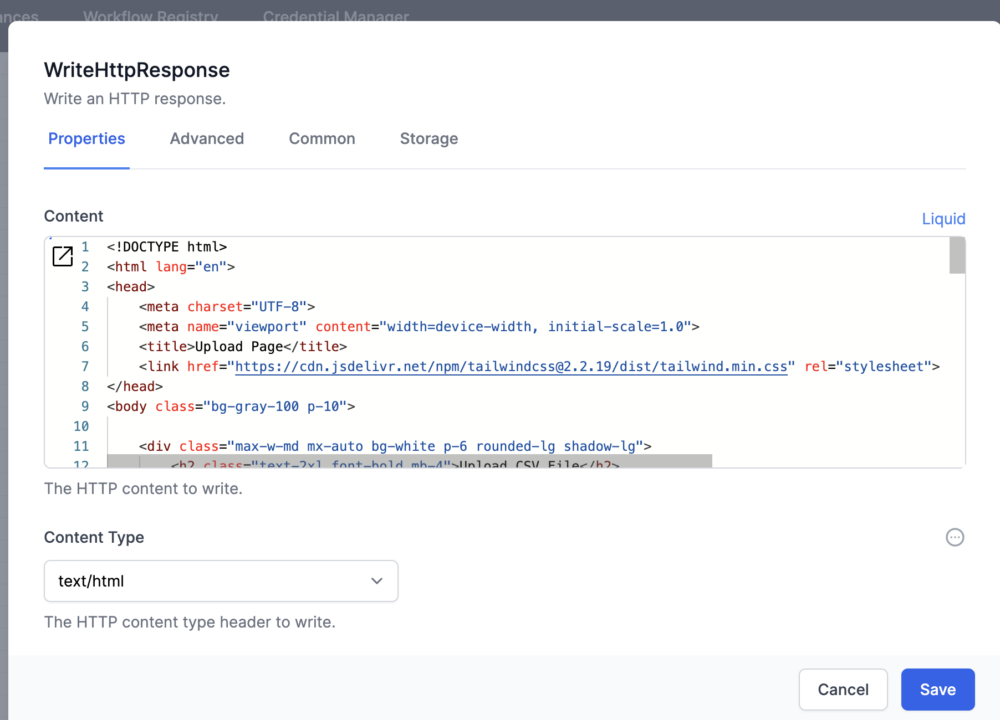
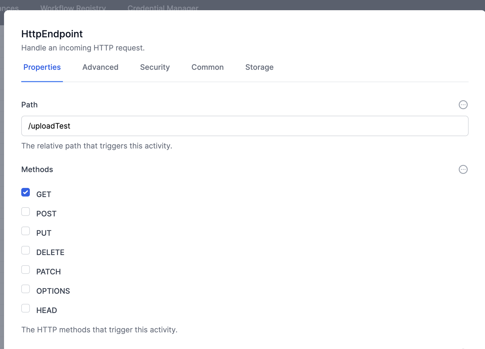
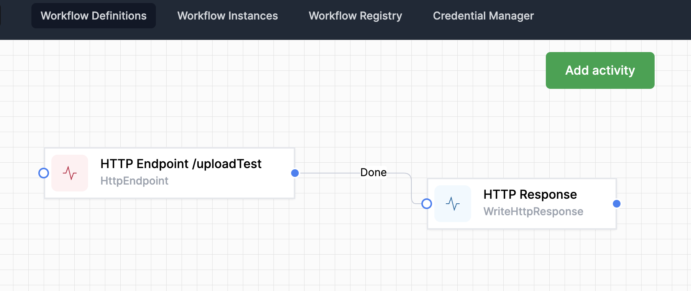
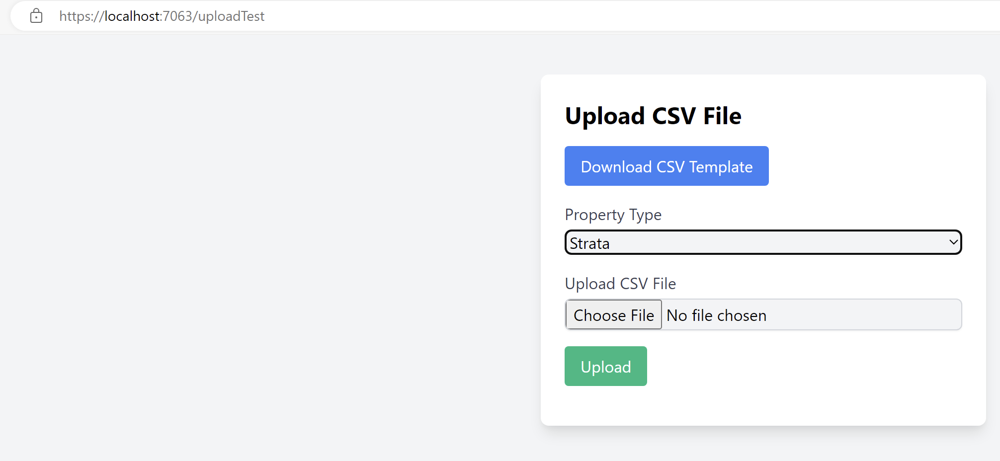
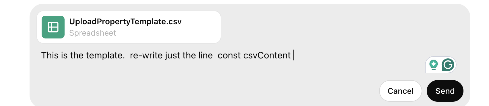
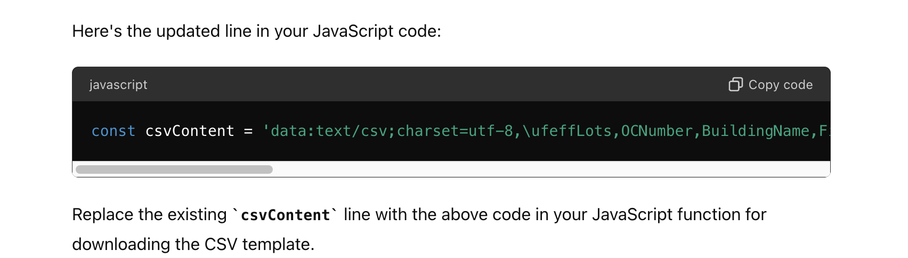

## Website example

When you want to build a website, we have used the ChatGPT Grimoire GPT with great success.  Open ChatPGT, select Explore GPTs and find **Grimoire**.

Here is a prompt we used recently

``` sh
I want another page on my site.  

I want to
1.  allow user to download a csv template file 
2.  allow user to upload file based on the template
3.  user will specify the PropertyType when uploading file as a dropdown with choices of 'Strata' or 'Commercial'

use Tailwind CSS for formatting.
```

**Grimoire** will produce all of the elements for your web page.  Now you just need to copy and paste them into the appropriate activities in your workflow.  

### HTML structure

The first part produced by Grimoire is the HTML.  Here is an example output:

```js
<!DOCTYPE html>
<html lang="en">
<head>
    <meta charset="UTF-8">
    <meta name="viewport" content="width=device-width, initial-scale=1.0">
    <title>Upload Page</title>
    <link href="https://cdn.jsdelivr.net/npm/tailwindcss@2.2.19/dist/tailwind.min.css" rel="stylesheet">
</head>
<body class="bg-gray-100 p-10">

    <div class="max-w-md mx-auto bg-white p-6 rounded-lg shadow-lg">
        <h2 class="text-2xl font-bold mb-4">Upload CSV File</h2>
        
        <button id="download-template" class="bg-blue-500 text-white px-4 py-2 rounded mb-4">Download CSV Template</button>
        
        <div class="mb-4">
            <label for="property-type" class="block text-gray-700">Property Type</label>
            <select id="property-type" class="mt-1 block w-full bg-gray-100 border border-gray-300 rounded-md shadow-sm">
                <option value="Strata">Strata</option>
                <option value="Commercial">Commercial</option>
            </select>
        </div>
        
        <div class="mb-4">
            <label for="file-upload" class="block text-gray-700">Upload CSV File</label>
            <input id="file-upload" type="file" accept=".csv" class="mt-1 block w-full bg-gray-100 border border-gray-300 rounded-md shadow-sm">
        </div>
        
        <button id="submit-button" class="bg-green-500 text-white px-4 py-2 rounded">Upload</button>
        
        <div id="result" class="mt-4 text-red-500"></div>
    </div>

    <script>
        document.getElementById('download-template').addEventListener('click', function () {
            const csvContent = "data:text/csv;charset=utf-8,Column1,Column2,Column3\n";
            const encodedUri = encodeURI(csvContent);
            const link = document.createElement('a');
            link.setAttribute('href', encodedUri);
            link.setAttribute('download', 'template.csv');
            document.body.appendChild(link);
            link.click();
            document.body.removeChild(link);
        });

        document.getElementById('submit-button').addEventListener('click', function () {
            const propertyType = document.getElementById('property-type').value;
            const fileUpload = document.getElementById('file-upload').files[0];
            const resultDiv = document.getElementById('result');

            if (!fileUpload) {
                resultDiv.textContent = "Please upload a file.";
                return;
            }

            const reader = new FileReader();
            reader.onload = function (event) {
                const csvContent = event.target.result;
                console.log('Property Type:', propertyType);
                console.log('CSV Content:', csvContent);
                resultDiv.textContent = "File uploaded successfully!";
            };
            reader.onerror = function () {
                resultDiv.textContent = "Error reading file.";
            };
            reader.readAsText(fileUpload);
        });
    </script>

</body>
</html>
```

You will put this code directly into your **HTTP Response** activity:

Edit the activity, set the Content to **Liquid**, and paste the HTML:

Select the `Content Type` as `text/HTML`, and set the activity name as usual under the *Common* tab.

Create another activity, `HTTP Endpoint`, like this:

and use an appropriate path.  In this case we use /uploadTest.  It can be anything logical, just make it unique.
Join the two activities, like this:

Now you can run the workflow and see your web page, as built by **Grimoire**
Go to another browswer window, and go to  

```sh
  https://localhost:7063/uploadTest   
```

or whatever endpoint name you used.



### Changing the template file

The Grimoire gave you a very simple example template.  Here is the line of code provided for you:

``` js
const csvContent = "data:text/csv;charset=utf-8,Column1,Column2,Column3\n";
```

You will doubtless have a template with your own fields, and a row of example data.  Instead of doing the work to alter code yourself (and perhaps making a typo along the way), let's use ChatGPT:

Upload your template directly to ChatGPT Grimoire, with a prompt like this:

The **Grimoire** responds like this:



### Receiving the file into your Workflow

So now you have a way of collecting data and sending it to your World of Workflows environment.  Let's ask ChatGPT what to do next:
