# Implementing an Overview workflow

One way to have a single workflow run for the entire process and still be able to make changes along the way is to use a simple workflow we will call an Overview workflow.

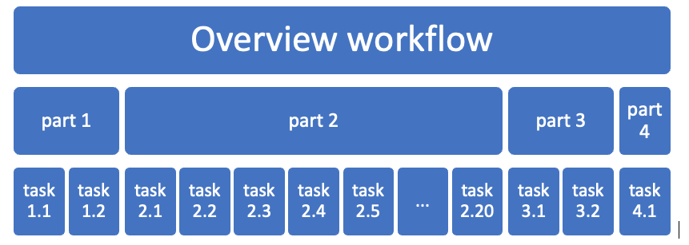

## Here is how to design this workflow.

1. Create a workflow, give it a suitable name, such as HR Overview.
2. Implement a method to start your HR Overview workflow (eg from a data object (see Implementing triggers), a timer (see Cron) )
3. Set up any variables you need to pass to the main workflow, such as the ObjectID of the triggering object instance
4. Add a Run workflow activity to kick off your main workflow
5. Add a Run JavaScript activity to grab the outcome of your main workflow
6. (optional, and recommended for debugging) add a TaskCreate activity to provide you with the ability to stop your workflow
7. Join everything up.

You will notice that there is almost nothing in this workflow that will ever need to change.  All it does is to call another workflow.  The simpler you make your Overview workflow, the less likelihood that it will ever need changes.

## Here are the activities in detail

1. The workflow is called `StaffOnboardingOverview`
2. Chose an `Object Instance Trigger` to start this workflow.  It is run from within a `Staff` instance:
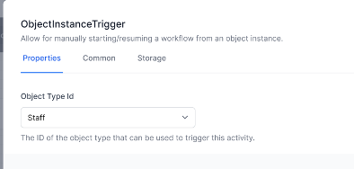
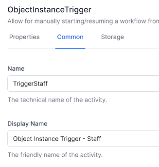
1. Set a variable called `ObjectId` to contain the ObjectId of the initiating Staff object:  
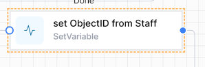  
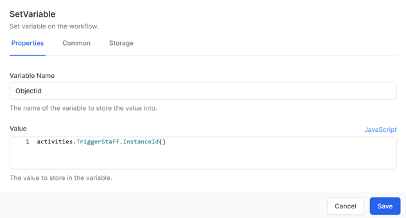
> Note: we use JavaScript to get the value, using the `Name` of the trigger activity to get the ObjectID, using this formula:
```js
activities.TriggerStaff.InstanceId()
```
1. This is the Run Workflow activity:  
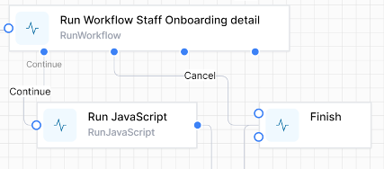  
The workflow definition uses a Liquid Filter to allow us to use the name of the workflow we are calling (rather than it’s ID)    
The Input is the JSON we will be passing to our main workflow   
The branches Continue & Cancel are the text entered into Possible Outcomes.  
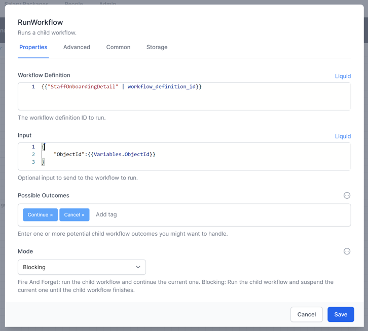  
Note the `Name` on the next page:  
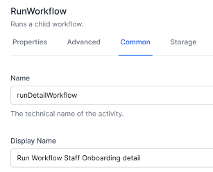
1. The Run JavaScript activity  
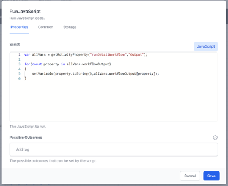  

>  Note how the name of the Run Workflow activity is used in the Run JavaScript.

```js   
var parameters = JSON.parse(activities.runDetailWorkflow.Output().workflowOutput)
   
   for(const property in parameters)
   {
       setVariable(property.toString(),parameters[property]);
   }
   
```
6. (Optional) Create a Task to allow you to stop the Overview workflow at will.  Note the branches
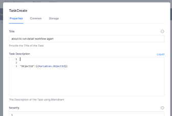  
...  
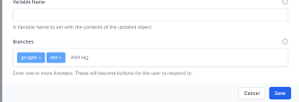
7. Add a Finish activity and connect the activities like this:  
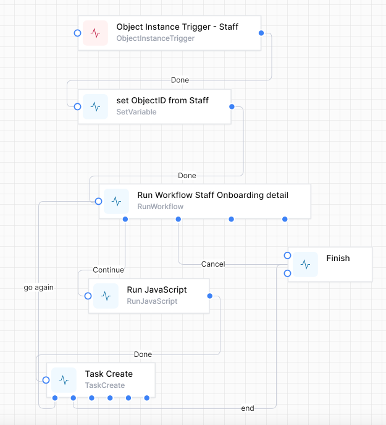
