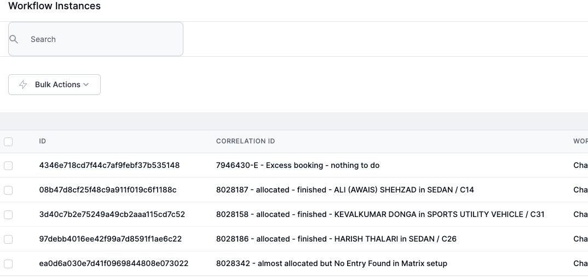

# Patterns & Practices

To understand how the various types of activities interact with each other in these workflows, we can break down the common patterns and their interactions step-by-step. Here is a detailed explanation of how the different activities interact with each other, focusing on those that involve HTTP interactions.

## Using Correlate for complete workflows

Debugging workflows can be tricky if many workflows are run in a short operiod of time.  t can be helpful to have a summary of where the workflow is up to when looking at the Instance Log.  One way to acheive this is to use the `Correlate` activity.  This write a string of text to the 'Correlation' field in the workflow instance.  this is then displayed when looking at the instance log.

For example, this workflow was called in a For loop.  Correlate was used to write the result of the workflow to the Correlation ID so that it is easy to identify which instance processed a particular record.



## Debugging within a `For Each`  loop

the Instance log shows 2 areas to assist with debugging a workflow:
1. Journal tab  
   The Journal will show the sequence of execution of the activities in your workflow, and sometime the data retrieved or written.  

2. Variables tab  
  The Variables tab show the value of each variable in the order in which it was created in the workflow.

When a loop has played out to the end, the Variables tab will show the value of the variables at the end of the loop.  If you want to know what happens inside a loop, you can use these two practices:

### Add a temporary `Break` activity

You can stop a loop using the `Break` activity.  This will mean that the values shown in the Variables tab will be as they were when you stopped the loop.

The rest of the workflow continues to execute, and so could alter the values of these variables.

### Add a temporary `Fault` activity

You can stop a loop using the `Failt` activity.  This will halt the workflow at that point, and you can review the variables as at the Fault.  You can also set a custom fault message to assist with your debugging.  

### Add variables with loop-based names

Variables can be created with a name that is unique for each iteration of the loop.  For example, if your loop is through a list of Companies, this JavaScript will create a variable name based on the ObjectId of each company.  You can give this variable the data that will help you debug your workflow.

```JavaScript
    setVariable("DebugCompany_"+getVariable("Company").Objectid, getVariable("theDebugVariable"))
```

When you look in the Variables tab of the workflow instance log you will see something like:
```json
    ...
    "DebugCompany_134234":"this is good",
    "DebugCompany_176764":"this is good",
    "DebugCompany_238764":"error: no APIKey",
    "DebugCompany_232374":"this is good",
    ...    
``` 

This allows you to focus on company with the 238764 ObjectId to find your logic error.

## HTTP Responses and the execution location

World of Workflow makes an excelent HTTPS server.  You can quickly generate Call/Respnse workflows to build simple or complex web sites.  See [WebExamles](./16_using_ai/websiteExamples.html) for examples.

When you send an HTTP Response to a browser it will often contain HTML, CSS and Script.

