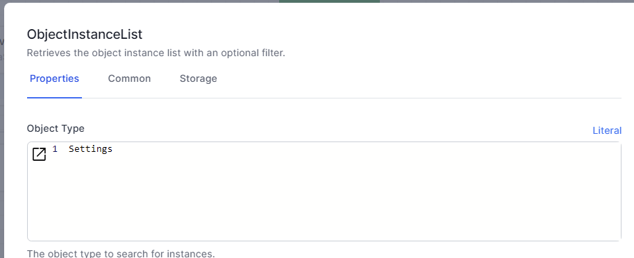
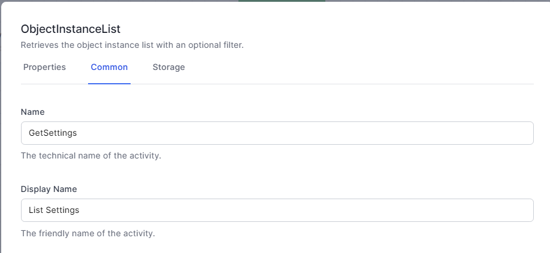
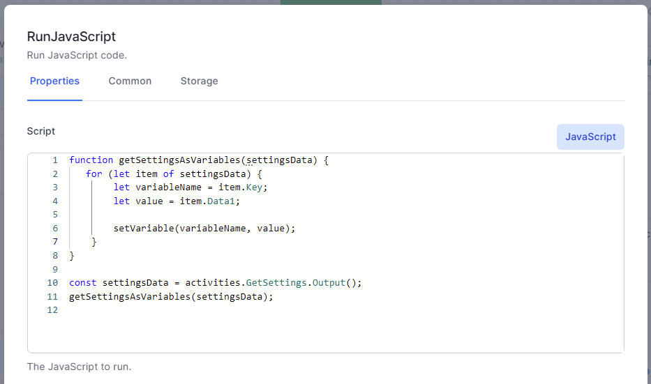

# The Settings Type

Workflows should be written with portability in mind.  Do not hard-code values that can be set in a global 'Settings' value.

1. Create a Type called `Settings`.
2. Rename the `Title` field to `Key`
3. Add a string field called `Data1`
4. (optional) Add additional string field called `Data2`

Add data to your Settings:


Add these two activities to your workflow to retrieve the Settings from the database into workflow variables of the same name:

- Object Instance List



- JavaScript

    ```js
    function getSettingsAsVariables(settingsData) {
        for (let item of settingsData) {
            let variableName = item.Key;
            let value = item.Data1;
            
            setVariable(variableName, value);
        }
    }

    const settingsData = activities.GetSettings.Output();
    getSettingsAsVariables(settingsData);

    ```

