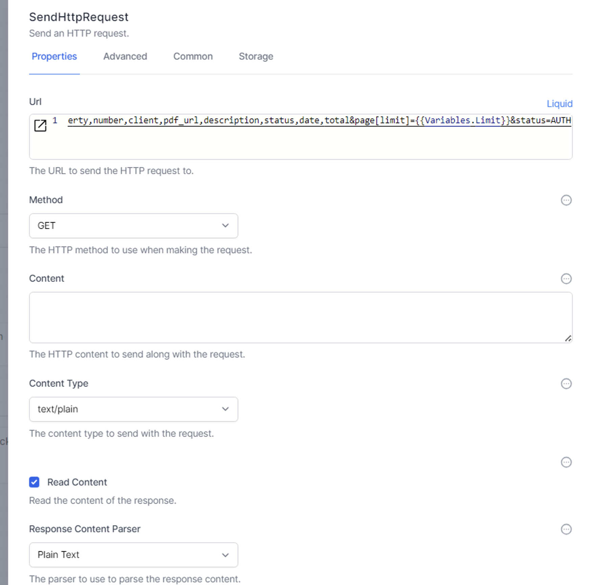
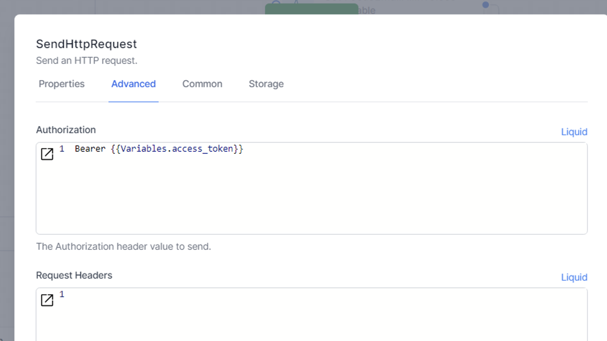
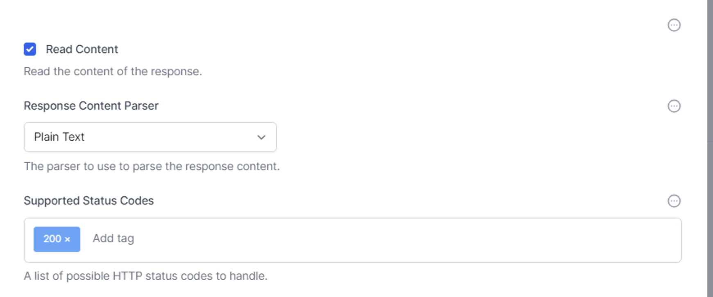
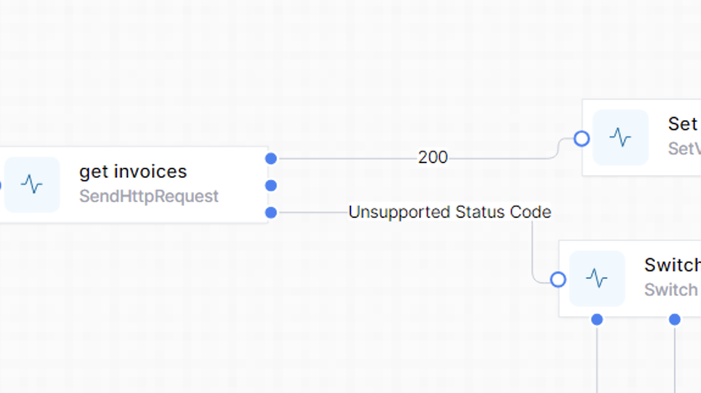
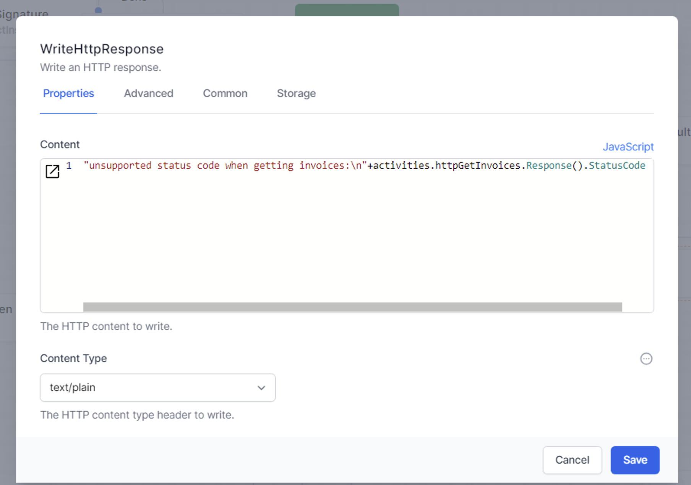
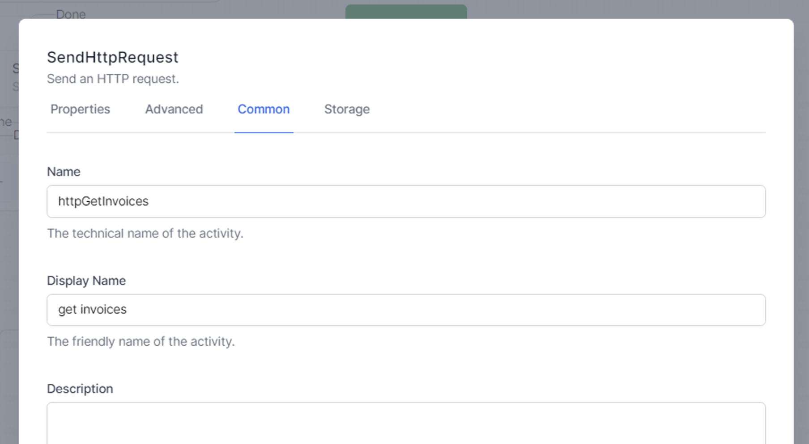
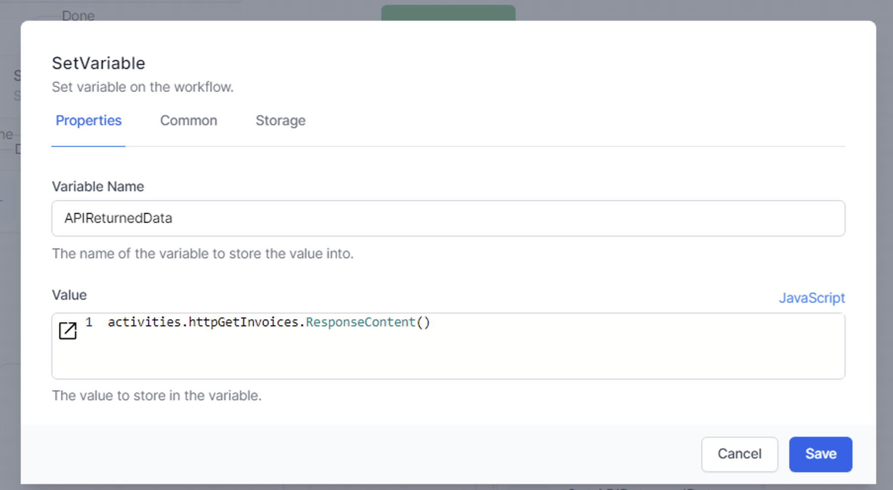
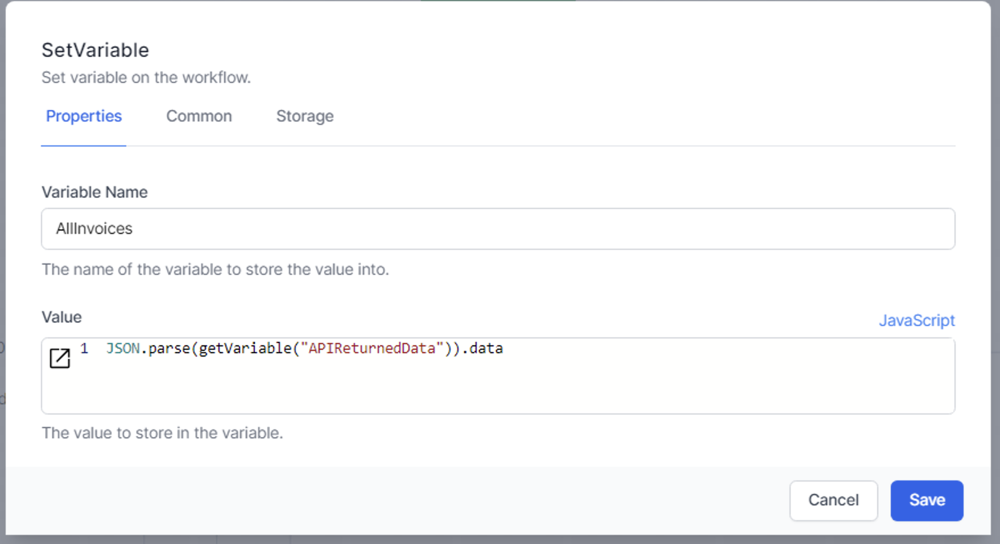

# Call an External API by HTTP Request

This example shows how to send an HTTP Request to a HTTP API.  

Note the use of Liquid variables in the URL field.  

In this GET example we expect a response, so we enabled `Read Content`

{: .key }
GET requests have all the data the API needs in the URL.
POST requests use the content field to supply the API with data it needs.  
The API's documentation will tell you wether to use GET or POST.

This API required an `access token`, which we supply in the `Advanced` => `Authorization` field.

Again, we used Liquid to supply the variable.  

Refer to this chapter to [set up and maintain an Access_Token](../22_samples/accessToken.html).

## Response codes

Each HTTP API will return a number as well as the payload.
Usually a good response is indicated by a return code of 200, but it can be be any other number: consult the API's documentation.  For more details, see [here](../12_workflow_activities/07_HTTP/02_HTTP-response.html)

You can enter any status code you choose to handle in the `Supported Status Codes` field of the HTTP Request.  This will create a branch in the Designer for you to connect other activities.

  

Any status codes which you do not define will be treated as 'unsupported', and flow down that branch.  You choose how granular you need to be to process the status codes from the API.

You can retrieve the status code with JavaScript like this:  
`activities.httpGetInvoices.Response().StatusCode`

You will replace `httpGetInvoices` with the `Name` you gave your HTTP Request.

## Read the data returned by the API

To read the data returned by the API (the 'payload') we need to give our HTTP Request a `Name`.  For example:

In a subsequent step we can then get the `ResponseContent()` of our HTTP Request:

Here we have set a variable to hold the data returned by the API.

The format of the data returned by each API will be unique to that API.  Most APIs now return either plain text or JSON, although your API might return XML or a byte array (for files).  Consult your API documentation for the format of the data to be returned.

The API in this example returns an array of invoices in JSON format.  To get the full list of invoices, we use the JavaScript command `JSON.parse()` or `jsonEncode()` or the liquid filter `| json`.  

