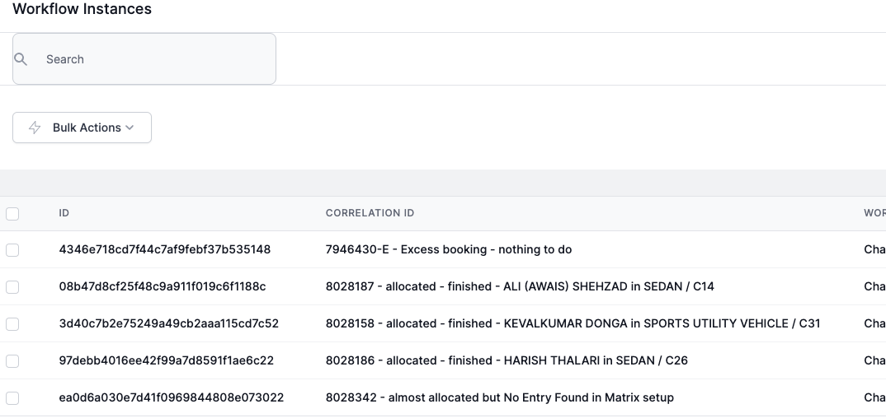
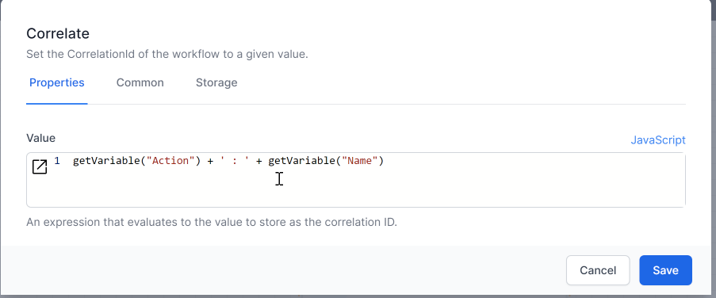

# Using Correlate for complex workflows

Debugging workflows can be tricky if many workflows are run in a short operiod of time.  t can be helpful to have a summary of where the workflow is up to when looking at the Instance Log.  One way to acheive this is to use the `Correlate` activity.  This write a string of text to the 'Correlation' field in the workflow instance.  this is then displayed when looking at the instance log.

For example, this workflow was called in a For loop.  Correlate was used to write the result of the workflow to the Correlation ID so that it is easy to identify which instance processed a particular record.

{: .key }
Take care when changing the Correlation ID of your workflow if you intend to use the `Signal` activity.  Signal uses the Correlation ID to tie two workflows together.