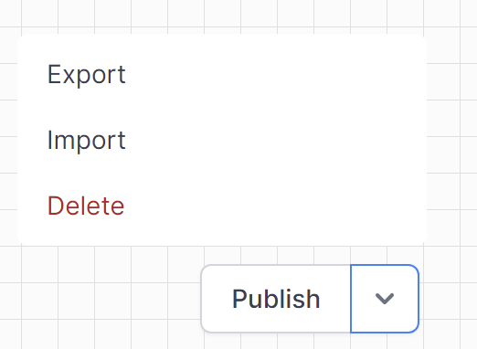

# HTTP Patterns and Practices

To understand how the various types of activities interact with each other in these workflows, we can break down the common patterns and their interactions step-by-step. Here is a detailed explanation of how the different activities interact with each other, focusing on those that involve HTTP interactions.

each example has a sample workflow file.  This can be imported into World of Workflows as a starting poingt for your development.
Go to `Admin` -> `Workflows` -> `Create Workflow`  
Click the arrow beside Publish and import the workflow file.

## 1. Setting Variables for HTTP Requests

**Activities Involved**:
- **SetVariable**: This activity is used to set variables that will be used in the HTTP requests, such as method type, URLs, and request content.

**Interaction**:
- **Example**: Before sending an HTTP request, the workflow sets the HTTP method and URL.
  - **Set Method**: `SetVariable` activity sets the HTTP method to "GET".
  - **Set URL**: `SetVariable` activity sets the API endpoint URL.

 <a href="./set-http-request-variables.json" download>Example workflow file</a>  

## 2. Sending HTTP Requests

**Activities Involved**:
- **SendHttpRequest**: This activity sends the actual HTTP request using the configured method, URL, and other parameters.

**Interaction**:
- **Example**: After setting the method and URL, the `SendHttpRequest` activity is triggered to perform the HTTP request.
  - **Send GET Request**: The `SendHttpRequest` activity sends a GET request to retrieve data.

## 3. Handling HTTP Responses

**Activities Involved**:
- **SetVariable**: This activity is used again to store the response from the HTTP request.
- **RunJavaScript**: This activity can be used to process or parse the response content.
- **If**: This activity checks conditions based on the HTTP response content to determine the next steps.

**Interaction**:
- **Example**: After receiving the response, the workflow handles it as follows:
  - **Store Response**: `SetVariable` activity stores the response content.
  - **Parse Response**: `RunJavaScript` activity parses the response JSON to extract necessary information.
  - **Conditional Check**: `If` activity checks if the response meets certain conditions (e.g., if the response contains specific data).

## 4. Conditional Logic Based on HTTP Response

**Activities Involved**:
- **If**: This activity determines the workflow path based on the HTTP response content or other conditions.

**Interaction**:
- **Example**: The workflow decides the next action based on the response.
  - **Check Response**: `If` activity checks if the response contains a specific value.
  - **Branching**: Depending on the condition, the workflow branches to different activities (e.g., updating a resource or creating a new one).

## 5. Updating and Creating Resources via HTTP

**Activities Involved**:
- **SendHttpRequest**: This activity sends PATCH requests to update resources or POST requests to create new resources.
- **ObjectInstanceUpdate**: Specifically updates existing records.
- **ObjectInstanceCreate**: Creates new records.

**Interaction**:
- **Example**: Based on the conditional logic, the workflow updates or creates resources.
  - **Update Resource**: `SendHttpRequest` or `ObjectInstanceUpdate` sends a PATCH request to update an existing resource.
  - **Create Resource**: `SendHttpRequest` or `ObjectInstanceCreate` sends a POST request to create a new resource.

## 6. Looping Through HTTP Responses

**Activities Involved**:
- **ForEach**: This activity iterates over each item in a list (e.g., a list of vehicles or users).
- **SendHttpRequest**: Sends additional HTTP requests for each item in the loop.

**Interaction**:
- **Example**: If the HTTP response contains a list of items, the workflow processes each item individually.
  - **Iterate Items**: `ForEach` activity loops through the items.
  - **Process Each Item**: Within the loop, `SendHttpRequest` or other activities process each item (e.g., updating or creating records).

### Detailed Example Workflow Interaction
Go to `Admin` -> `Workflows` -> `Create Workflow`  
Click the arrow beside Publish and import this workflow file:  <a href="./create-edit-user,json" download>Create or Edit system user workflow file</a>  

Let's consider the "Create or Edit system user" workflow as a detailed example:

1. **Set Variables**:
   - **Set Method and URL**: `SetVariable` activities set the method to "GET" and the URL for the Microsoft Graph API.

2. **Send Initial HTTP Request**:
   - **Get Group**: `SendHttpRequest` activity sends a GET request to retrieve groups from Microsoft Graph.

3. **Handle Initial Response**:
   - **Store Group Response**: `SetVariable` activity stores the response content.
   - **Check if Groups Exist**: `If` activity checks if the response contains any groups.

4. **Conditional Logic Based on Response**:
   - **Get Group Members**: If groups exist, another `SendHttpRequest` activity sends a GET request to retrieve group members.
   - **Set Group Members**: `SetVariable` activity stores the group members response.
   - **Check if User Exists in Group**: `If` activity checks if the user exists in the group.

5. **Update or Create User Based on Conditions**:
   - **Create New User**: If the user does not exist, `SendHttpRequest` sends a POST request to create a new user invitation.
   - **Update Existing User**: If the user exists, `SendHttpRequest` sends a PATCH request to update the user information.

6. **Loop Through Additional HTTP Responses (if needed)**:
   - **Iterate Over Group Members**: `ForEach` activity loops through each group member to perform additional actions if necessary.

### Summary

The interaction of activities in workflows involving HTTP requests follows a structured pattern:

1. **Initialize Variables**: Set necessary variables for HTTP requests.
2. **Send Requests**: Perform HTTP operations to interact with external services.
3. **Process Responses**: Handle and parse the HTTP responses.
4. **Conditional Logic**: Use conditions to guide the workflow based on the responses.
5. **CRUD Operations**: Update or create resources based on the workflow logic.
6. **Iterate**: Process lists of items returned from HTTP responses.

These interactions form the basis for documenting how workflows interact with HTTP services, providing clear guidelines on setting up, executing, and processing HTTP-based operations within the workflows.