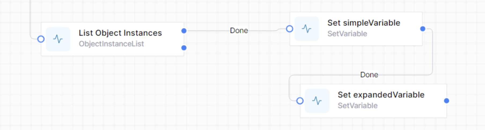
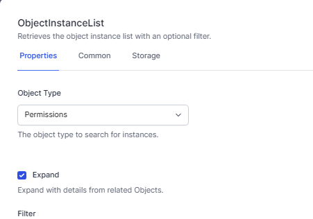
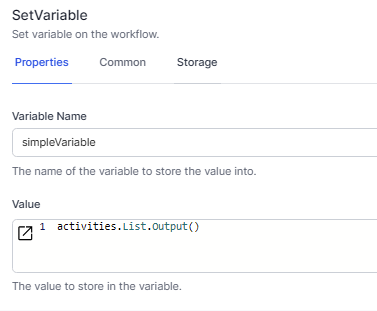
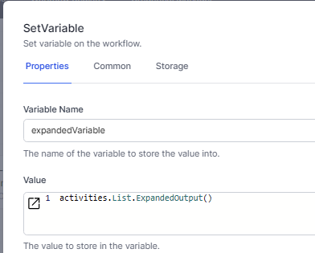

# Combining 2 arrays into 1 array

## Use the `Expand` option of `List Object Instances`

The `List Object Instances` activity has an 'Expand' option, which allows you to collect, in one array, the details of two Tables, linked by a Reference field.

Consider a Table (called `Permissions`) which has a reference field called `Feature`.

In this example we have created two variables,  `simpleVariable` using .Output() and `expandedVariable` using .ExpandedObject() 

Workflow overview:  


Listing the data:  


Setting the simple variable:  


Setting the expanded variable:  


The resulting variables might look like this:  

```js
{
  "simpleVariable": {
    "$type": "System.Object[], System.Private.CoreLib",
    "$values": [
      {
        "OriginalVersion": null,
        "ObjectId": 25,
        "Feature": [
          "long",
          34
        ],
        "Title": "JIm - Access4 Charges"
      }
    ]
  },
  "expandedVariable": {
    "$type": "System.Object[], System.Private.CoreLib",
    "$values": [
      {
        "$id": "3",
        "$type": "System.Dynamic.ExpandoObject, System.Linq.Expressions",
        "ObjectId": 25,
        "OriginalVersion": null,
        "Feature": {
          "OriginalVersion": null,
          "ObjectId": 34,
          "Title": "Access4 Charges",
          "URL": "/access4Charges"
        },
        "Title": "JIm - Access4 Charges"
      }
    ]
  }
}
```

{: .key }
The details of the referenced Table, Features, is included in the 'expandedVariable' variable.  This allows easy access to all of the fields of the referenced type.

## JavaScript function

In addition to this built-in functionality, you may have a data structure that has two Tables with common (or even just similar) data columns, that you want to programmatically bring into one array.


```js

function join2Tables(Primaries,Secondaries) {

    return Primaries.map(Primary => {
        // Find the corresponding entry for each in the secondary table 
        let Second = Secondaries.find(s => Primary.Purpose == s.ObjectId );  // this is using an exact match.  
        
        // another example:
        // Find the corresponding entry in Secondaries where the first 3 characters of Primary.Purpose match s.Purpose
        // let Second = Secondaries.find(s => Primary.Purpose.substring(0, 3) === s.Purpose);


        // Only return Primary and Second data if a matching Second is found
        if (Second) {
            return {
                ...Primary, // Spread operator to include all properties of chauffeur
                LinkedObject: Second, // Add the found Second object
                                    // LinkedObject will be a new field in the array.  Rename this as appropriate
            };
        } else {
        return undefined; // Explicitly return undefined for non-matches
        }
    }).filter(item => item !== undefined); // Filter out undefined items (where no matches occur)
}

// Example usage
let Secondaries = getVariable("FilePurposes"); 
let Primaries = getVariable("Files");

let combinedData = join2Tables(Primaries,Secondaries);
return combinedData

```


Here’s a brief explanation of how the function works:

1. **Mapping Over Primaries**: You iterate over each `Primary` object in the `Primaries` array.
2. **Finding a Match**: For each `Primary`, you find the corresponding `Secondary` object in the `Secondaries` array where `Primary.Purpose` matches `s.ObjectId`.
3. **Creating a Combined Object**: If a match is found (`Second`), you create a new object combining `Primary` and `Second` under a new property `LinkedObject`.
4. **Filtering Undefined**: After mapping, you filter out `undefined` values which occur when no matching `Secondary` is found.

You might want to consider renaming `LinkedObject` to something more descriptive depending on the context.  This should give you a clear understanding of which `Secondary` is linked to each `Primary` and help make your data handling more intuitive.
