# Implementing the main workflow

The main workflow can now be designed to be called as many times as needed to ensure that it does not run for too long.

## Accept parameters from the Overview workflow

Create this as the first activity in your main workflow:  
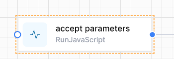

Use this JavaScript to take the JSON passed from the `Overview workflow` and convert it to dot-notation variables.

```js
var parameters = JSON.parse(input)
setVariable("Parameters",parameters)
```

If the JSON passed is: 
```json
{
    “ObjectId”:123
}
```

This allows you to reference the passed in ObjectId in Liquid as 

`{{Variables.Parameters.ObjectId}}` 


or in JavaScript as   
`getVariable(“Parameters”).ObjectId`


## Use Status fields as starting points of your main workflow

Use a Switch to direct the flow, using data saved in your object to determine where the flow is up to.  For example:  
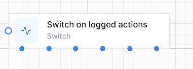  
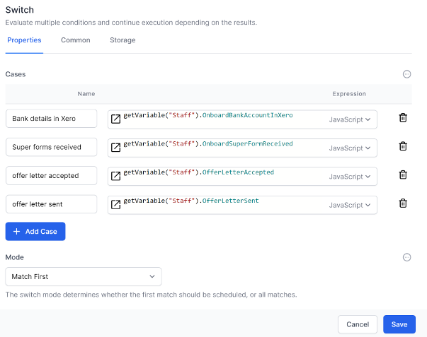  

In this switch statement you first want to match the last checkpoint in your workflow then the next-to-last checkpoint, and so on.

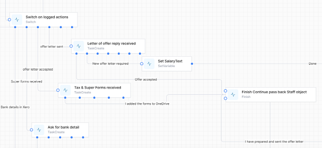

## Return to the Overview workflow frequently
This is the Finish activity.  
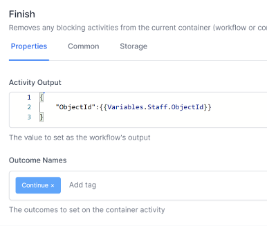

It passes back the ObjectId so that the Overview workflow can use it to call the main workflow again.  It also passes back the ‘Continue’ Outcome, which is used to determine whether to run the main workflow again.  (If we pass back ‘Cancel’, the Overview workflow will stop).

Notice that the main workflow does the minimum amount of processing between the switch statement and the finish statement, ideally just enough to prepare and process one Task Create activity.  This is where the magic occurs: now the main workflow only has to be in existence for one task at a time.  As soon as this task is complete, a new instance of the main workflow is created, and continued from this checkpoint.

## Ensure variables are available

Note that you will need to ensure the variables you set in your main workflow are available when the workflow is restarted.  This can be done by calling a ‘set variables’ workflow, or specifically in the main workflow.  

Example of a `SetupVariables` workflow:  

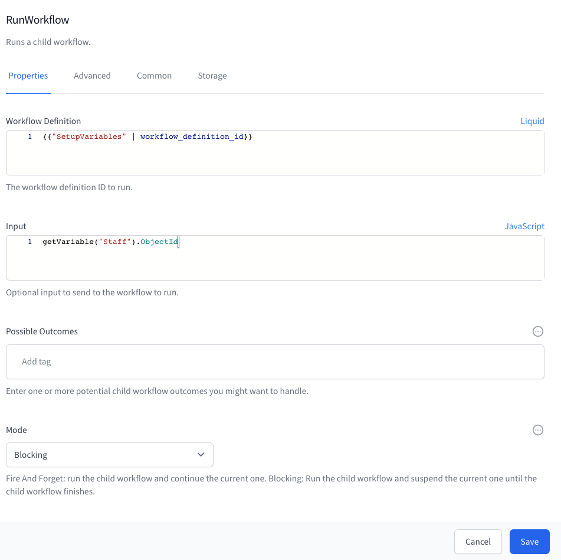

We pass in a suitable `ObjectID` that we always know, since this was passed to the Main workflow
Note that Mode is `BLOCKING`, waiting for the `SetupVariables` workflow to complete.

The first activity in the `SetupVariables` workflow is to get the database object using the passed in ObjectId.  For example:

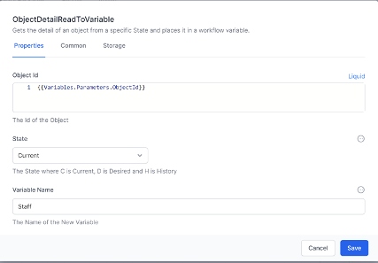

The rest of the variables are then set up.  These could be anything you always need in your workflows, such as an array of statuses, or the url of a website...

The last 2 activities in the `SetupVariables` workflow are to set up send back the variables to the calling workflow:

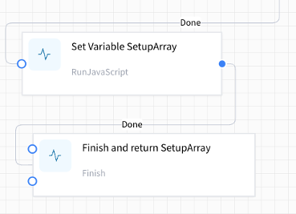

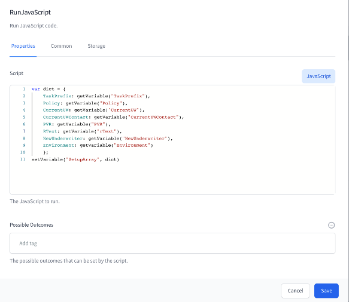  
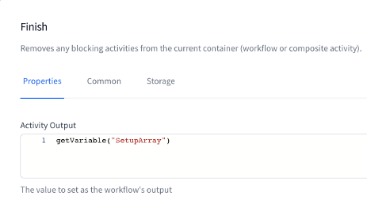

Another method of setting variables in the main workflow or the `SetupVariables` workflow is to build up the variables from the known data.  For example, in this case, if the `Staff` already has a `SalaryPackage` we can get the `SalaryPackage` object from the `Staff` object.  Otherwise we can create the `SalaryPackage` object and save the relationship back to the Staff object:

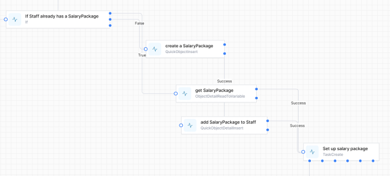

