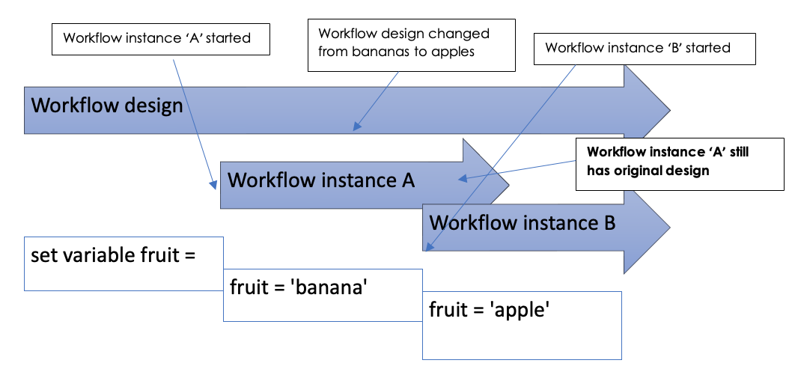
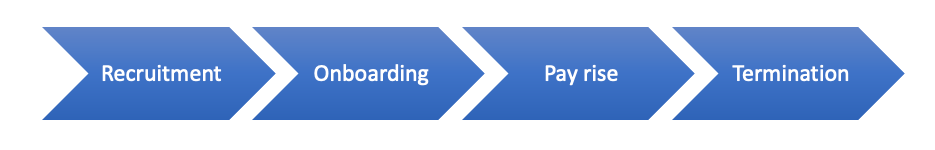
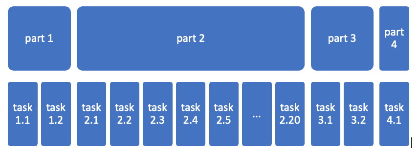

# Designing long-running workflows

As you develop your workflows, you will have workflows in production which you need to change.  It is easy to make these changes and they will apply to all future instances of your workflows.  However, if you have a workflow that started before your change was made and has not yet completed, Workd Of Workflows  will execute your old workflow.

This diagram describes this scenario:


The workflow engine will continue to run your workflows as they were designed until they complete.  This maintains the integrity of your design, and you can be confident that the workflow will continue to run the way you design it, even if changes are subsequently made to that workflow.

> This can become a problem if you expect your workflows to run for an extended period of time.
>   
For example, your company has a process that manages your employee HR process - from recruitment, onboarding, pay rises and eventual termination of employment.  
You could write this as a single workflow, and each time an employee starts with the company a new instance of the workflow would be created.  The effect of this is that you would have one instance for Jane Smith’s employment, a second instance for John Doe’s employment and so forth.

You would expect that your employment process would change during the period of a specific employee’s employment.  However, the instances that are still running will not inherit any design changes you make to the workflow.  We hope and expect that employees will be with us for many years, and change to the workflow during this time is inevitable.

## How do we manage the automation of a long-running process?

Firstly, break up your workflows into manageable pieces.  Design your workflows so that each one can be completed in a ‘reasonable’ period of time.  This might be a day, a week or month, depending on the workflow and the likelihood of change.

Here is an example of one way to break up this sample workflow.


Each workflow could call the next.  For example, changes made to the Pay Rise workflow would now apply to an employee currently being processed by the Onboarding workflow.

## What if you have a complex workflow and breaking it into small flows does not suit?  

A more challenging example might be a workflow to manage thousands of insurance renewals, where a complex process must run for months and there is a high likelihood of making process improvements whilst thousands of workflow instances are running.

We can imagine breaking your workflows into smaller pieces.  Part 2 could be called from Part 1.  In Part 2 you may need 20 tasks, some asked in only specific scenarios.  



However, changes to Part 2 might need to impact the existing long-running workflow instances.  

We have developed the `Overview workflow` concept to manage this.

{: .key }
A stub workflow calls the main workflow.

The main workflow sets some statuses in an object as it goes along.

At suitable points (eg when there is a likelihood of the main workflow having a task that does not get processed for a while) the main workflow ends, passing back enough detail that the stub (parent) workflow knows that it needs to re-run the main workflow.  

When the main workflow kicks off again, it will use the status info it already set to move to the right part of the flow. 

Attached are 2 sample flows: overview (the stub) and Detail (the main workflow)

## Main Workflow

The main workflow has these elements:
- A number of triggers to start the Workflow
- A set of variables created based on the triggers
- A ```RunWorkflow``` Activity as follows:
  - WorkflowDefinition: ```Liquid```
    ```liquid
    
    {{"<STUB WORKFLOW NAME" | workflow_definition_id}}
    
    ```
  - Input - ```Liquid```
    ```liquid
    
    {
        "Variable Name":"{{Variables.VariableName1}}",
        "Variable Name 2":"{{Variables.VariableName2}}"
    }
  
    ```
   - Possible Outcomes:
     - Continue
     - Cancel
   - Mode
     - Blocking
 - A ```RunJavascript``` Activity to get the output of the stub workflow with the following code:
   ```javascript
   var allVars = getActivityProperty("runDetailWorkflow","Output");
   for(const property in allVars.workflowOutput)
   {
     setVariable(property.toString(),allVars.workflowOutput[property]);
   }
   ```
# The Details Workflow

The Details workflow will have these elements
- A ```RunJavascript``` activity to get the incoming variables with the following code:
  ```javascript
  var parameters = JSON.parse(input)
  setVariable("Parameters",parameters)
  ```
The Details workflow will then run the required process.
