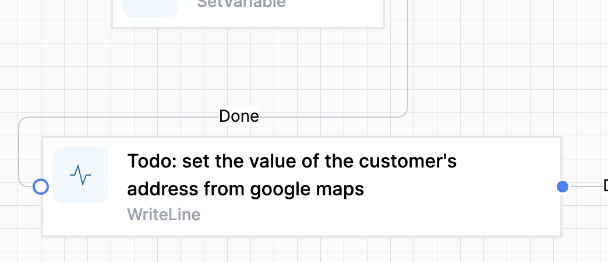

# Using `Write Line` to aid debugging

The `WriteLine` activity is an output-only activity that can be used in a variety of ways

## Show variable value

The `Text` output of the `Write Line` activity is available in the Instance Log.  Here is an example of its use:

```js  
let action = getVariable("Parameters").Action
let r = 'Key eq '
if (action == "Draft") {
    r += "'QuoteEmailHTML'"
} else {
    // final
    r += "'QuoteEmailSigned'"
}

return r
```

## Comment

The `Display Name` field in the `Write Line` activity can be used to carry comments that are easily seen in the workflow.  For example:  


## Linking branches 

Another helpful use of WriteLine is to bring branches of your workflow together.  Perhaps an if/else path needs to join up, and you need a 'holding' activity to make the graphical representation of your workflow easier to understand.  Feed as many branches into WriteLine as you need, and have a single exit point to your next activity.  You can give it a meaningful comment too.

