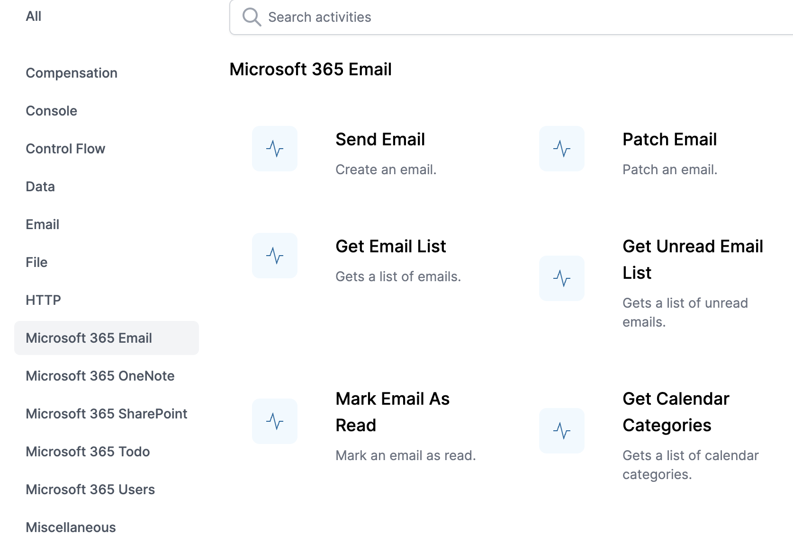
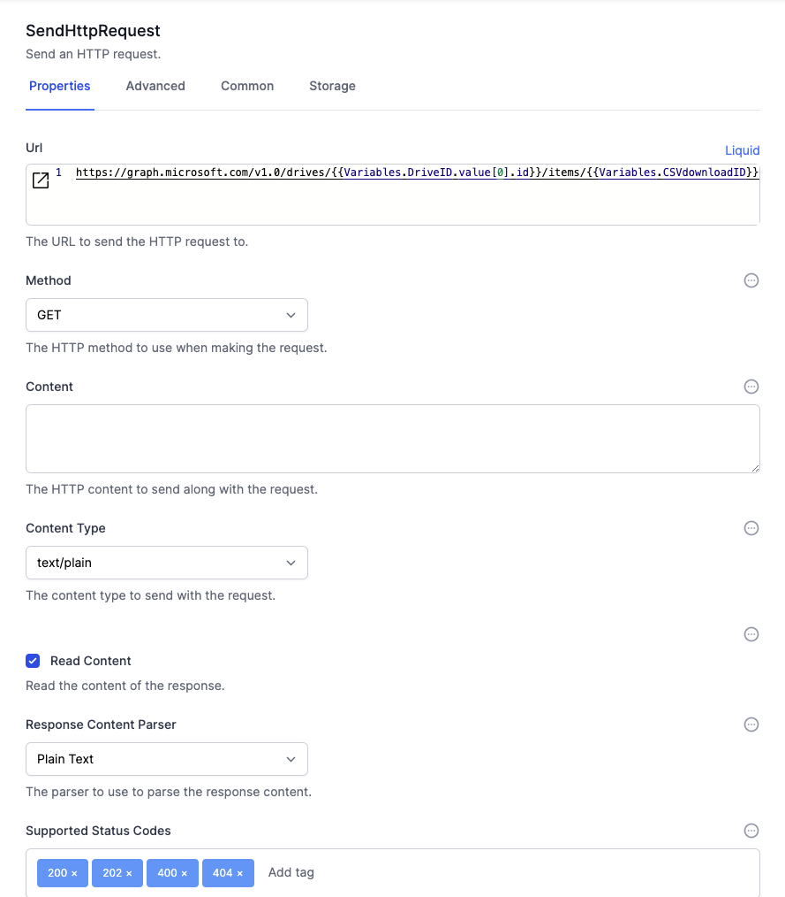

# MSGraph Plugin

This plugin allows you to easily us the Microsoft MSGraph plugin.  These are simple interfaces to some of the most commonly-used Microsoft 365 functionality, with activities for
  - Email
  - Calendar
  - OneNote
  - SharePoint
  - ToDo
  - Users  

 

For example, you can send and read emails, get unread emails, create calendar entries.  

The MSGraph API is complex and comprehensive.  This plugin makes working with MSGraph from within World of Workflows very easy.  

We add to this plugin all the time, so let us know if you need activities for additional APIs.

## Additional API Functionality

You can also access all of the MSGraph functionality using standard HTTP calls. 

Here is an example of getting a oneDrive file:

For more information on using the MSGraph API directly, use the [MSGraph Explorer](https://developer.microsoft.com/en-us/graph/graph-explorer){:target="_blank"}

