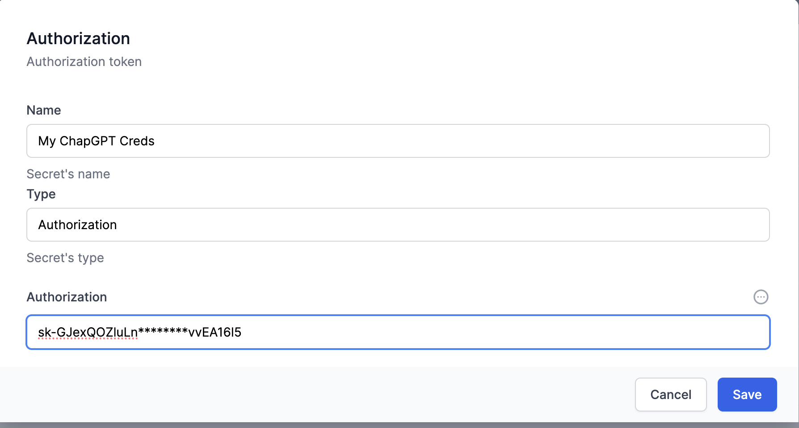
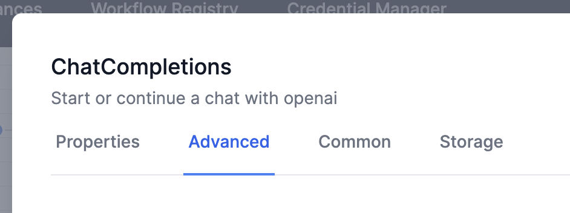
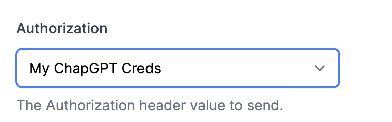

# ChatGPT activities in World of Workflows

## API access

In order to use the OpenAPI plugin, you will also need a ChatGPT API Key. (These are now called Project Keys, with more granular control over your resources).

Navigate to [api-keys](https://platform.openai.com/api-keys){:target="_blank"} to create a key.

## Create a credential for chatting with ChatGPT

1. Navigate to `Admin` -> Workflows. 
2. Open `Credential Manager`
3. Click `Add New` 
4. Select `Authorization` and give it a suitable name (eg My ChatGPT Creds)
5. Leave the Type as `Authorization`

6. Add your secret API key value in `Authorization` and save the new credential.
7. Use this credential when you create an OpenAI activity.  eg 
    
    ...
    

[Fine tuning example jsonl](../finetuning/wow16.jsonl){:target="_blank"}
