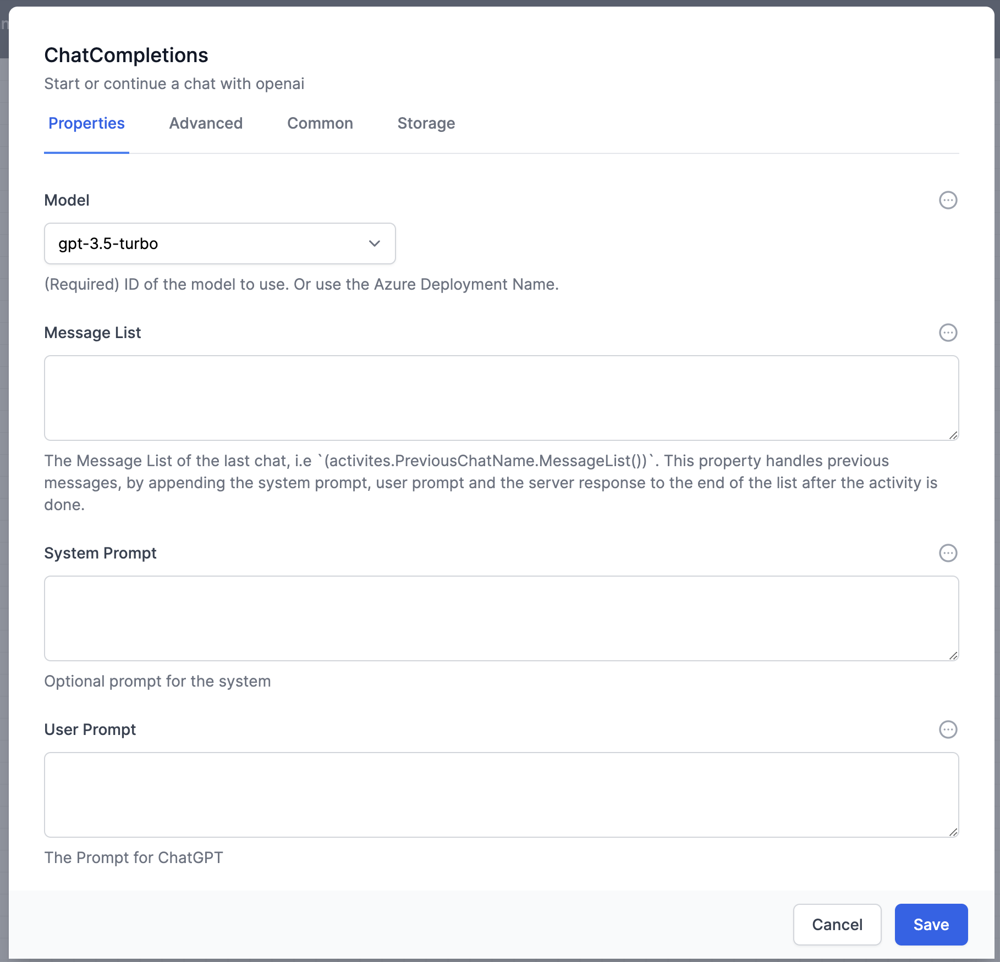
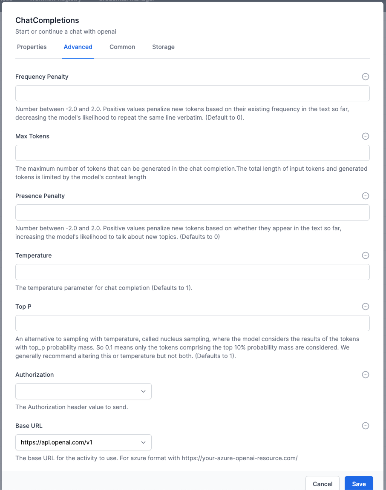
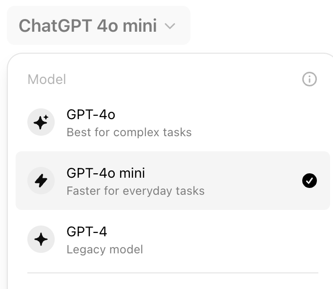
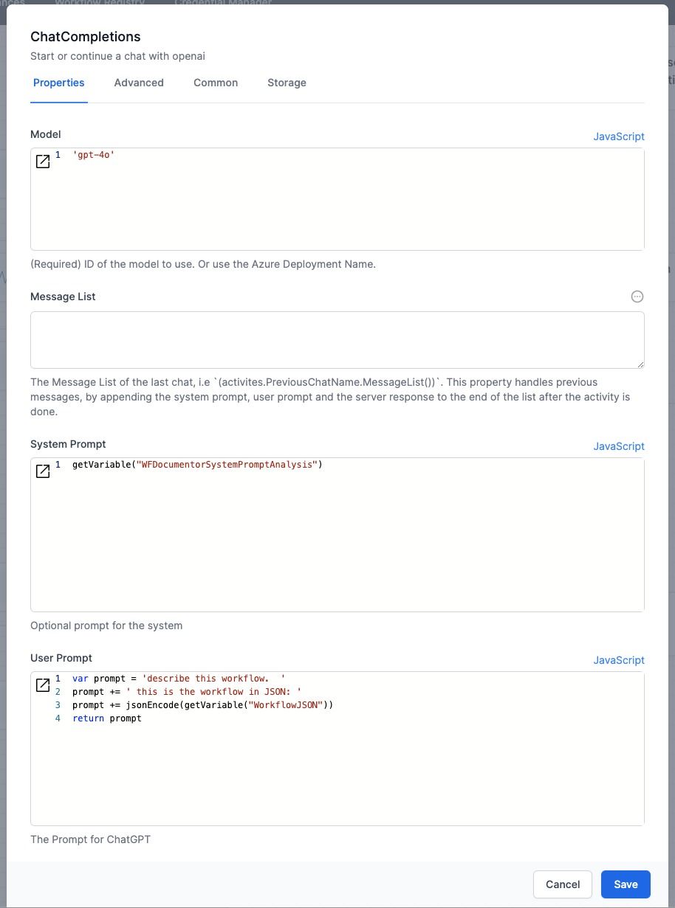
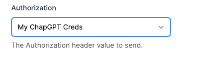
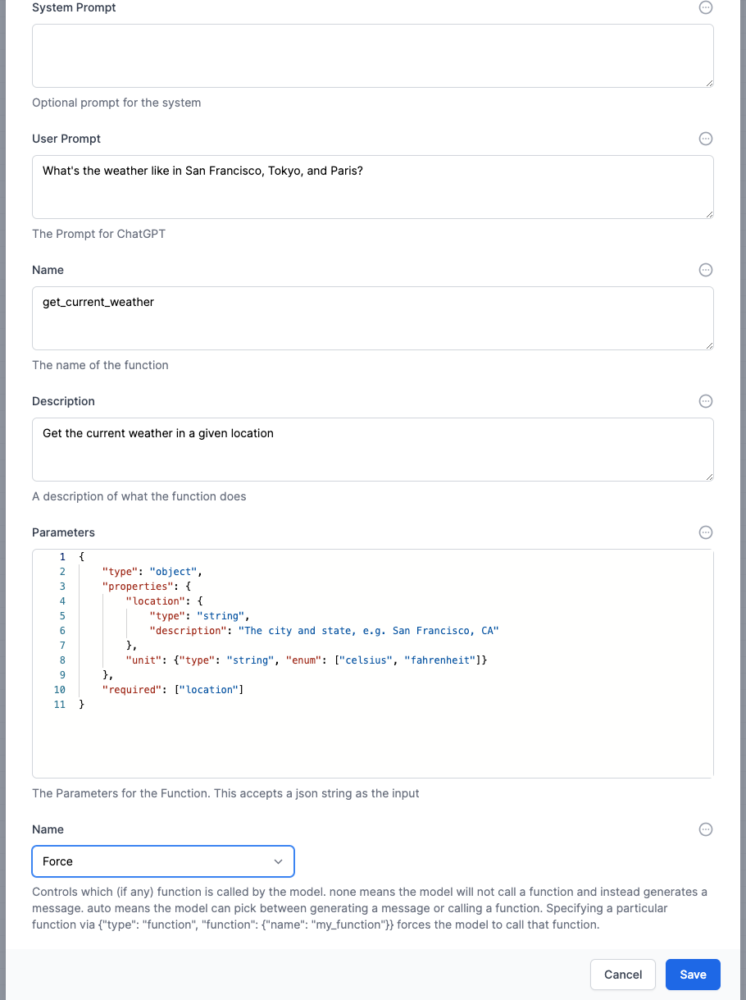
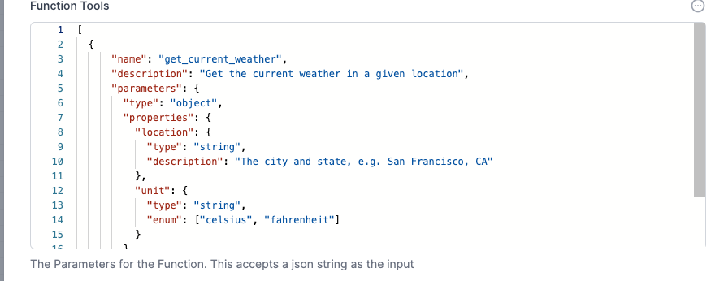
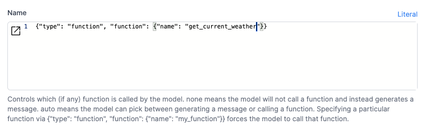
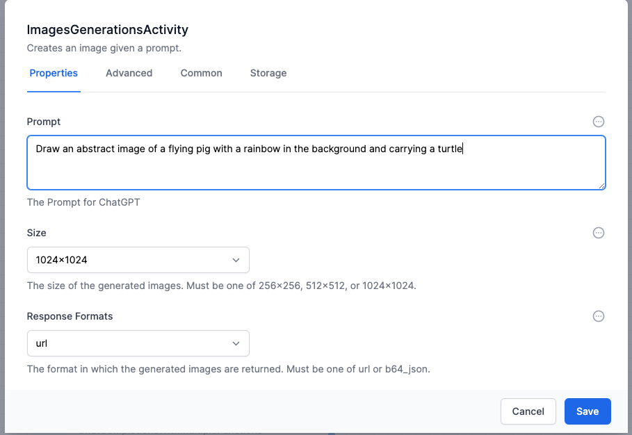

# ChatGPT activities in World of Workflows

{: .key }

In order to use the OpenAPI plugin, you will also need a [ChatGPT API Key](./OpenAIPluginAPIKey.html). 

## Chat Completions Activity

The first OpenAI activity you will likely use is `Chat Completions Activity`

There are many fields here, but you normally only need to attend to these:
- **Model** You will see this in the ChatGPT interactive interface.  The model is the name that OpenAI gives to a specific large language model.  Since new models are released regulrarly, your model might not exist in the dropdown.  Change the entry field to Literal and enter your model.  eg `gpt-4o-mini`
- **Message List** can be used to pass the previous chat output when you ask a series of questions
- **System Prompt** A string of text to give ChatGPT some context, or overriding instructions, or tone of voice
- **User Prompt** As string of text you use to ask ChatGPT a question
- **Authorization** The credential you [created](../19_plugins/OpenAIPluginAPIKey.html).

The other fields are for advanced users, and correspond to the [ChatGPT API](https://platform.openai.com/docs/api-reference/introduction){:target="_blank"}.

### Real-world example

This is how we configured the `Chat Completions Activity` to analyze a supplied workflow file:

The system prompt was obtained from a variable (so that it can be changed easily if needed) and was this
> You are a business analyst with World of Workflows. you understand Elsa workflows. You always produce output in markdown. Do not include a mermaid diagram. Do not include a conclusion paragraph. Do include: 1. 2 paragraphs to describe what the workflow is designed to achieve. 2: a table with the sequence flow, using activity names and the purpose, 3: a table of Workflow Activities showing displayName , properties.values and the purpose of any JavaScript. 4: a table of variables and how they are used. check for the setVariable and getVariable commands in any JavaScript and include these in this table 5: a table of javascript functions and what calls them.

The only Advanced tab field we set was Authorization:

## Chat Completions With Functions activity

This activity is similar to the `Chat Completions Activity`, with the added functionality of ChatGPT functions.

Functions allows you to specify a JSON format for the response.  The format will always be followed by ChatGPT if the *Name* field is selected as `Force` (see example below).

The previous example shows using the System Prompt to attempt to force ChatGPT to respond with a certain type of structured data.  When you need a specific output, use Functions.

For example, if we were asking about a PDF invoice, and wanted to know the Due Date, the amount and the company name, these would be specified as the Parameters to the function.  It looks like a JSON schema.

In all other respects, this is like `Chat Completions Activity`

Another example:

## Chat Completions With Multiple Functions activity

This activity is similar to the `Chat Completions with Functions` activity, except that you pass an array of functions to ChatGPT.

The *Name* field is can be set to Force ChatGPT to use a specific function.

## Create Image with DALLE
With this activity you can interact with Dall-E

## Create Speech activity

This allows you to engage ChatGPT to build a speak file from text.

##  Speech to Text activity

This allows you to engage ChatGPT to turn a speak file into text.
the speach file will by a ByteArray.  You might need to use the **Utilities** plugin to turn a file into a Byte Array.

The Model to use is 'whisper-1'

## Chat Completions With Vision

This activity allows an image to use used to guide ChatGPT.  The image must be a URL.  

{: .key }
If you want to use your own World of Workflows server to host the image, you will create another workflow to 'serve' that image.  

> For example, your workflow would be run via an HTTP Endpoint, answering to '/getImage?id=1234' or 'getImage?name=flyingPig'.  The workflow would use the ReadFile activity to get the file from disk (the output is a byte array) which is then sent using the `Http Response` activity.  The `Content` would be the output from the ReadFile activity.  Set the `Content-Type` to the appropriate MIME type (image/png, application/pdf, etc.).

[Fine tuning example jsonl](../finetuning/wow16.jsonl){:target="_blank"}
