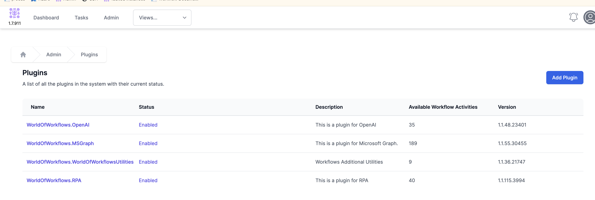

# Plugins in World of Workflows

Plugins are libraries of activities which can be dynamically added to an instance of World of Workflows.

These libraries must be digitally signed with the World of Workflows certificate, to ensure that malicious code does not get into customers hands, however library authors can create libraries and submit them for approval.

Plugins are available in [this GitHub repository](https://github.com/World-of-Workflows/WorkflowsUniversity/releases/tag/plugins-1.7){:target="_blank"}.  Download the .zip file and add to your instance of World of Workflows, using Plugin Manager:
Navigate to `Admin` -> `Plugins`

## Publicly available Plugins

- **[MS Graph](./MSGraph.html)** - This plugin allows you to easily us the Microsoft MSGraph plugin.  There are activities for
  - Email
  - Calendar
  - OneNote
  - SharePoint
  - ToDo
  - Users  
  

-  **Utilities** - This plugin contains a number of useful utilities  
   - HTML to Markdown - Converts HTML to Markdown
   - Markdown to HTML - Converts Markdown to HTML
   - PDF to Text - Extracts the text from a PDF file with OCR or text overlay
   - Byte Array to Base64 - Converts a byte array to a base64 string
   - JWT Decoder - decodes a JWT into constituent parts 
   - JWT Decoder - validates a JWT 
   - Parse Multipart form data from an HTML Endpoint
   - Base64 to Byte array - reads a Base64 data string and outputs a Byte array  

- **Autotask** - A plugin to read and write Autotask data

- **Xero** - A Plugin to read and write Xero data

- **SQL** - A Plugin to execute SQL commands from within a Workflows

- **RPA - Robotic Process Automation** - This is the Robitic Process Automation Plugin for World of Workflows. It uses Playwright to automate web applications.  It supports 3 browser types (Chromium, Edgium and Firefox) and using the available activities, almost anything you can do on a website can be automated.  

- **PowerShell** - A Plugin that allows running of Powershell scripts from within World of Workflows

- **OpenAI** - A Plugin that provides access to ChatGPT. Users will need to have registered with OpenAI and will need an API Key

## Under Development

- **AzureAdmin** - This plugin will provide tools for working with Azure.  It is a work in progress. 

- **NinjaOne** - This plugin will provide tools for working with NinjaOne.  It is a work in progress. 

## Plugin Development

World of Workflows is actively creating new Plugins, so watch [this space](https://github.com/World-of-Workflows/WorkflowsUniversity/releases){:target="_blank"}.  You can make your own too.  [Plugin Development](./plugin_development.html) describes getting started with developing your own plugin.  You are invited to write your own World of Workflows plugins to extend the functionality of your workflows.  
