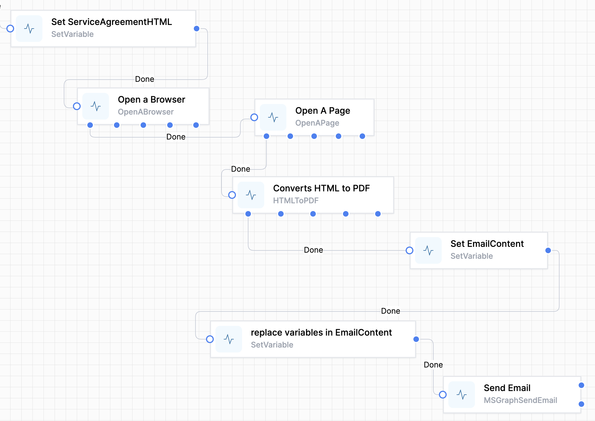
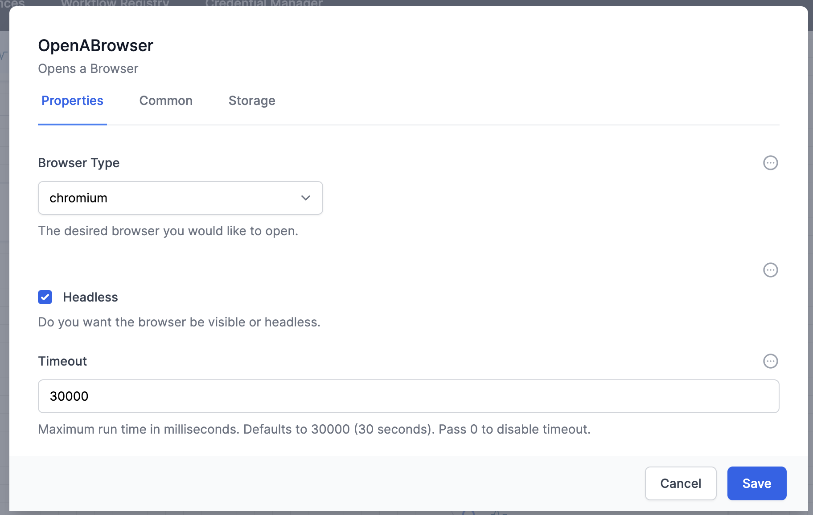
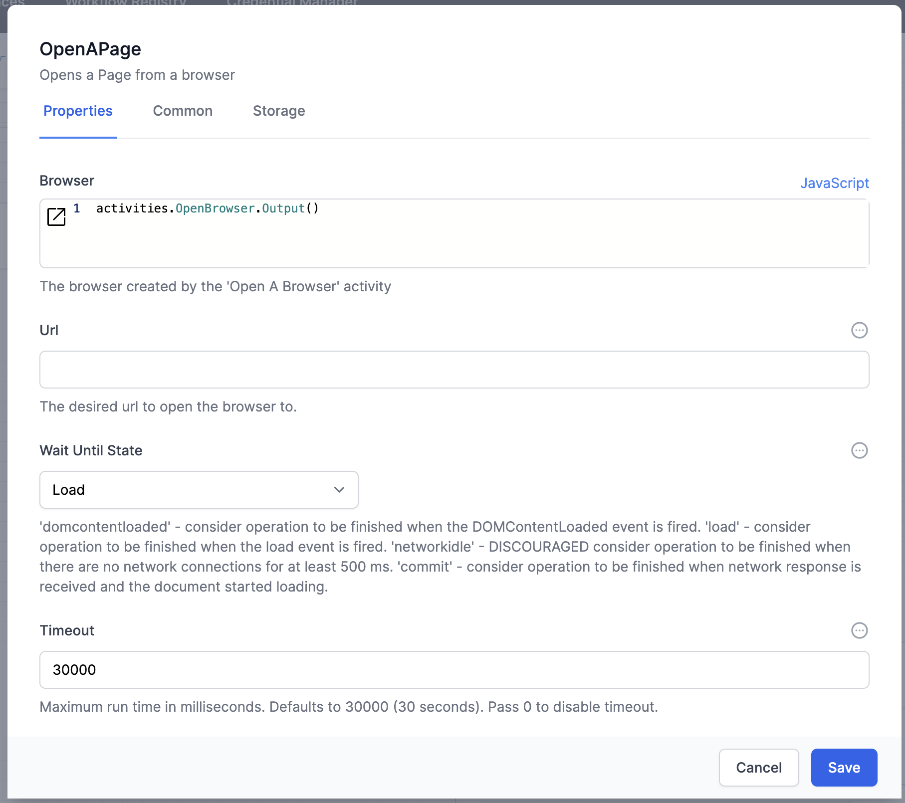
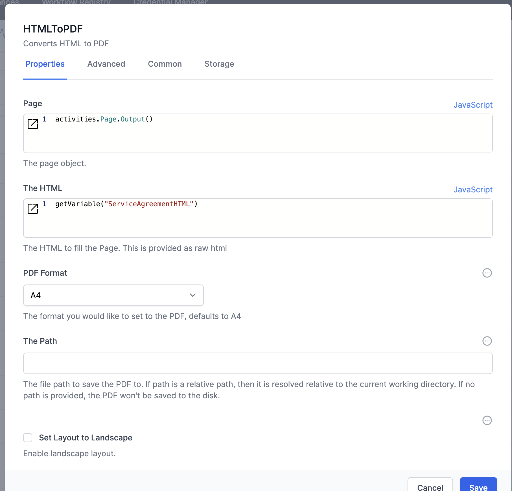
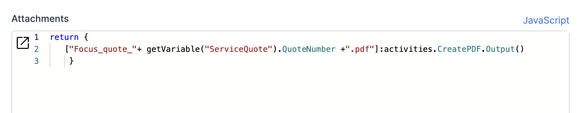

# RPA plugin
This plugin provides activities for working with websites as if your workflow were acting as a human on the website.

## Creating a PDF

One of the features of the RPA plugin is that it allows the simple conversion of HTML to PDF files.

This example shows how it can be used.  



1. ### Set up your HTML.  
   This can be in a variable, or maybe use the `Markdown to HTML` activity in the Utilities plugin.
2. ### Create the OpenABrowser activity:
   
   > You will always choose `Headless`.  Also note the extended timeout.  
     This has the name of `OpenBrowser`, for use in the next activity.  
3. ### Create and link the `OpenAPage` activity
   
   The Browser will be the output from the OpenABrowser activity.
   The Name of this activity could be `Page`
4. ### Create and link the `HTMLToPDF` activity
   
   Supply the output of the OpenAPage activity and the HTML from your variable in step 1.  
   The Name of this activity could be `CreatePDF`
5. ### To use the PDF, either 
   1. save it to disk 
      1. for Personal Edition, enter a location on your C: drive in `The Path`
      2. for Business Edition `The Path` will be on your Azure server - specify '/data' or a folder within this location, eg '/data/PDF' or
   2. Send it in an email.  
      Here is how you refer to it in the Attachments field of the MSGraphSendEmail activity from the MS Graph plugin:

      ```js
         return {["filename"]:activities.<CreatePDFActivityName>.Output() }
      ```

      For example:

      ```js
      return {
         ["Focus_quote_"+ getVariable("ServiceQuote").QuoteNumber +".pdf"]:activities.CreatePDF.Output()
      }
      ```
    
      