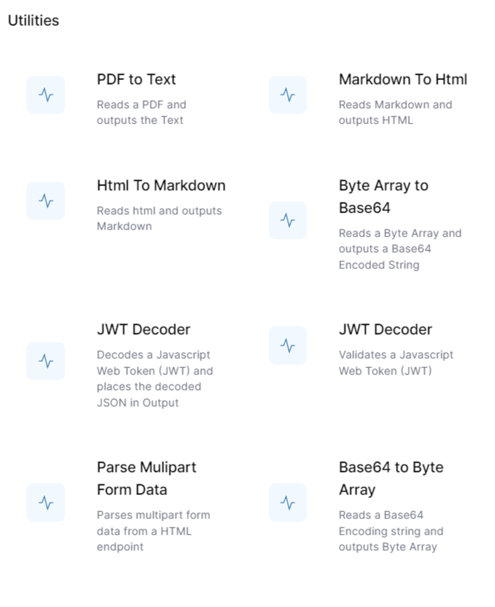

# Utilities plugin

This plugin has a number of helpful activities, and is a recommended plugin for almost all World of Workflow environments.



## PDF to Text
This activity takes a PDF file and extracts the text from it, unformatted.  It is useful when you want to send the data in a PDF to ChatGPT.  

The input will be a base64 encoded string.  For example, 
in this [sample workflow](../22_samples/UploadPDFChat.html) we POST the PDF file to an HTTP Endpoint as JSON, and then use this JavaScript in this `PDF to Text` activity:
```js
    activities.httpFileReceive.Output().body.fileContent
```

## Markdown to HTML and HTML to Markdown
These two activities are helpful when you need to convert your text between HTML and Markdown.

## Byte Array to Base64 and Base64 to Byte Array
These two activities are helpful when you need to convert binary data.  The File activities use byte arrays, so these activities will be useful when reading and writing files.

## JWT Decoder
There are two activities for this function, one is a simple decoder, the other requests validation of the JWT before it decodes it.  
These activities are used in the [**Granular Web Authentication**](../22_samples/GranualWebAuthentication.html) solution.


