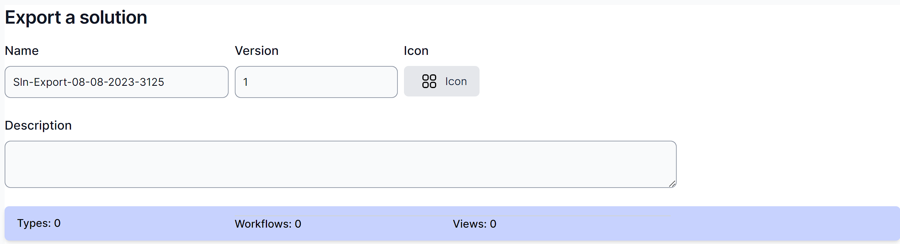
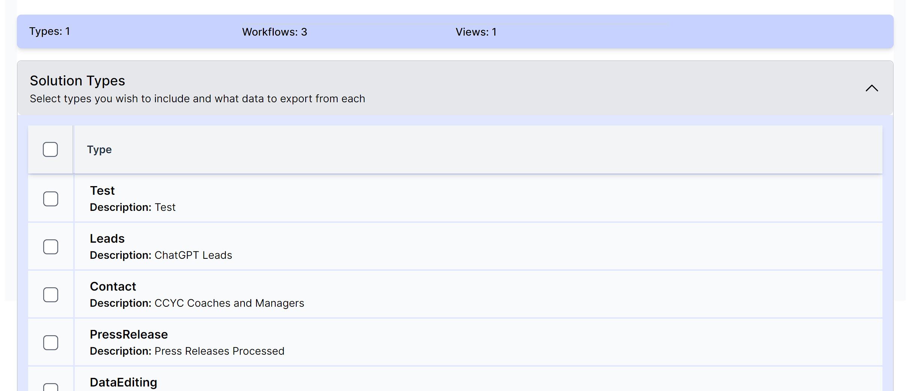
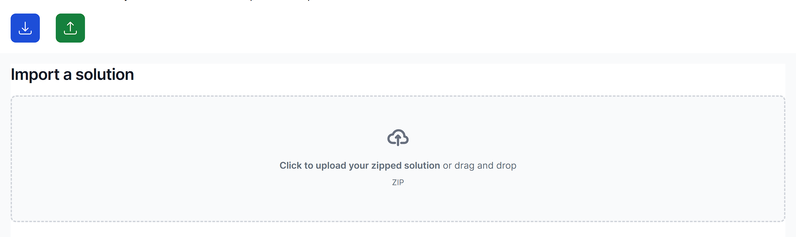
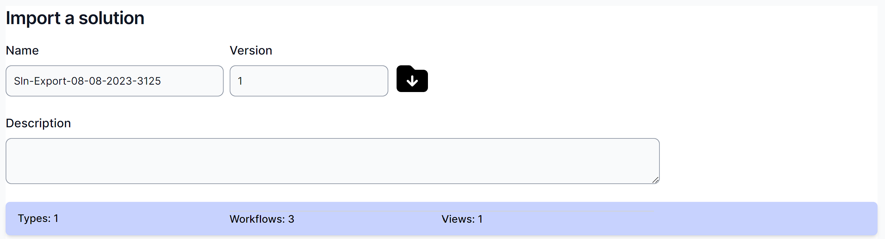
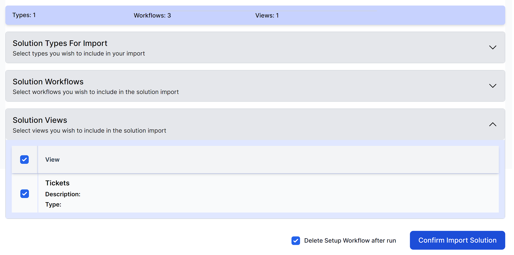

# Solutions

Solutions are packaged collections of Types, Views and Workflows. Using the Solutions feature of world of workflows, you can export these items and re-import them into another system.

**Note:** Solutions are compressed into Zip files. Solution Authors can open the zip file and edit the files within prior to sending a solution to someone else.

## Exporting Solutions

Navigate to Admin -\> Solutions and click the Export button .

Give the solution a name, version, and optional description and icon,

Next, expand **Types, Workflows** and **Views** and select the items you want to include in the solution.

When complete, click **Export Solution.**

The system will download a zip file.

In this zip file are several files:

- **SOLUTION_DETAILS** is a file which contains information on your solution in **JSON** format.

- **SETUP_WF** is a workflow that is run when the solution in imported. It creates all the types, and views. You can modify this workflow to do anything you wish by importing it into World of Workflows, editing it and exporting it.

- **The remaining files** are the workflows you wish to import.

## To import a solution

Navigate to Admin -\> Solutions and click the green import button .

Click to upload the solution or drag and drop.

Check the Name, Version, Icon and Description are what you expect:

Verify (or deselect) the types, workflows and views.

Finally, check whether you want to delete the setup workflow after run and click **Confirm Import Solution.**

**Important:** Importing solutions is at your own risk. Solutions can contain destructive workflows so ensure you check the solution source and setup workflow before importing.
