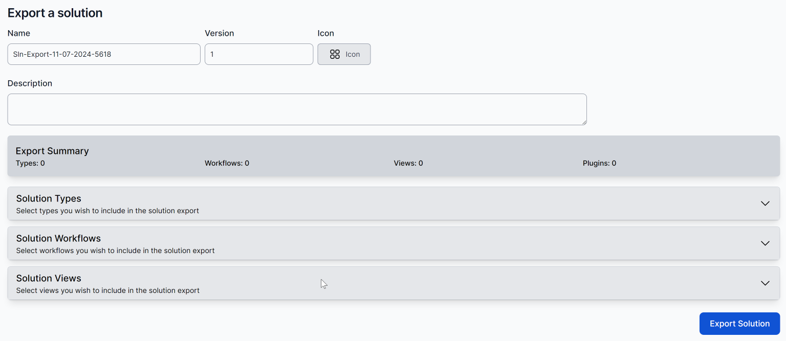

# Solutions: Export and Import your work

Any World of Workflows instance will be a collection of Types, Views, Data, Workflows and possibly Plugins.  

An important feature of World of Workflows is that these are portable between World of Workflows instances.  Development is usually performed on your own copy of Personal Edition.  When the time comes to add this to your Business Edition instance you will use Solutions Export and Import.

Solutions are packaged collections of Types, Views and Workflows. Using the Solutions feature of world of workflows, you can export these items and re-import them into another system.

**Note:** Solutions are compressed into Zip files. Solution Authors can open the zip file and edit the files within prior to sending a solution to someone else.

## Creating a Solution

1. Navigate to `Admin` -> `Solutions` in your source instance (eg Personal Edition)  

2. Select `Create Solution Export`  

3. Enter a name (or take the default), a version if relevant, an icon (to brand your solution) and a description to indicate the contents of your Solution.
4. Choose the Types, Workflows and Views
   

5. When you select a Type, you can choose to also copy some of the data within the type.  This can be helpful when setting up a Production environment from your Development environment, to copy items such as the list of Statuses used in a dropdown menu
   
6. Types which reference other Types are noted in blue.  Selecting one (eg Contacts in this example will automatically select the referenced types.  You can unselect these as appropriate.
   
7. Select any desired Workflows  
   
   Any Plugins required by your workflows will be automatically included in the solution.'
8. Select any desired Views   
   

> Note that Search text on this page is Case Sensitive

A summary is displayed.  Use the button to export the solution

A Zip file will be created in your browser's download folder.

### Modifying a Solution

World of Workflows is an open, extensible environment.  This applies to Solutions as well. 
A Solution is a carefully-crafted World of Workflows workflow.  Like any workflow, it can be altered using World of Workflows graphical interface.  
Here is an example of the contents of a Solution:  
  
You can import any of the SETUPxxx_WF.json files to modify what the workflow will do when the solution is imported.  This might be useful if you wanted to run a proprietary workflow once when a solution is imported.
Note that the Utilities plugin is included in this solution.

## Importing a solution

To add a Solution to a World of Workflows instance:
1. Navigate to `Admin` -> `Solutions`
2. Click `Import Solution`
3. Select the solution's .Zip file
4. Confirm the actions before importing the solution.
   