# Register an Office 365 Application

> **Note:** These steps need to be performed by an administrator of your office 365 environment. If you are not an administrator, send this document to your administrator and ask for the table below to be filled in:

# Information required
The following table is the required information to connect World of Workflows to Office 365

| Item | Value | Description | 
| --- | --- | --- |
| OAuth 2.0 authorization Endpoint | ```https://login.microsoftonline.com/12818749-ac4d-484c-b76b-535e933a3458/oauth2/v2.0/authorize``` | This is the authorization endpoint for Office 365. Replace ```12818749-ac4d-484c-b76b-535e933a3458``` with your tenant id. |
| OAuth 2.0 token Endpoint | ```https://login.microsoftonline.com/12818749-ac4d-484c-b76b-535e933a3458/oauth2/v2.0/token``` | This is the token endpoint for Office 365. Replace ```12818749-ac4d-484c-b76b-535e933a3458``` with your tenant id. |
| Client Id | ```83985cc1-e552-4908-a038-8e12dec21fbc``` | This is the client id for the application, available in the overview page of the application. |
| Client Secret | xxx | This is the client secret, recorded from below |


# Registering the application
The following steps register the application correctly in order to connect World of Workflows to Office 365.

1. Navigate to the [Azure Portal Azure AD Blade](https://portal.azure.com/#view/Microsoft_AAD_IAM/ActiveDirectoryMenuBlade/~/Overview) at https://portal.azure.com/#view/Microsoft_AAD_IAM/ActiveDirectoryMenuBlade/~/Overview
   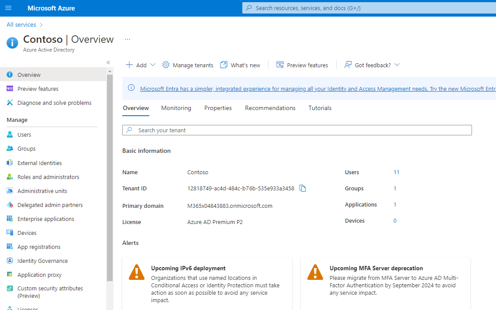
2. Click **App Registrations**
   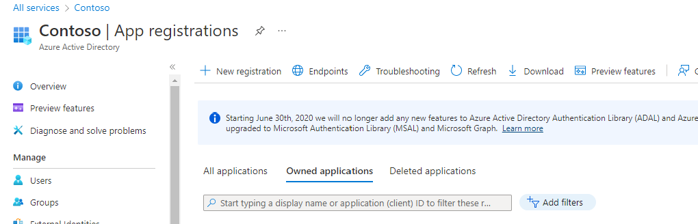
3. Click **New Registration**
   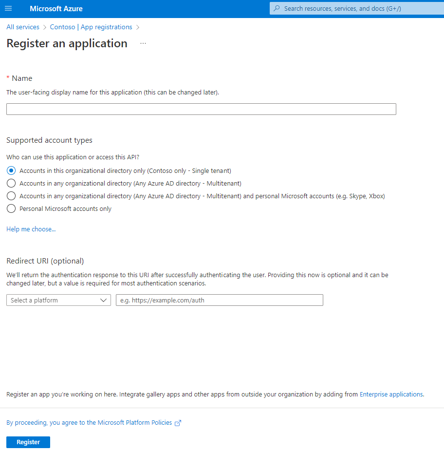
4. Enter the following details:
   1. **Name:** World of Workflows
   2. **Supported Account Types:** Accounts in this organizational directory only
   3. **Redirect URI:** - Leave Blank
   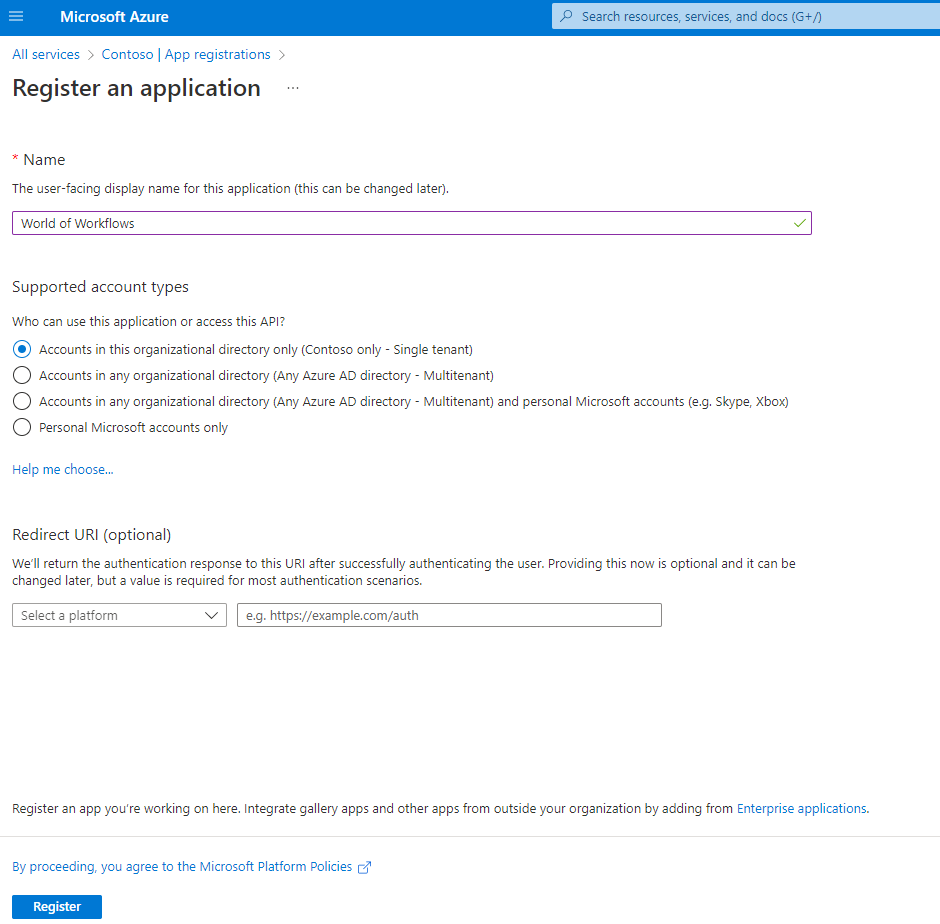
5. Click **Register**
   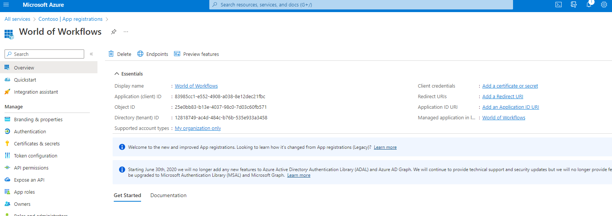
6. Click **Add a Redirect URI**
   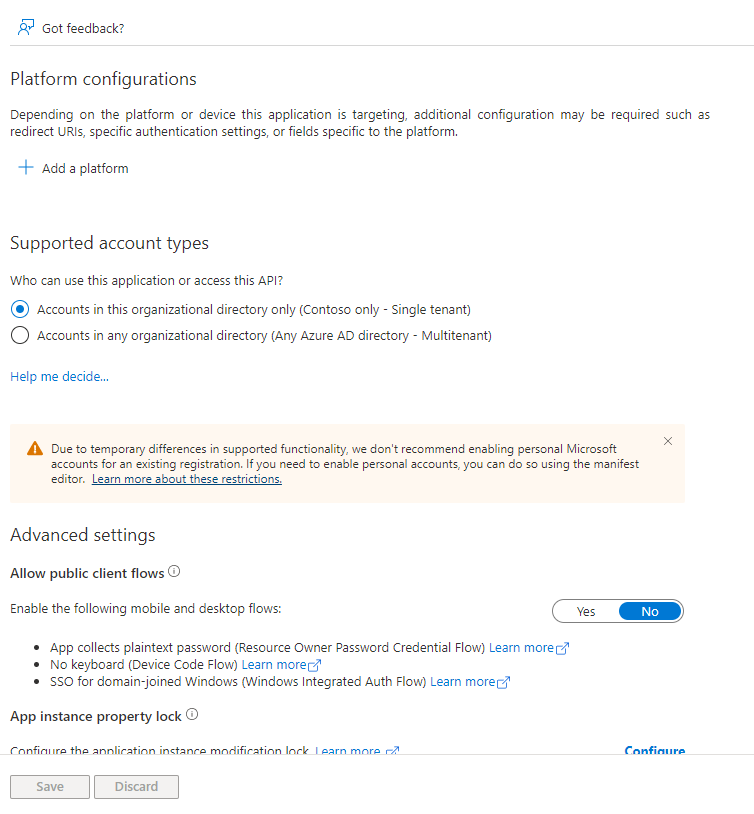
7. Click **+ Add a platform**
   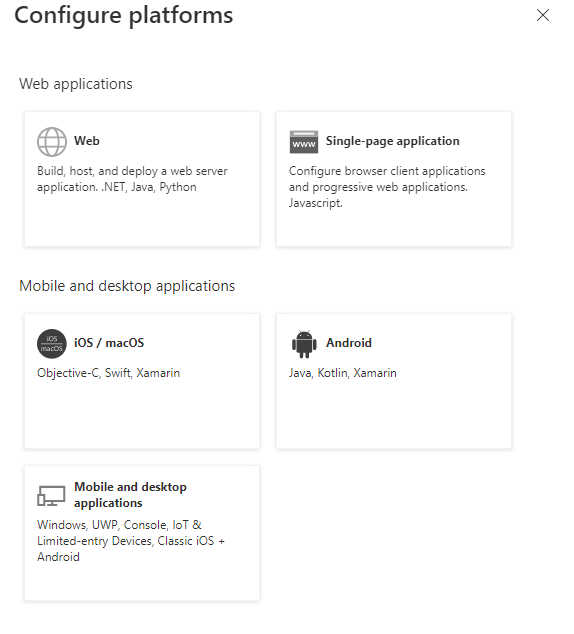
8. Click **Web**
   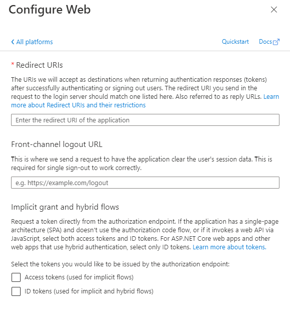
9. Add the redirect URI of ```https://localhost:7063/v1/oauth2/callback``` for World of Workflows PE. For any other edition, replace ```localhost:7063``` with your World of Workflows domain.
10. Select both Access tokens and ID tokens and click **Configure**
  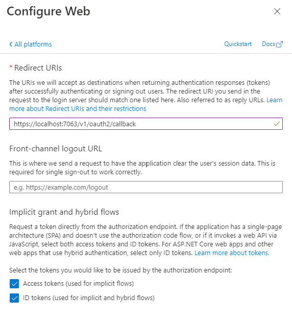 
11. On the left choose **Certificates and Secrets**
    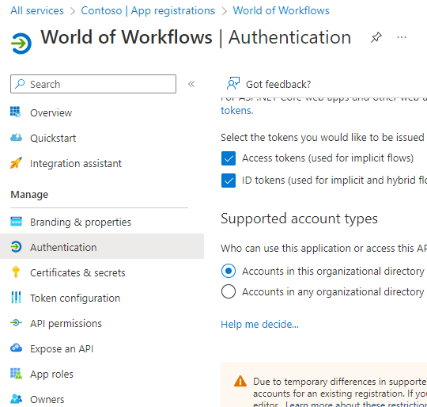
12. Click **New Client Secret**
    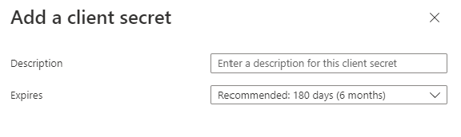
13. Add a description, e.g. World of Workflows. 
14. Add a Expiry. *Remember to set a calendar message to remind you to create a new secret and update workflows before expiry!*
15. Click **Add**
16. Copy the Value and record somewhere (paste into the table at the top of this document). The secret will no lonber be visible after you leave this page.
    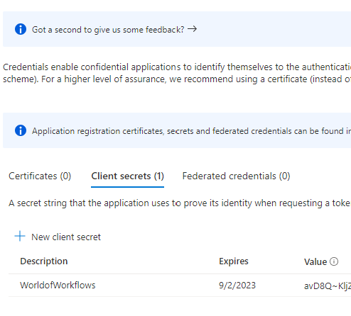
17. Record the Secret Id.
18. Navigate to **Overview** on the top left
19. Click **Endpoints**
20. Record the correct information for the table at the top of this document.
21. Your completed Credential screen should look something like this:

22. Click Authorize and follow the prompts to sign in.

