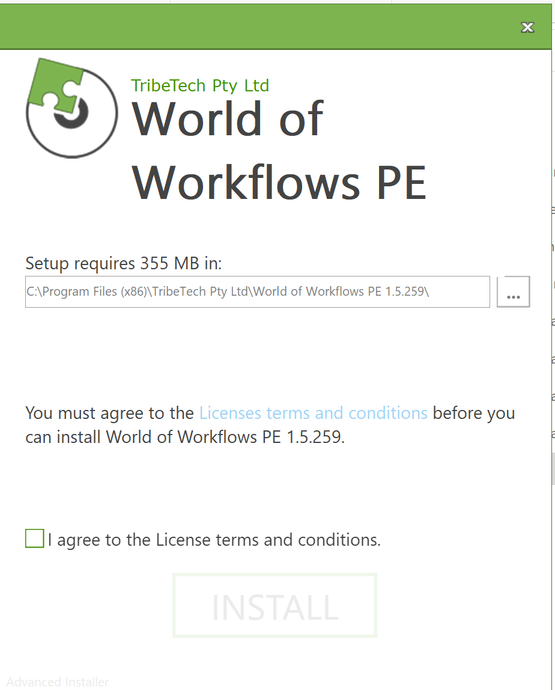
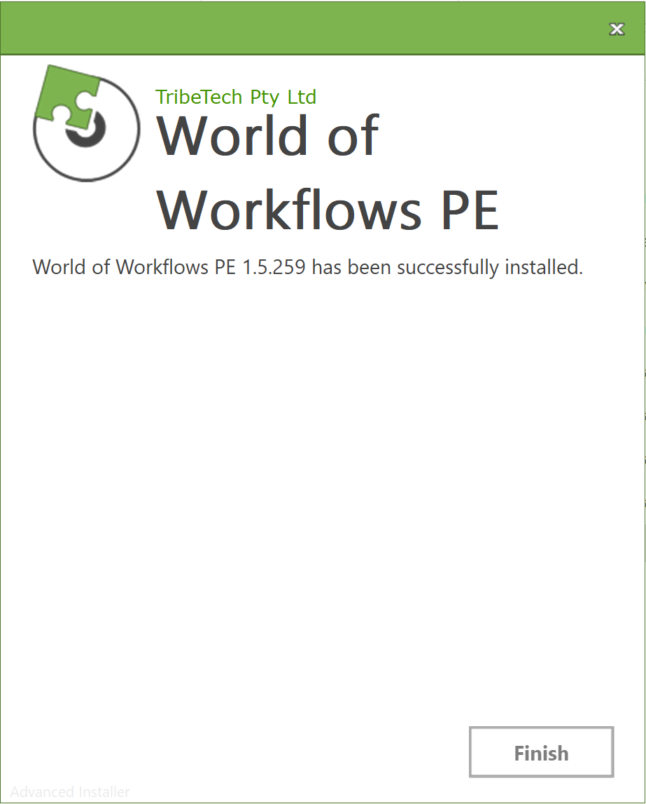
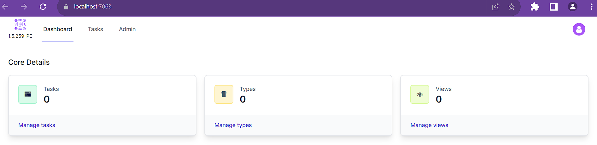
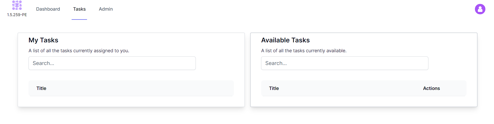
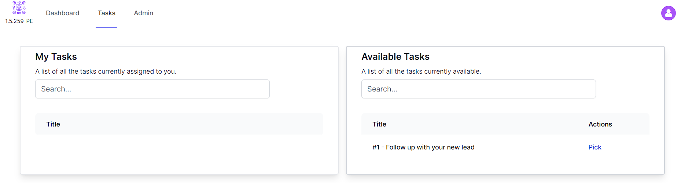
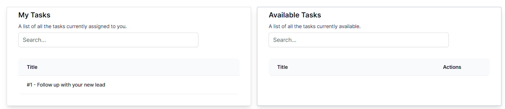
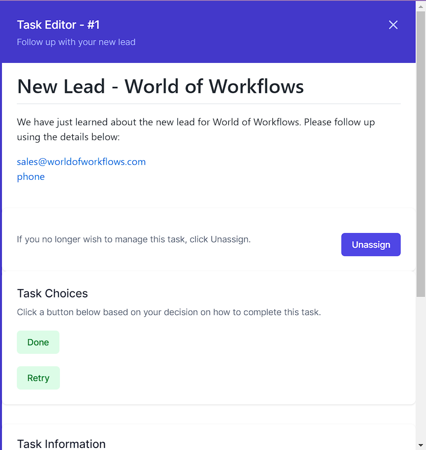
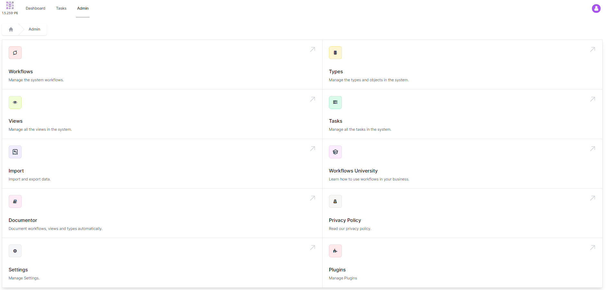

# Introduction to World of Workflows

"World of Workflows" is an innovative software solution engineered to enhance and simplify your business processes. It offers an intuitive environment for devising, administering, and automating workflows, both straightforward and intricate. Any process consisting of multiple steps is considered a workflow in this comprehensive system. With a selection of over 100 activities, expandable through plugins, you can effortlessly customize workflows to align with your organization's specific requirements.

The software is fortified with a versatile, user-configurable database and a sophisticated task management system, allowing for effective project and task management, team collaboration, and real-time progress tracking.

There are two main editions of "World of Workflows":
* The Personal Edition (PE) is designed for personal use or workflow development and operates on a local PC.
* The Business Edition (BE) can be run on any major cloud provider or your own servers, and it offers additional features such as single sign-on and elaborate permissions and access control.

The software's key features and components include the Workflow Editor, which offers a flexible interface for creating and modifying workflows. It offers a broad array of pre-existing activities, a user-configurable database for data management and integration with external databases or APIs, and a powerful task management system for task creation, assignment, and tracking.

Additionally, "World of Workflows" offers workflow templates for swift implementation of common processes, advanced features like workflow automation with triggers, integration with third-party applications, and the ability to create custom activities. The Business Edition provides comprehensive security and permission settings to ensure data protection and controlled access.

The software's extensibility is further demonstrated with plugins that extend system capabilities, OData access for simplified reporting and dashboarding, and a Credential Manager for secure connections to third-party APIs and systems.

The extensible database, accessible both from the User Interface and within workflows, offers high performance, customizable tables, columns, and relationships, custom views, flexible import and export options, and inline editing.

The detailed task system incorporates features like Task Queues, Task Details formatted with Markdown, the ability to update database data directly from a task, and custom outcomes that branch the workflow. This allows the system to instruct users where manual tasks are needed, thereby enhancing the overall efficiency and effectiveness of task management.

In this module, we're going to use the Personal Edition. You can download a copy for free by registering at [www.worldofworkflows.com](https://www.worldofworkflows.com/). Once you've registered, you'll receive an email with a link to download the software. 

## Installation
1. Download the software from the link provided in the email.
2. Run the installer and follow the prompts to complete the installation.
   
3. Choose the folder and click I agree to the License terms and conditions
4. Click **Install**
   
5. Click **Finish**
6. On your desktop will be an icon for World of Workflows. Click to open the application
   
7.  When you see the image above, installation has successfully completed

## Navigating the User Interface
On the home page or **Dashboard**, you can see the following
1. An icon top left showing the version of the software (in this case 1.5.259-PE)
2. A menu showing **Dashboard**, **Tasks**, and **Admin**
3. Three tiles showing **Tasks**, **Tables** and **Views**

## Tasks
The Tasks screen allows an end user to work with incoming task queues and manage their own to do list.

The right hand pane, **Available Tasks** shows a list of tasks available for processing. To add a task to the **My Tasks** list, you click on any task within the **Available Tasks** list. This is called **Picking** a task.

Once a task is **picked**, it moves to the left column and is available for use. 

The screen below shows the tasks page with a new task

Now, by clicking the task, it has become **picked**

Finally by clicking the task in the **My Tasks** list, you can work with the task.

> The reason we use this system is to allow task queuing. In a multi-user system, we don't want two people doing a task, so we present a list of available tasks. The second a user **picks** a task, it becomes unabailable to other users.

When you click the task, the task editor appears.

The task editor allows you to work with the task.

The title at the top (in blue in this example) shows the Id of the Task, in this case **#1** and the title of the task, in this case **Follow up with your new lead**.

Right below that is the task description. This is a form of rich text, allowing videos, images, links, and other formatting.

Below that is the ability to **Unassign** a task. This removes it from your list and adds it back to the list of available tasks.

Below that are tack choices, allowing you to choose from a list of options. In this case, the task is **Follow up with your new lead** and the choices are **Done** or **Retry**.

> Tasks also have the ability to include editing of data in the database, but that will be covered later.

All other areas in World of Workflows are within the **Admin** section from the menu.

## Admin

The Admin page allows you to work with and configure the rest of the system. An overview of the areas are below, with details to follow.

### Workflows
Workflows are the core of World of Workflows. Workflows allows you to create automated processes, by joining a rich set of activities together. Workflows are limited by your imagination, but can do anything from qualify a lead, send an email, update date and much, much more.

### Tables
This is the database system within World of Workflows. The platform contains a rich, relational and fast database you can use to store and manipualte any data you require.

### Views
Views are custom views of your data which can then appear as menu items in the system. For example, you may have a view of all your customers, or a view of all your products. These views can then be used to create tasks, or to display and edit data in the system.

### Tasks
This allows you to administer all the tasks in the system.

### Import
This wizard allows you to easily import data from CSV into World of Workflows Tables.

### Workflows University
Our online training and reference system. Use this to access live training, help and information on the platform.

### Documentor
The documentor automatically documents your environment including all types, views and workflows.

### Privacy Policy
View and review legal agreements for World of Workflows

### Settings
Use this to enable developer mode, restart World of Workflows, or create a backup.

### Plugins
Plugins extend workflows with additional functionality. Use this section to add, remove and configure plugins.