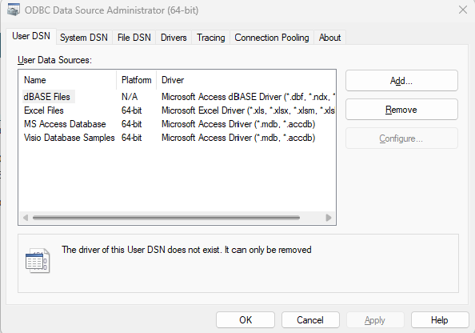
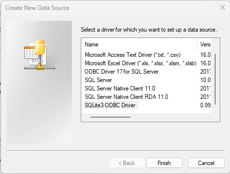
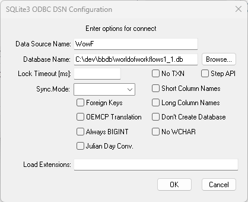
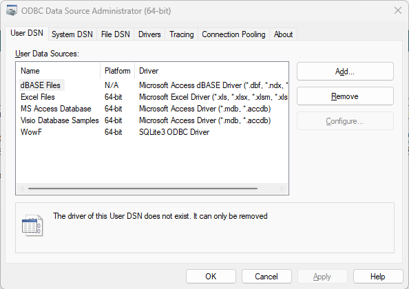
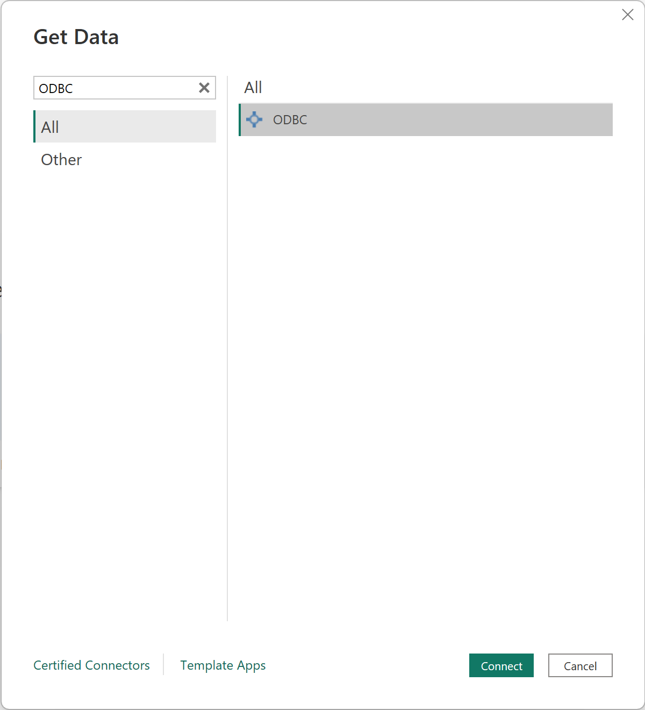
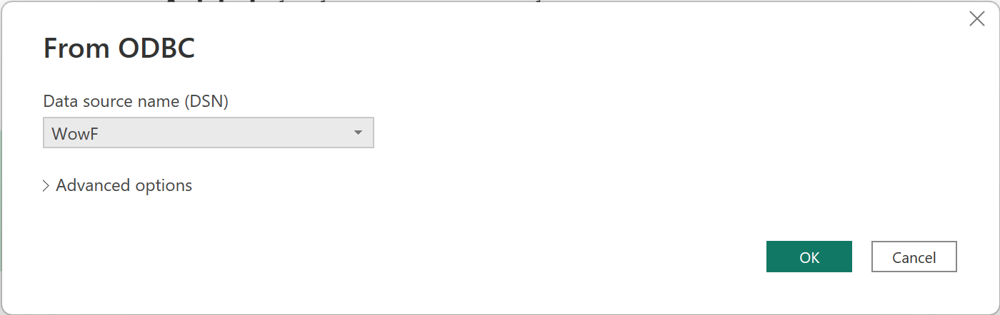
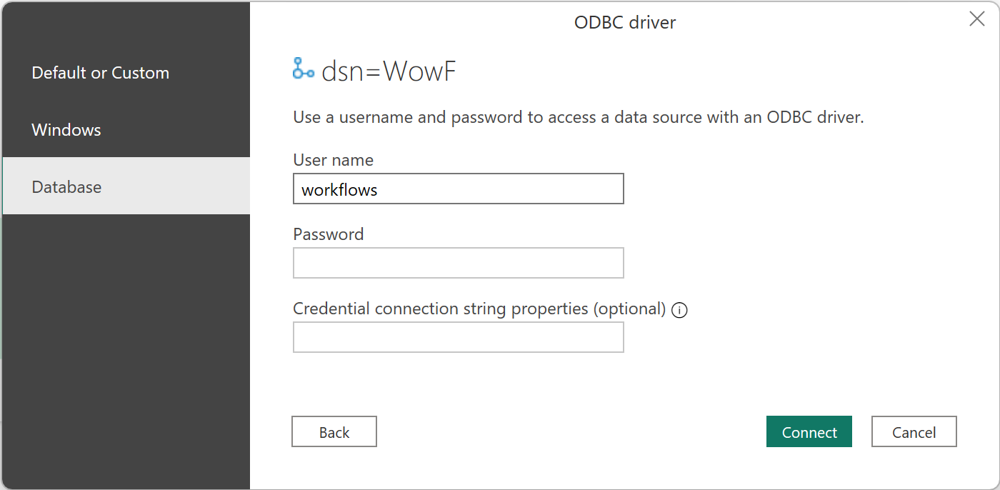
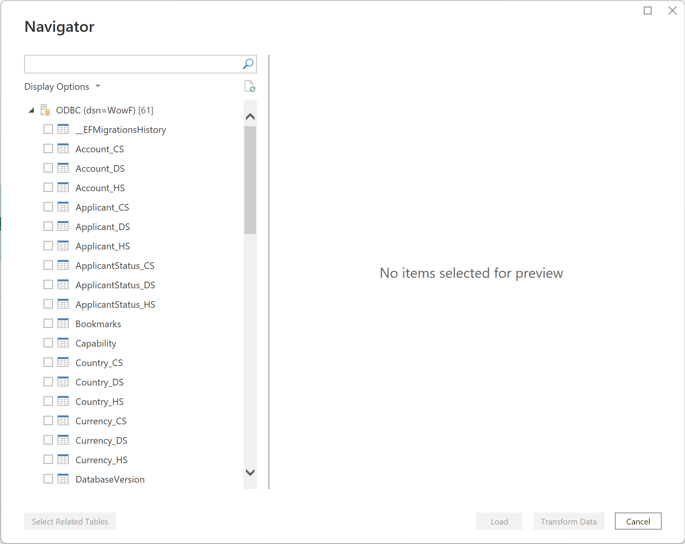

# Reporting in World of Workflows

This section of the documentation covers the reporting features of Workflows PE. World of Workflows PE stores its data in a [SQLite](https://www.sqlite.org/index.html) database.

In a default configuration, this will be located in the following location:

```cmd
C:\ProgramData\WorldOfWorkflows\worldofworkflows.db
```

In that folder are also regular backups which are automatically taken every time the World of Workflows Service starts and stops.

## Prerequisites

To report on the database, you will need to install and configure the Sqlite ODBC Driver. Please download and run the appropriate one for your system:

1. For x86 machines, download the [32-bit ODBC Driver](sqliteodbc.exe)
2. For x64 machines, download the [64-bit ODBC Driver](sqliteodbc64.exe)

## Backup your database
To report on a database, we **strongly** recommend you take a copy of your database, using the following simple procedure.

1. Stop the World of Workflows Service
   1. Open Services manager - Windows Key - R - services.msc
   2. Scroll down to find World of Workflows
   3. Click Stop
2. Copy the database somewhere else and record this location
3. Click Start to restart World of Workflows.

## Configure your DSN
To configure the connection, click Start and type ODBC. For x86 machines, choose ODBC Data Sources (32-bit). For x64 machines, choose ODBC Data Sources (64-bit).



Click **Add**



Choose **SQLite3 ODBC Driver** and click **Finish**



In the **Data Source Name** field, enter a name for your connection. This can be anything you like, but we recommend you use WowF.

Click **Browse** and navigate to the database file you saved earlier. When done, click **Ok**.



## Reporting in PowerBI
If you don't have PowerBI, you can download it for free from [here](https://powerbi.microsoft.com/en-us/desktop/).

Once you have PowerBI installed, you can connect to your database using the DSN you created earlier.

1. Open PowerBI
2. Click **Get Data**
3. Choose **ODBC**
   
4. Select your DSN Created above
   
5. Enter any username and click **Connect**
   
6. Choose the tables you want to report on and click **Load**
   

You can now report on World of Workflows using PowerBI. All relationships will be preserved.


