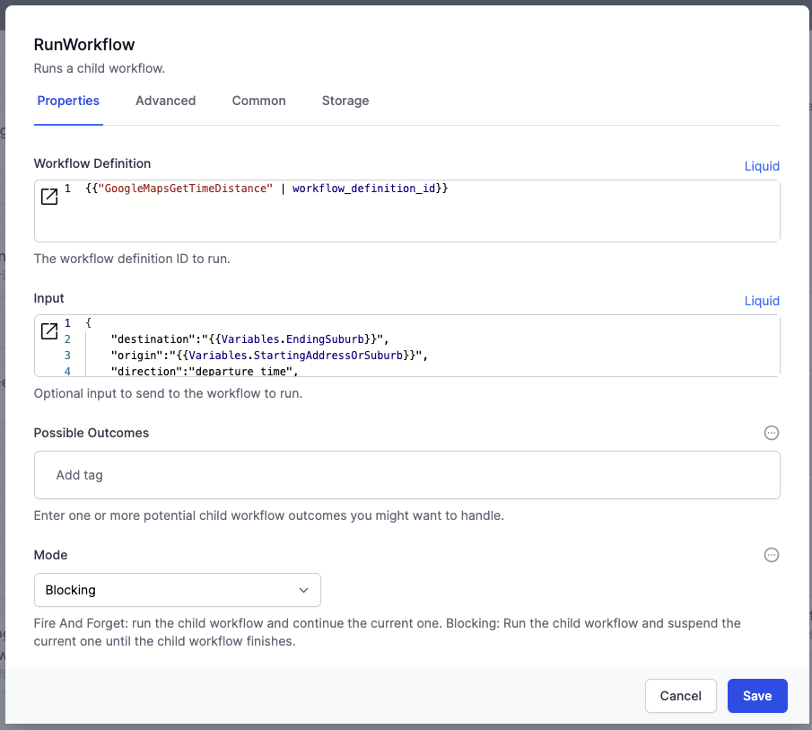
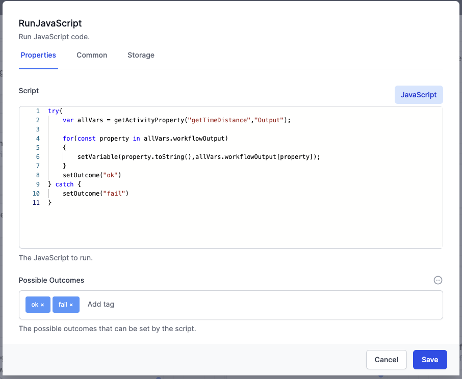


# Calling Google Maps API for Distance and Time calculations

The Google Maps API allows a developer to find out how long it takes to travel between 2 locations.

{: .key }
This is a paid service.  The cost of each API call is measured in fractions of a cent; nevertheless ensure you budget for expected volumes.


You will need to [register with Google API](https://cloud.google.com/docs/authentication/api-keys){:target="_blank"} to obtain your personal Google API key.

## Set up the call to this workflow

The `GoogleMapsGetTimeDistance` workflow is called from a 'parent' workflow, using the `RunWorkflow` activity:



The parent workflow sets up the following Liquid parameters

```json
{
    "destination":"{{Variables.EndingSuburb}}",
    "origin":"{{Variables.StartingAddressOrSuburb}}",
    "direction":"departure_time",
    "time":"{{Variables.StartDateTime}}",
    "State":"{{Variables.State}}",
    "Ref":"{{Variables.Reference}}"
}
```


## GoogleMapsGetTimeDistance

You can <a href="./google-maps-get-time-distance.json" download> download </a>this sample workflow

**GoogleMapsGetTimeDistance** workflow is designed to retrieve the travel time and distance between two locations using Google Maps API.

Below are the detailed steps of the workflow:

1. **Set GetInput Variable**:
   - **Activity Type**: `SetVariable`
   - **Description**: Sets the variable `GetInput` from the input provided to the workflow.
   - **JavaScript**: `input`

2. **Get Parameters**:
   - **Activity Type**: `SetVariable`
   - **Description**: Parses the input JSON to extract parameters like origin, destination, state, time, booking reference, and direction.
   - **JavaScript**: `JSON.parse(getVariable("GetInput") ?? '')`
   - **Variable**: `Parameters`

3. **Write Parameters**:  
   > This describes what to expect as parameters from the parent workflow.  Note that this cannot be the first activity: the firt activity MUST use the JavaScript `input` command to deal with the incoming parameters. 
   - **Activity Type**: `WriteLine`
   - **Description**: Outputs the parameters for debugging purposes.
   - **Text**: Parameters like destination, origin, reference, time, direction, state.

4. **Set up Google Maps Strings**:  
   This is where we set the variables that we want to pass to the Google Maps API.  All are values passed from the parent workflow.

   - **Activity Type**: `RunJavaScript`
   - **Description**: Constructs strings for origin and destination by concatenating the state and sets other variables.
   - **JavaScript**:
     ```javascript
     try {
       setVariable("destination", getVariable("Parameters").destination + ' , ' + getVariable("Parameters").State);
       setVariable("origin", getVariable("Parameters").origin + ' , ' + getVariable("Parameters").State);
       setVariable("direction", getVariable("Parameters").direction);
       setVariable("time", getVariable("Parameters").time);
       setVariable("Ref", getVariable("Parameters").Ref);
       setOutcome("ok");
     } catch {
       setOutcome("fail");
     }
     ```
   - **Possible Outcomes**: `ok`, `fail`
   
    {: .key }
    SetOutcome() allows you to build different branches from the `RunJavaScript` activity
     

5. **Condition Check: If Time is Valid**:
   - **Activity Type**: `If`
   - **Description**: Checks if the time variable is valid.
   - **JavaScript**:
     ```javascript
     if (isNullOrEmpty(getVariable("time"))) return false;
     return true;
     ```

6. **List Google Maps Key Settings**:  
   This activity retrieves a single entry from the Settings Type, using a filter.
   - **Activity Type**: `ObjectInstanceList`
   - **Description**: Retrieves the Google Maps API key from the settings.
   - **ObjectType**: `Settings`
   - **Filter**: `Key eq 'GoogleMapsKey'`
   - **Limit**: `1`

7. **Set Google Maps Key**:  
   Note the use of the first (only) entry in the returned list, using the [0] entry
   - **Activity Type**: `SetVariable`
   - **Description**: Sets the `GoogleMapsKey` variable.
   - **JavaScript**:
  
     ```javascript
     try { activities.ListGMK.Output()[0].Data1 }
     catch {}
     ```

8. **Convert Time to UTC Time in Seconds**:
   - **Activity Type**: `RunJavaScript`
   - **Description**: Converts the provided time to UTC time in seconds since the Unix epoch.
   - **JavaScript**:
    
     ```javascript
     try {
       const sydneyTime = new Date(getVariable("time"));
       const timezoneOffset = sydneyTime.getTimezoneOffset() * 60000;
       setVariable("timezoneOffset", timezoneOffset);
       const utcTimeInMilliseconds = sydneyTime.getTime() - timezoneOffset;
       const utcTimeInSeconds = Math.floor(utcTimeInMilliseconds / 1000);
       setVariable("output", getVariable("time") + ` Sydney time corresponds to ${utcTimeInSeconds} seconds since the Unix epoch (UTC).`);
       setVariable("utcTimeInSeconds", utcTimeInSeconds);
       setVariable("utcDateTime", new Date(utcTimeInMilliseconds));
       setOutcome("ok");
     } catch {
       setOutcome("fail");
     }
     ```

9.  **Check for Null Time Fault**:
   - **Activity Type**: `Fault`
   - **Description**: Generates a fault if the time is null.
   - **Message**: `time is null`

10. **Check for Bad Parameters Fault**:
    - **Activity Type**: `Fault`
    - **Description**: Generates a fault if parameters are invalid.
    - **Message**: `bad parameters`

11. **Get Time Distance from Google Maps**:  
    This is the actual call to Google Maps.  The parameters are all passed in the URL as replaceable Liquid variables.
    - **Activity Type**: `SendHttpRequest`
    - **Description**: Sends a GET request to the Google Maps API to get travel time and distance.
    - **URL**:
      ```liquid
      https://maps.googleapis.com/maps/api/distancematrix/json?destinations={{Variables.destination}}&origins={{Variables.origin}}&units=metric&key={{Variables.GoogleMapsKey}}&{{Variables.direction}}={{Variables.utcTimeInSeconds}}
      ```
    - **Method**: `GET`
    - **ContentType**: `application/json`

12. **Find Return Values**:
    - **Activity Type**: `RunJavaScript`
    - **Description**: Extracts the duration in traffic and distance values from the Google Maps API response.
    - **JavaScript**:
      ```javascript
      function findValue(obj, keyToFind) {
        let value;
        if (Array.isArray(obj)) {
          for (let i = 0; i < obj.length; i++) {
            value = findValue(obj[i], keyToFind);
            if (value !== undefined) {
              return value;
            }
          }
        } else {
          for (let key in obj) {
            if (key === keyToFind) {
              return obj[key];
            }
            if (typeof obj[key] === 'object') {
              value = findValue(obj[key], keyToFind);
              if (value !== undefined) {
                return value;
              }
            }
          }
        }
        return value;
      }
      try {
        const jsonData = activities.getTimeDistance.ResponseContent();
        if (jsonData.status == "OK") {
          const durationInTrafficValue = jsonData.rows[0].elements[0].duration_in_traffic.value;
          const distanceValue = jsonData.rows[0].elements[0].distance.value;
          setVariable("durationInTrafficValue", durationInTrafficValue);
          setVariable("distanceValue", distanceValue);
          setOutcome("OK");
        } else {
          setOutcome("bad response");
          setVariable("MapsError", jsonData.status + " : " + jsonData.error_message);
          setVariable("durationInTrafficValue", 0);
          setVariable("distanceValue", 0);
        }
      } catch {
        setOutcome("fault");
        setVariable("MapsError", "caught error");
        setVariable("durationInTrafficValue", 0);
        setVariable("distanceValue", 0);
      }
      ```
    - **Possible Outcomes**: `OK`, `bad response`, `fault`

13. **Set Maps Response**:
    - **Activity Type**: `SetVariable`
    - **Description**: Stores the Google Maps API response.
    - **JavaScript**: `activities.getTimeDistance.ResponseContent()`
    - **Variable**: `mapsResponse`

14. **Correlate**:  
    This activity helps to identify a specific instance from the list of instance logs.  
    - **Activity Type**: `Correlate`
    - **Description**: Sets a correlation value based on booking reference, origin, destination, and time.
    - **JavaScript**:
     
      ```javascript
      let r = getVariable("Ref") + ' - ' + getVariable("origin") + ' to ' + getVariable("destination") + ' at ';
      r += getVariable("time");
      return r;
      ```

15. **Condition Check: If Duration > 200 Minutes**:
    Sometimes the API might misunderstand the data we feed it, and it can lead to unexpected results.  Here we apply a sanity check, and if the distance is too big, refer to a human
    - **Activity Type**: `If`
    - **Description**: Checks if the duration in traffic exceeds 200 minutes.
    - **JavaScript**:
     
      ```javascript
      return (Math.round(getVariable("durationInTrafficValue") / 60) > 200);
      ```

16. **Correlate**:
    - **Activity Type**: `Correlate`
    - **Description**: Sets a correlation value with additional information about the duration.
    - **JavaScript**:
      ```javascript
      let r = getVariable("Ref") + ' - ' + getVariable("origin") + ' to ' + getVariable("destination") + ' at ';
      r += getVariable("time");
      r += " duration:" + Math.round(getVariable("durationInTrafficValue") / 60) + " minutes";
      return r;
      ```

17. **Correlate**:
    - **Activity Type**: `Correlate`
    - **Description**: Sets a correlation value with error information.
    - **JavaScript**:
      ```javascript
      let r = getVariable("Ref") + ' - ' + getVariable("origin") + ' to ' + getVariable("destination") + ' at ';
      r += getVariable("time");
      r += " - MapsError: " + getVariable("MapsError");
      return r;
      ```

18. **Run Workflow ChauffeurCreateBackgroundTask**:
    - **Activity Type**: `RunWorkflow`
    - **Description**: Runs a background task workflow to handle errors and provide detailed messages.
    - **WorkflowDefinitionId**: `getWorkflowDefinitionIdByName("ChauffeurCreateBackgoundTask")`
    - **Input**:
      ```javascript
      let o = "**" + getVariable("origin") + "**";
      let d = "**" + getVariable("destination") + "**";
      let tt = Math.round(getVariable("durationInTraffic

Value") / 60);
      let message = {
        "ErrorSummary": "The estimated duration from a trip was " + tt.toString() + " minutes",
        "ErrorDetail": "We just asked Google Maps for the time between \n" + o + " and \n" + d + ". \n\nSometimes Google Maps translates an address and looks for the wrong place.  \n\nIf **" + tt.toString() + " minutes** is wrong for this trip, it will be because Google Maps did not understand the *origin* or the *destination*. \n\n\n To resolve this you likely need to create a *LOCALITY* in World of Workflows.   Use the with just the *SUBURB* of either \n-the *ORIGIN* " + o + " or \n-the *DESTINATION* " + d + ". \nin in the *ADDRESS* field.  The *DESCRIPTION* will be an address of the locality that Google Maps can find.\n\n\nThe Details contains the response from Google Maps.  The value used is *duration_in_traffic*.",
        "JSONDetails": getVariable("mapsResponse")
      };
      return {
        "Message": message
      };
      ```

19. **Finish and Return Minutes and KM**:  
    This is how the data is passed back, in JSON, to the parent workflow.
    - **Activity Type**: `Finish`
    - **Description**: Completes the workflow and returns the travel time in minutes and distance in kilometers.
    - **JavaScript**:
      ```javascript
      return {
        "durationInTrafficMinutes": Math.round(getVariable("durationInTrafficValue") / 60),
        "distanceKM": Math.round(getVariable("distanceValue") / 10) / 100
      };
      ```


## Reading the passed-back data

The parent workflow will read the returned data.  This is a generic routine that can handle any JSON response.  Note the use of `Possible Outcomes` to build logic branches in the parent workflow.



```javascript
try{
    var allVars = getActivityProperty("getTimeDistance","Output");

    for(const property in allVars.workflowOutput)
    {
        setVariable(property.toString(),allVars.workflowOutput[property]);
    }
    setOutcome("ok")
} catch {
    setOutcome("fail")
}
```

## Summary

This example shows how to build a workflow where inputs are parsed, validated, and transformed correctly, then uses the Google Maps API to get travel information, processes the response, and handles errors appropriately.


