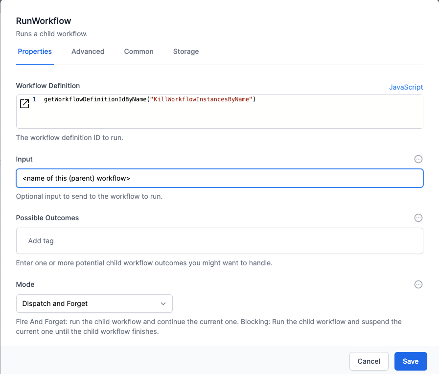

# Clean Up Workflow instance logs

This  removes workflow instance logs for a given workflow name.

It uses the built-in activity `RemoveWorkflowInstances`.  It is designed to be run at the end of a Web UI workflow to remove the log entries. 

Instance Log entries are great for debugging your workflow, but having too many will slow the performance of your World of Workflows instance.

Whilst it is easy to directly invoke the  `RemoveWorkflowInstances` activity from your workflows, doing so will add a delay to the workflow.  Use this workflow to delete the instances in the 'background'.   This is especially important when building Web UI workflows: you want to remove any delay in the rendering of your web pages, whilst still keeping the instance logs to a minimum.

## Invoking the workflow


Open your workflow.  This will be a workflow that creates log entries that you no longer wish to debug and keep log entries for.

Create a `Run Workflow` activity.  Enter this in the Workflow Definition:
```js
getWorkflowDefinitionIdByName("KillWorkflowInstancesByName")
```
In the `input` field, type the `Name` of the workflow you are editing.  You can find this by clicking on the cog icon in the top right of the editor.

Set the `Mode` to `Dispatch and Forget` so that we don't wait for a result.

Link this activity to one of the last activities in your workflow.  

## Expected results
Each time you run your workflow there will now only be a single log entry for your workflow, and this will be the log of the latest workflow run.  

## Modification ideas
In KillWorkflowInstancesByName, alter the Instance Selection of the RemoveWorkflowInstances activity to keep additional log entries if this suits your environment.  

