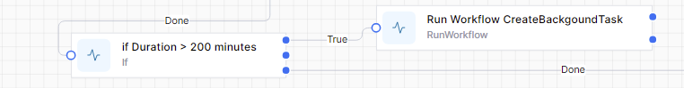
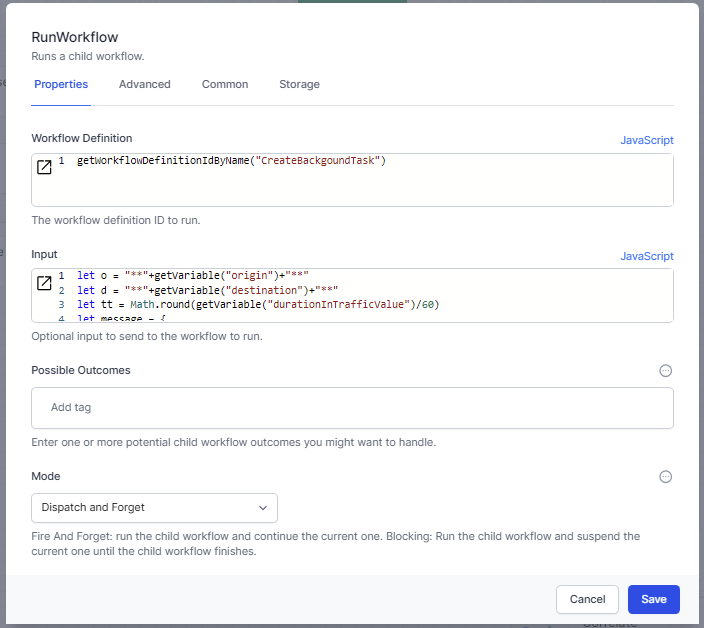

# Create a task in the 'background'

World of Workflows has an advanced mechanism for interactoing with humand, called [Tasks](../05_tasks/README.html).  Normally when you create a task the workflow waits (technical term is 'suspends') until the task is dealt with by a human.  This is often the required business process, because the information required from the human will influence the rest of the workflow.

Sometimes you might want to create a task and *not* wait for a human response.  This might be because you are in a loop and each iteration in the loop can be dealt with separately.

## Mechanism

To set this up, you will

1. Add a `Run Workflow` activity into your 'parent' workflow where you want the background task created.  
   

2. Determine the data you want to be shown in the task:
   
   
3. Set the `Mode` to `Dispatch and forget` so that the parent workflow does not wait until the child workflow is finished
   
4. Create a new workflow, called `Create Background Task`.  
   You can <a href="./create-backgound-task.json" download> download </a>this sample workflow.
   
5. Adjust the functionality as needed. If you need to ask the human questions, you will also want to pass the ObjectId of the related object to the child workflow.

