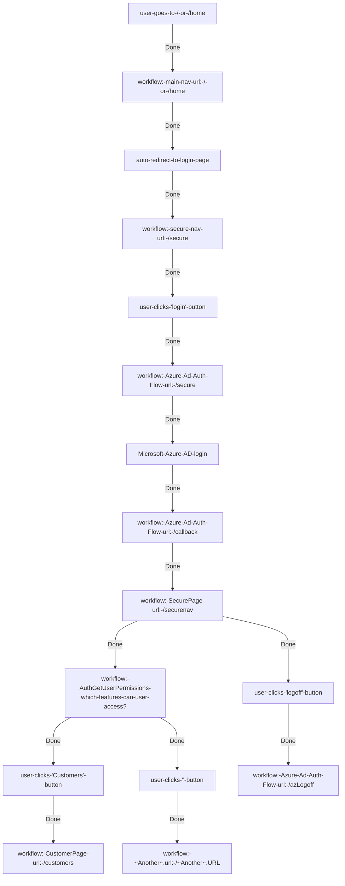
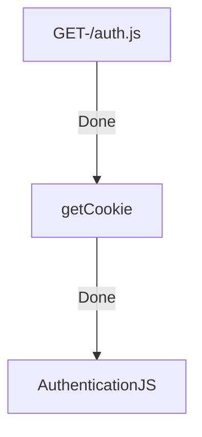
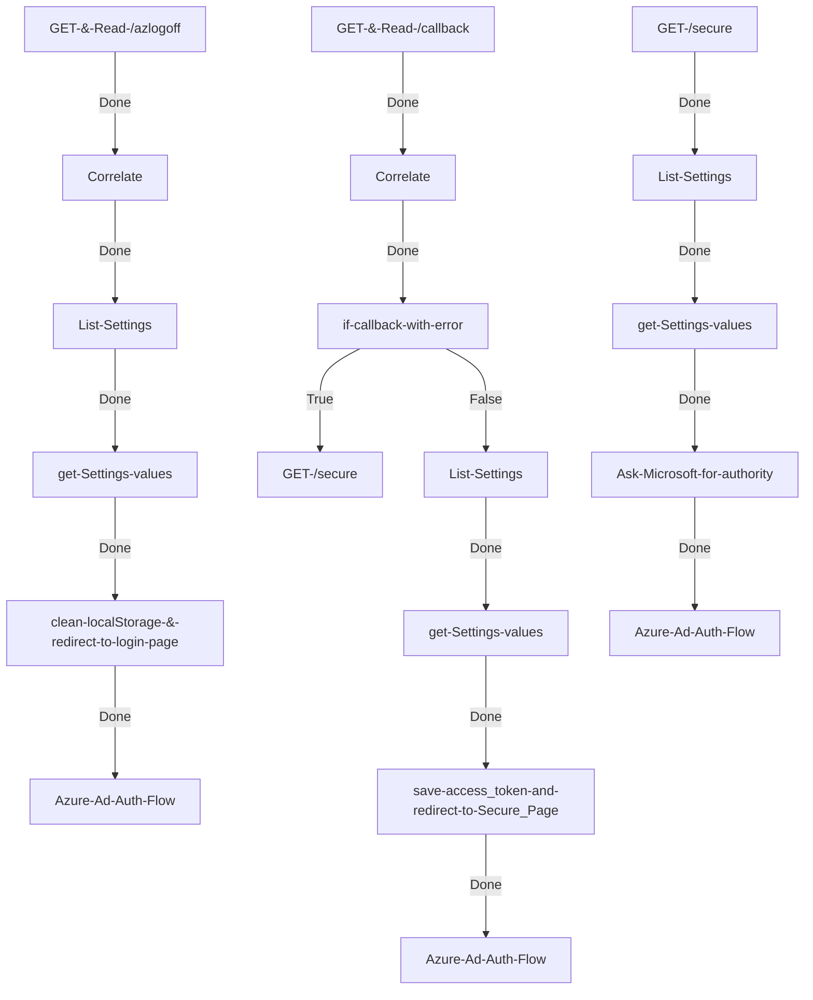
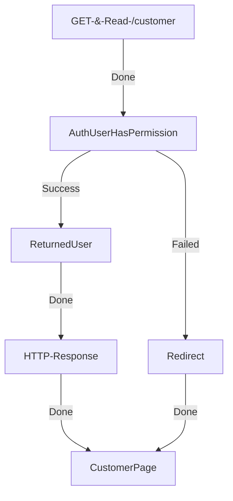
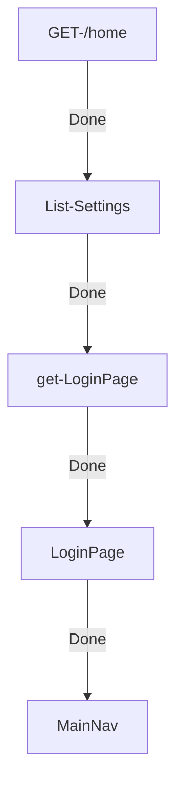
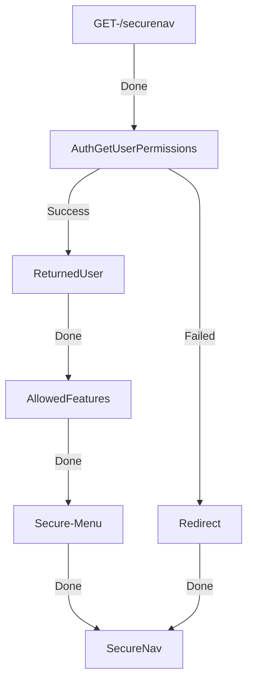

# Granular Web Authentication and Access Control

This **Solution** contains Azure AD (aka EntraID) Granular Web Authentication and access control.

Users are granted authentication rights through Entra Id, and then continue to be granted access to areas of the system using a comprehensive permission system.

## Solution Assumptions

1. You have access to Entra Id
2. You are creating a web application in Workflows
3. Every User who has rights to access the application will be given a user account
4. You can choose default permissions

## Requirements

1. An Entra Id Application (See [below](#creating-the-entra-id-application))
2. The [Utilities](../19_plugins/utilities.html) Plugin
3. This   <a href="./GranularAuth.zip" download> Solution </a>downloaded, ready to import.

## Installation

1. Start World of Workflows 
2. Install the Utilities Plugin
3. Import the Solution

{: .key }
References to the server URL in this sample are to `https://localhost:7063`.  This is for World of Workflows Personal Edition.  For World of Workflows Business Edition, replace `localhost:7063`with the url for your server.

### Creating the Entra ID Application

1. Navigate to the [Azure Portal -> Entra Id -> App Registrations](https://portal.azure.com/#view/Microsoft_AAD_IAM/ActiveDirectoryMenuBlade/~/RegisteredApps)
2. Click **+ New Registration**
3. Type the Name (e.g. WOW Cookbook)
4. Add a SPA Redirect URI of `https://localhost:7063/callback`
5. Click API Permissions on the left
6. Click **+ Add a permission**
7. Choose **Microsoft Graph**
8. Click **Delegated permissions**
9. Scroll down and select all OpenId permissions (email, offline_access, openid and profile) and click **Add permissions**
10. Click **Token Configuration** on the left
11. Click **Add optional claim**
12. Choose **Access**
13. Select email, family_name, given_name and upn at a minimum
14. Click **Add**
15. Record the **Client Id** and **Tenant Id** from the Overview page of the application.
16. Navigate to [Enterprise Applications](https://portal.azure.com/#view/Microsoft_AAD_IAM/StartboardApplicationsMenuBlade/~/AppAppsPreview/menuId~/null) under Entra Id
17. Deselect Application type == Enterprise Applications
18. Find the application you just created
19. Click Users and Group and add any users and groups.

## Settings
Finally, Navigate to Workflows (eg `https://localhost:7063/admin`), go to `Tables`, then `Settings` type and set up these entries:

|Key|Value|
|:--|:--|
|**ClientId** |The Client Id from Step 15 above|
|**TenantId** |The Tenant Id from Step 15 above|
|**RedirectUri** | https://localhost:7063/callback|
|**SecurePage** | https://localhost:7063/securenav|
 

## User Table

Either add yourself to the users table, or navigate to https://localhost:7063/home and try to navigate to customers. It will fail but add you to the users table.

## Permission Table

Add an entry to the permission table:

    **user** - `Your email address`  
    **Feature** - `Customers`  
    **Permission** - `Read` set to True

## Access now works

Navigate to https://localhost:7063/home and navigate to customers successfully..

# How it works

1. When you authenticate it takes the access token and saves it to local storage
2. As we include `auth.js` in every page, this intercepts any hyperlink and adds the token as a bearer token
3. The `customers` workflow grabs the HTTP input, and allows you to add the Feature and Permission. You then run the `Auth-GetPermissions` workflow with this data and it will return `success` or `failure` which you can use to navigate your workflow.

# Troubleshooting

There may have been conflict between the Tables imported as part of this solution and your existing Tables. Resolve this by editing each workflow and reviewing the `ObjectGetList` Activities.  Ensure they point to the correct Table.  

If in doubt, use this [documentation](#workflow-details) to select the correct `Table`.  For example, `Main Navigation Page` documentation shows this:

>**List Settings**:  
    - **Activity Type**: ObjectInstanceList  
    - **Display Name**: List Settings  
    - **Description**: Retrieves a list of settings objects.  
    - **Properties**:  
        --  ObjectType: `Settings`  
        --  ...
  
  
Ensure that this activity does correctly reference the `Settings` type.  

Repeat for all `ObjectGetList` Activities in all workflows

# Workflows Diagrams

## Overview of the solution's workflows



## Workflow: Auth - GetUserPermissions

```mermaid
flowchart TD
     39bfe728-2f9a-4666-a877-b8120a97c4d8[JWT-Decoder-to-DecodeJWT]
     f4e5c90a-c2ee-459e-92a0-c3a2a93329d9[AllowedFeatures]
     31d0afe4-c2d4-4097-b8e9-4fbdd30d539c[Success]
     1a6da16f-171b-4de5-8163-cf1ed8bb0f0e[Failed]
     95eee41a-ead0-40a9-bad3-8b2cd41a667a[If-user-has-permission-to-any-features]
     a9150565-71d9-4396-a5de-81778369a19d[Failed]
     35060409-d563-4012-8634-d06c84a26d8a[ThesePerms]
     ee9f5fac-19ee-4d58-9455-f69949bcdc7d[Correlate]
     27393236-b834-472d-99da-2f91c34f7e07[Create-a-User-ThisUser]
     de1db40e-3c76-42e5-80e5-1441a1a267bd[ThisUser]
     651d4b10-8cb6-47bc-a22d-05505dc0edcb[Get-Permissions]
     b1918fb4-80a4-4509-9f89-986b37fc5d93[There-is-a-User]
     1e668332-b285-4a40-8c83-61ce30dcc20a[UserInfo]
     ec1deac3-f7e2-419f-9d11-750a4c7f5a80[Correlate]
     4134818a-972f-4960-b17d-10b0b2888146[Try-to-get-a-User-from-JWT.upn]
     ca6525d7-b47a-4967-8bc6-3804680965f8[Token]
     30b53375-e279-4f44-a0f3-bdb2fe9a83d0[Correlate]
     d04d174f-a20d-4c03-867f-ccd8913bb00a[Start-here-with-parameters]
     2fa8c908-455a-4771-9afa-e61774cf4b4b[Failed]
     4507dbb0-1ed3-499f-b4ae-f447509aca1f[AuthUserHasPermission]
     39bfe728-2f9a-4666-a877-b8120a97c4d8 ---> |Success| 1e668332-b285-4a40-8c83-61ce30dcc20a
     4134818a-972f-4960-b17d-10b0b2888146 ---> |Done| b1918fb4-80a4-4509-9f89-986b37fc5d93
     b1918fb4-80a4-4509-9f89-986b37fc5d93 ---> |True| de1db40e-3c76-42e5-80e5-1441a1a267bd
     de1db40e-3c76-42e5-80e5-1441a1a267bd ---> |Done| 651d4b10-8cb6-47bc-a22d-05505dc0edcb
     95eee41a-ead0-40a9-bad3-8b2cd41a667a ---> |True| 31d0afe4-c2d4-4097-b8e9-4fbdd30d539c
     95eee41a-ead0-40a9-bad3-8b2cd41a667a ---> |False| 1a6da16f-171b-4de5-8163-cf1ed8bb0f0e
     651d4b10-8cb6-47bc-a22d-05505dc0edcb ---> |Done| 35060409-d563-4012-8634-d06c84a26d8a
     d04d174f-a20d-4c03-867f-ccd8913bb00a ---> |Done| 30b53375-e279-4f44-a0f3-bdb2fe9a83d0
     30b53375-e279-4f44-a0f3-bdb2fe9a83d0 ---> |Done| ca6525d7-b47a-4967-8bc6-3804680965f8
     1e668332-b285-4a40-8c83-61ce30dcc20a ---> |Done| ec1deac3-f7e2-419f-9d11-750a4c7f5a80
     ec1deac3-f7e2-419f-9d11-750a4c7f5a80 ---> |Done| 4134818a-972f-4960-b17d-10b0b2888146
     b1918fb4-80a4-4509-9f89-986b37fc5d93 ---> |False| ee9f5fac-19ee-4d58-9455-f69949bcdc7d
     ee9f5fac-19ee-4d58-9455-f69949bcdc7d ---> |Done| 27393236-b834-472d-99da-2f91c34f7e07
     27393236-b834-472d-99da-2f91c34f7e07 ---> |Done| 651d4b10-8cb6-47bc-a22d-05505dc0edcb
     ca6525d7-b47a-4967-8bc6-3804680965f8 ---> |Done| 39bfe728-2f9a-4666-a877-b8120a97c4d8
     35060409-d563-4012-8634-d06c84a26d8a ---> |Done| f4e5c90a-c2ee-459e-92a0-c3a2a93329d9
     f4e5c90a-c2ee-459e-92a0-c3a2a93329d9 ---> |Done| 95eee41a-ead0-40a9-bad3-8b2cd41a667a
     39bfe728-2f9a-4666-a877-b8120a97c4d8 ---> |Failed| 2fa8c908-455a-4771-9afa-e61774cf4b4b
     d04d174f-a20d-4c03-867f-ccd8913bb00a ---> |Done| 4507dbb0-1ed3-499f-b4ae-f447509aca1f
     651d4b10-8cb6-47bc-a22d-05505dc0edcb ---> |Object type not found| a9150565-71d9-4396-a5de-81778369a19d
```



* * *
## Workflow: Auth - UserHasPermission

```mermaid
flowchart TD
     d04d174f-a20d-4c03-867f-ccd8913bb00a[Start-here-with-parameters]
     ee9f5fac-19ee-4d58-9455-f69949bcdc7d[Correlate]
     9f634f73-3b26-4bb4-98e8-28ad6c3b0469[AuthUserHasPermission]
     30b53375-e279-4f44-a0f3-bdb2fe9a83d0[Correlate]
     ca6525d7-b47a-4967-8bc6-3804680965f8[Token]
     800cbcb7-f4c3-4c84-ba08-6f2535542e52[JWT-Decoder-to-DecodeJWT]
     1e668332-b285-4a40-8c83-61ce30dcc20a[UserInfo]
     4134818a-972f-4960-b17d-10b0b2888146[Try-to-get-a-User-from-JWT.upn]
     b1918fb4-80a4-4509-9f89-986b37fc5d93[There-is-a-User]
     de1db40e-3c76-42e5-80e5-1441a1a267bd[ThisUser]
     651d4b10-8cb6-47bc-a22d-05505dc0edcb[Get-Permissions]
     27393236-b834-472d-99da-2f91c34f7e07[Create-a-User-ThisUser]
     ff793672-8b9e-43b9-9af5-e2b38d651fa2[Failed]
     31c57881-8108-4dbf-9261-3518be3aca59[Failed]
     35060409-d563-4012-8634-d06c84a26d8a[ThesePerms]
     95eee41a-ead0-40a9-bad3-8b2cd41a667a[If-user-has-permission-to-this-feature]
     1a6da16f-171b-4de5-8163-cf1ed8bb0f0e[Failed]
     ec1deac3-f7e2-419f-9d11-750a4c7f5a80[Correlate]
     31d0afe4-c2d4-4097-b8e9-4fbdd30d539c[Success]
     4134818a-972f-4960-b17d-10b0b2888146 ---> |Done| b1918fb4-80a4-4509-9f89-986b37fc5d93
     b1918fb4-80a4-4509-9f89-986b37fc5d93 ---> |True| de1db40e-3c76-42e5-80e5-1441a1a267bd
     de1db40e-3c76-42e5-80e5-1441a1a267bd ---> |Done| 651d4b10-8cb6-47bc-a22d-05505dc0edcb
     95eee41a-ead0-40a9-bad3-8b2cd41a667a ---> |True| 31d0afe4-c2d4-4097-b8e9-4fbdd30d539c
     95eee41a-ead0-40a9-bad3-8b2cd41a667a ---> |False| 1a6da16f-171b-4de5-8163-cf1ed8bb0f0e
     651d4b10-8cb6-47bc-a22d-05505dc0edcb ---> |Done| 35060409-d563-4012-8634-d06c84a26d8a
     35060409-d563-4012-8634-d06c84a26d8a ---> |Done| 95eee41a-ead0-40a9-bad3-8b2cd41a667a
     d04d174f-a20d-4c03-867f-ccd8913bb00a ---> |Done| 30b53375-e279-4f44-a0f3-bdb2fe9a83d0
     30b53375-e279-4f44-a0f3-bdb2fe9a83d0 ---> |Done| ca6525d7-b47a-4967-8bc6-3804680965f8
     1e668332-b285-4a40-8c83-61ce30dcc20a ---> |Done| ec1deac3-f7e2-419f-9d11-750a4c7f5a80
     ec1deac3-f7e2-419f-9d11-750a4c7f5a80 ---> |Done| 4134818a-972f-4960-b17d-10b0b2888146
     b1918fb4-80a4-4509-9f89-986b37fc5d93 ---> |False| ee9f5fac-19ee-4d58-9455-f69949bcdc7d
     ee9f5fac-19ee-4d58-9455-f69949bcdc7d ---> |Done| 27393236-b834-472d-99da-2f91c34f7e07
     27393236-b834-472d-99da-2f91c34f7e07 ---> |Done| 651d4b10-8cb6-47bc-a22d-05505dc0edcb
     ca6525d7-b47a-4967-8bc6-3804680965f8 ---> |Done| 800cbcb7-f4c3-4c84-ba08-6f2535542e52
     800cbcb7-f4c3-4c84-ba08-6f2535542e52 ---> |Success| 1e668332-b285-4a40-8c83-61ce30dcc20a
     800cbcb7-f4c3-4c84-ba08-6f2535542e52 ---> |Failed| ff793672-8b9e-43b9-9af5-e2b38d651fa2
     d04d174f-a20d-4c03-867f-ccd8913bb00a ---> |Done| 9f634f73-3b26-4bb4-98e8-28ad6c3b0469
     651d4b10-8cb6-47bc-a22d-05505dc0edcb ---> |Object type not found| 31c57881-8108-4dbf-9261-3518be3aca59
```



* * *
## Workflow: Auth - AuthGetUserPermissionsAnyFeatures
This returns the permissions that a user has permissions to, and the user name.  If no permissions, it returns false

## Workflow: AuthenticationJS



* * *
## Workflow: Azure Ad Auth Flow



* * *
## Workflow: Sample CustomerPage



* * *
## Workflow: Sample Main Navigation Page



* * *
## Workflow: Secure Navigation Page



* * *
* * *


# Workflow details

The Solution Consists of the following Workflows:


## Main Navigation Page

Here is a step-by-step description of how the "Main Navigation Page" workflow operates:

1. **GET /home Endpoint**:
    - **Activity Type**: HttpEndpoint
    - **Display Name**: GET /home
    - **Description**: This is the entry point of the workflow. It listens for HTTP GET requests on the "/home" path.
    - **Properties**:
      - Path: `/home`
      - Methods: `["GET"]`

2. **List Settings**:
    - **Activity Type**: ObjectInstanceList
    - **Display Name**: List Settings
    - **Description**: Retrieves a list of settings objects.
    - **Properties**:
      - ObjectType: `Settings`
      - Filter, Skip, Limit, OrderBy, Expand: These fields are optional and not set in this case.

3. **Run JavaScript**:
    - **Activity Type**: RunJavaScript
    - **Display Name**: get Settings values
    - **Description**: Runs a JavaScript function to extract a value from the settings retrieved in the previous step.
    - **Script**:
      ```javascript
        function getValueByKey(jsonData, key) {
            for (let item of jsonData) {
                if (item.Key === key) {
                    return item.Value;
                }
            }
            return null; // Or handle "key not found" as needed
        }

        setVariable("LoginPage", getValueByKey(activities.GetSettings2.Output(),"LoginPage"));
      ```

4. **Redirect to LoginPage**:
    - **Activity Type**: Redirect
    - **Display Name**: Redirect to LoginPage
    - **Description**: Redirects the request to the LoginPage URL obtained from the settings.
    - **Properties**:
      - Location: `{{Variables.LoginPage}}` (uses the LoginPage variable set in the previous step)
      - Permanent: This field is not set.

5. **Clear Workflow Instances**:
    - **Activity Type**: RemoveWorkflowInstances
    - **Display Name**: Clear Workflow Instances
    - **Description**: Clears instances of the workflow to manage resource usage and ensure a clean state.
    - **Properties**:
      - WorkflowDefinitionName: `MainNav`
      - VersionSelection: `All`
      - InstanceRetention, DateSelection, IncludeIdle, IncludeSuspended, IncludeRunning: These fields are optional and not set in this case.

### Workflow Connections
The activities are connected sequentially:
1. **GET /home Endpoint** → **List Settings** (on Done outcome)
2. **List Settings** → **Run JavaScript** (on Done outcome)
3. **Run JavaScript** → **Redirect to LoginPage** (on Done outcome)
4. **Redirect to LoginPage** → **Clear Workflow Instances** (on Done outcome)

This workflow listens for a GET request at "/home", retrieves settings, extracts the LoginPage URL, redirects to that URL, and finally clears the workflow instances to maintain a clean state.

## Secure Navigation Page

Here is a step-by-step description of how the "Secure Navigation Page" workflow operates:

1. **GET /securenav Endpoint**:
    - **Activity Type**: HttpEndpoint
    - **Display Name**: GET /securenav
    - **Description**: This is the entry point of the workflow. It listens for HTTP GET requests on the "/securenav" path.
    - **Properties**:
      - Path: `/securenav`
      - Methods: `["GET"]`

2. **Auth Get User Permissions**:
    - **Activity Type**: RunWorkflow
    - **Display Name**: AuthGetUserPermissions
    - **Description**: This activity runs a workflow to authenticate the user and retrieve their permissions.
    - **Properties**:
      - WorkflowDefinitionId: Retrieved using `getWorkflowDefinitionIdByName("AuthGetUserPermissions")`
      - Input: 
        ```javascript
        var result = {
            "html": activities.httpInit.Output(),
            "Permission": "Read"
        };
        return result;
        ```
      - Mode: `Blocking`

3. **Returned User**:
    - **Activity Type**: SetVariable
    - **Display Name**: ReturnedUser
    - **Description**: Stores the user information retrieved from the permissions workflow.
    - **Properties**:
      - VariableName: `ReturnedUser`
      - Value: Extracted via JavaScript as `activities.runAuthGetPermissions.Output().workflowOutput.ThisUser`

4. **Allowed Features**:
    - **Activity Type**: SetVariable
    - **Display Name**: AllowedFeatures
    - **Description**: Stores the features that the authenticated user is allowed to access.
    - **Properties**:
      - VariableName: `AllowedFeatures`
      - Value: Extracted via JavaScript as `jsonDecode(jsonEncode(activities.runAuthGetPermissions.Output().workflowOutput.AllowedFeatures))`

5. **Secure Menu**:
    - **Activity Type**: WriteHttpResponse
    - **Display Name**: Secure Menu
    - **Description**: Generates and returns a secure menu page based on the allowed features and user information.
    - **Properties**:
      - Content:
        ```liquid
        <!DOCTYPE html>
        <html lang="en">
        <head>
            <meta charset="UTF-8">
            <meta name="viewport" content="width=device-width, initial-scale=1.0">
            <title>Secure Menu</title>
            <link rel="stylesheet" href="https://cdnjs.cloudflare.com/ajax/libs/font-awesome/6.0.0-beta3/css/all.min.css">
            <style>
                /* Styles omitted for brevity */
            </style>
            <script src="/auth.js"></script>
        </head>
        <body>
            <header>
                <a href="/home" style="font-size: 24px;">Home</a>
                <a>Main Menu</a>
                <a href="/securenav" style="font-size: 24px;">Secure Menu</a>
            </header>
            <nav>
                <ul>
                    <li><a class="text-white">{{Variables.ReturnedUser.name}}</a> </li>
                    
                        <li><a href="{{feature.URL}}"><i class="fas fa-bars-progress"></i>{{feature.Title}}</a></li>
                    
                    <li>&nbsp;</li>
                    <li><a href="/azLogoff"><i class="fas fa-bars-progress"></i> Logoff</a></li>
                </ul>
            </nav>
        </body>
        </html>
        ```
      - ContentType: `text/html`
      - StatusCode: `OK`
      - CharSet: `utf-8`

6. **Redirect on Failure**:
    - **Activity Type**: Redirect
    - **Display Name**: Redirect
    - **Description**: Redirects the user to the home page in case of a failure in retrieving permissions.
    - **Properties**:
      - Location: `/home`

7. **SecureNav**:
    - **Activity Type**: RemoveWorkflowInstances
    - **Display Name**: SecureNav
    - **Description**: Clears instances of the Secure Navigation workflow to manage resource usage and ensure a clean state.
    - **Properties**:
      - WorkflowDefinitionName: `SecureNav`
      - VersionSelection: `All`
      - InstanceRetention: `1`

### Workflow Connections
The activities are connected sequentially:
1. **GET /securenav Endpoint** → **Auth Get User Permissions** (on Done outcome)
2. **Auth Get User Permissions** → **Returned User** (on Success outcome)
3. **Auth Get User Permissions** → **Redirect on Failure** (on Failed outcome)
4. **Returned User** → **Allowed Features** (on Done outcome)
5. **Allowed Features** → **Secure Menu** (on Done outcome)
6. **Secure Menu** → **SecureNav** (on Done outcome)
7. **Redirect on Failure** → **SecureNav** (on Done outcome)

This workflow listens for a GET request at "/securenav", authenticates the user, retrieves allowed features, generates a secure menu, and finally clears the workflow instances to maintain a clean state.

## AuthenticationJS

Here is a step-by-step description of how the "Authentication JavaScript Workflow" operates:

1. **GET /auth.js Endpoint**:
    - **Activity Type**: HttpEndpoint
    - **Display Name**: GET /auth.js
    - **Description**: This is the entry point of the workflow. It listens for HTTP GET requests on the "/auth.js" path, typically serving a JavaScript file.
    - **Properties**:
      - Path: `/auth.js`
      - Methods: `["GET"]`

2. **Write getCookie Script**:
    - **Activity Type**: WriteHttpResponse
    - **Display Name**: getCookie
    - **Description**: This activity writes a JavaScript function that handles cookie retrieval and checks for the presence of an access token. If the token is missing, it redirects the user to the "/home" page.
    - **Properties**:
      - Content:
        ```javascript
        function getCookie(name) {
            const value = `; ${document.cookie}`;
            const parts = value.split(`; ${name}=`);
            if (parts.length === 2) return parts.pop().split(';').shift();
        };

        window.onload = function () {
            const accessToken = getCookie("accessToken");
            if (!accessToken) {
                window.location.href = "/home"; // Redirect to login if no token
                return;
            }
        };

        (function() {
            // Helper function to get a cookie by name
        })();
        ```
      - ContentType: `text/javascript`
      - StatusCode: `OK`
      - CharSet: `utf-8`

3. **Remove Workflow Instances**:
    - **Activity Type**: RemoveWorkflowInstances
    - **Display Name**: AuthenticationJS
    - **Description**: Clears instances of the Authentication JavaScript workflow to manage resource usage and ensure a clean state after the script has been served.
    - **Properties**:
      - WorkflowDefinitionName: `AuthenticationJS`
      - VersionSelection: `All`
      - InstanceRetention: `1`

### Workflow Connections
The activities are connected sequentially:
1. **GET /auth.js Endpoint** → **Write getCookie Script** (on Done outcome)
2. **Write getCookie Script** → **Remove Workflow Instances** (on Done outcome)

This workflow listens for a GET request at "/auth.js", serves a JavaScript file that handles cookie management and redirection, and finally clears the workflow instances to maintain a clean state.

## Auth - UserHasPermission Workflow

### Overview
This workflow is designed to check if a user has the necessary permissions for a specific feature.
It starts by setting up the necessary variables, decoding the JWT token, and checking if the user exists.
If the user exists, it retrieves the user's permissions and verifies if the user has the required permissions for the specified feature.
The workflow concludes with either success or failure based on the permissions check.

### Workflow Activities

1. **Start here with parameters**
   - **Activity Type**: RunJavaScript
   - **Display Name**: Start here with parameters
   - **Description**: This activity initializes the workflow by setting up necessary variables such as `htmlOut`, `Feature`, and `Permission` using input parameters.
   - **Script**:
     ```javascript
     setVariable("htmlOut", input.html);
     setVariable("Feature", input.Feature);
     setVariable("Permission", input.Permission);
     ```
   - **Outcome**: Done

2. **Correlate (Feature/Permission Check)**
   - **Activity Type**: Correlate
   - **Display Name**: Correlate
   - **Description**: Logs the feature and permission being checked for the user.
   - **Value**:
     ```javascript
     ' checking ' + getVariable("Feature") + ' / ' + getVariable("Permission") + ' for ' + JSON.parse(activities.DecodeJWT.Output()).upn;
     ```
   - **Outcome**: Done

3. **AuthUserHasPermission**
   - **Activity Type**: RemoveWorkflowInstances
   - **Display Name**: AuthUserHasPermission
   - **Description**: This activity manages the lifecycle of the workflow, ensuring old instances are removed.
   - **WorkflowDefinitionName**: AuthUserHasPermission
   - **InstanceRetention**: 2
   - **Outcome**: Success, Failed, Faulted

4. **Token**
   - **Activity Type**: SetVariable
   - **Display Name**: Token
   - **Description**: Extracts the `accessToken` from the cookie.
   - **Value**:
     ```javascript
     const cookie = getVariable("htmlOut")?.headers?.Cookie;
     return getAccessToken(cookie);
     ```
   - **Outcome**: Done

5. **JWT Decoder to DecodeJWT**
   - **Activity Type**: JWTDecoder
   - **Display Name**: JWT Decoder to DecodeJWT
   - **Description**: Decodes the JWT token to retrieve user information.
   - **Token**: `getVariable("Token")`
   - **Outcome**: Success, Failed

6. **UserInfo**
   - **Activity Type**: SetVariable
   - **Display Name**: UserInfo
   - **Description**: Stores the decoded JWT user information.
   - **Value**:
     ```javascript
     JSON.parse(activities.DecodeJWT.Output());
     ```
   - **Outcome**: Done

7. **Try to get a User from JWT.upn**
   - **Activity Type**: ObjectInstanceList
   - **Display Name**: Try to get a User from JWT.upn
   - **Description**: Attempts to retrieve the user from the database using the `upn` from the JWT.
   - **ObjectType**: User
   - **Filter**:
     ```javascript
     return `upn eq '` + JSON.parse(activities.DecodeJWT.Output()).upn + `'`;
     ```
   - **Outcome**: Done, Object type not found

8. **There is a User**
   - **Activity Type**: If
   - **Display Name**: There is a User
   - **Description**: Checks if the user exists in the database.
   - **Condition**:
     ```javascript
     activities.getUser.Output().length > 0;
     ```
   - **Outcome**: True, False, Done

9. **ThisUser**
   - **Activity Type**: SetVariable
   - **Display Name**: ThisUser
   - **Description**: Stores the user information retrieved from the database.
   - **Value**:
     ```javascript
     activities.getUser.Output()[0];
     ```
   - **Outcome**: Done

10. **Get Permissions**
    - **Activity Type**: ObjectInstanceList
    - **Display Name**: Get Permissions
    - **Description**: Retrieves the permissions associated with the user.
    - **ObjectType**: Permissions
    - **Filter**:
      ```liquid
      User eq {{Variables.ThisUser.ObjectId}}
      ```
    - **Outcome**: Done, Object type not found

11. **ThesePerms**
    - **Activity Type**: SetVariable
    - **Display Name**: ThesePerms
    - **Description**: Stores the permissions retrieved for the user.
    - **Value**:
      ```javascript
      activities.getPerms.ExpandedOutput();
      ```
    - **Outcome**: Done

12. **If user has permission to this feature**
    - **Activity Type**: If
    - **Display Name**: If user has permission to this feature
    - **Description**: Checks if the user has the required permissions for the specified feature.
    - **Condition**:
      ```javascript
      return hasAccessToFeature(activities.getPerms.ExpandedOutput(), getVariable("Feature"), getVariable("Permission"));
      ```
    - **Outcome**: True, False, Done

13. **Success**
    - **Activity Type**: Finish
    - **Display Name**: Success
    - **Description**: Marks the workflow as successful if the user has the required permissions.
    - **Outcome**: Success

14. **Failed**
    - **Activity Type**: Finish
    - **Display Name**: Failed
    - **Description**: Marks the workflow as failed if the user does not have the required permissions or the user is not found.
    - **Outcome**: Failed

### Workflow Connections

- **Start here with parameters** → **Correlate (Feature/Permission Check)** → **AuthUserHasPermission** (on Done outcome)
- **Correlate** → **Token** → **JWT Decoder to DecodeJWT** → **UserInfo** → **Try to get a User from JWT.upn**
- **Try to get a User from JWT.upn** → **There is a User** → **ThisUser** → **Get Permissions** → **ThesePerms** → **If user has permission to this feature**
- **If user has permission to this feature** → **Success** (if True) or **Failed** (if False)

## Auth - GetUserPermissions Workflow

### Overview
This workflow is designed to retrieve and verify user permissions.
It begins by initializing necessary variables and extracting the JWT token.
The workflow then attempts to retrieve the user from the database using the JWT, checks if the user exists, and retrieves the associated permissions.
Based on these permissions, the workflow determines if the user has access to any features and concludes with success or failure.

### Workflow Activities

1. **Start here with parameters**
   - **Activity Type**: RunJavaScript
   - **Display Name**: Start here with parameters
   - **Description**: Initializes the workflow by setting up necessary variables like `htmlOut` and `Permission` using input parameters.
   - **Script**:
     ```javascript
     setVariable("htmlOut", input.html)  // we use this to get the cookie for JWT
     setVariable("Permission", input.Permission)  // eg 'Read'
     ```
   - **Outcome**: Done

2. **Correlate (checking all features)**
   - **Activity Type**: Correlate
   - **Display Name**: Correlate
   - **Description**: Logs that all features are being checked with the specified permission.
   - **Value**:
     ```javascript
     ' checking all features, ' + getVariable("Permission")
     ```
   - **Outcome**: Done

3. **Token**
   - **Activity Type**: SetVariable
   - **Display Name**: Token
   - **Description**: Extracts the `accessToken` from the cookie.
   - **Value**:
     ```javascript
     function getAccessToken(str) {
         if (!str) {
             return null;
         }
         
         const match = str.match(/accessToken=([^;]*)/);
         return match ? match[1] : null;
     }

     const cookie = getVariable("htmlOut")?.headers?.Cookie;
     return getAccessToken(cookie);
     ```
   - **Outcome**: Done

4. **JWT Decoder to DecodeJWT**
   - **Activity Type**: JWTDecoder
   - **Display Name**: JWT Decoder to DecodeJWT
   - **Description**: Decodes the JWT token to retrieve user information.
   - **Token**: `getVariable("Token")`
   - **Outcome**: Success, Failed

5. **UserInfo**
   - **Activity Type**: SetVariable
   - **Display Name**: UserInfo
   - **Description**: Stores the decoded JWT user information.
   - **Value**:
     ```javascript
     JSON.parse(activities.DecodeJWT.Output());
     ```
   - **Outcome**: Done

6. **Correlate (checking specific user)**
   - **Activity Type**: Correlate
   - **Display Name**: Correlate
   - **Description**: Logs the user being checked based on the `upn` from the JWT.
   - **Value**:
     ```javascript
     ' checking ' + getVariable("Permission") + ' for ' + JSON.parse(activities.DecodeJWT.Output()).upn
     ```
   - **Outcome**: Done

7. **Try to get a User from JWT.upn**
   - **Activity Type**: ObjectInstanceList
   - **Display Name**: Try to get a User from JWT.upn
   - **Description**: Attempts to retrieve the user from the database using the `upn` from the JWT.
   - **ObjectType**: User
   - **Filter**:
     ```javascript
     return `upn eq '` + JSON.parse(activities.DecodeJWT.Output()).upn + `'`;
     ```
   - **Outcome**: Done, Object type not found

8. **There is a User**
   - **Activity Type**: If
   - **Display Name**: There is a User
   - **Description**: Checks if the user exists in the database.
   - **Condition**:
     ```javascript
     activities.getUser.Output().length > 0;
     ```
   - **Outcome**: True, False, Done

9. **ThisUser**
   - **Activity Type**: SetVariable
   - **Display Name**: ThisUser
   - **Description**: Stores the user information retrieved from the database.
   - **Value**:
     ```javascript
     activities.getUser.Output()[0];
     ```
   - **Outcome**: Done

10. **Create a User - ThisUser**
    - **Activity Type**: ObjectInstanceCreate
    - **Display Name**: Create a User - ThisUser
    - **Description**: Creates a new user object in the database if the user does not exist.
    - **ObjectType**: User
    - **Values**:
      ```javascript
      let JWT = JSON.parse(activities.DecodeJWT.Output())
      var result = {
          "upn": JWT.upn,
          "givenName": JWT.given_Name,
          "familyName": JWT.family_Name,
          "name": JWT.name
          
      };
      return result
      ```
    - **VariableName**: ThisUser
    - **Outcome**: Done, Object type not found

11. **Get Permissions**
    - **Activity Type**: ObjectInstanceList
    - **Display Name**: Get Permissions
    - **Description**: Retrieves the permissions associated with the user.
    - **ObjectType**: Permissions
    - **Filter**:
      ```liquid
      User eq {{Variables.ThisUser.ObjectId}}
      ```
    - **Outcome**: Done, Object type not found

12. **ThesePerms**
    - **Activity Type**: SetVariable
    - **Display Name**: ThesePerms
    - **Description**: Stores the permissions retrieved for the user.
    - **Value**:
      ```javascript
      activities.getPerms.ExpandedOutput();
      ```
    - **Outcome**: Done

13. **AllowedFeatures**
    - **Activity Type**: SetVariable
    - **Display Name**: AllowedFeatures
    - **Description**: Retrieves the features the user has permissions for.
    - **Value**:
      ```javascript
      function getFeaturesWithPermission(permissions, permissionField) {
        return permissions
          .filter(permission => permission[permissionField])
          .map(permission => ({
            Title: permission.Feature.Title,
            URL: permission.Feature.URL
          }));
      }

      return getFeaturesWithPermission(getVariable("ThesePerms"), getVariable("Permission"));
      ```
    - **Outcome**: Done

14. **If user has permission to any features**
    - **Activity Type**: If
    - **Display Name**: If user has permission to any features
    - **Description**: Checks if the user has the required permissions for any features.
    - **Condition**:
      ```javascript
      !isNullOrEmpty(getVariable("AllowedFeatures"))
      ```
    - **Outcome**: True, False, Done

15. **Success**
    - **Activity Type**: Finish
    - **Display Name**: Success
    - **Description**: Marks the workflow as successful if the user has the required permissions.
    - **ActivityOutput**:
      ```javascript
      return {
          "ThesePerms":getVariable("ThesePerms"),
          "ThisUser":getVariable("ThisUser"),
          "AllowedFeatures":getVariable("AllowedFeatures")
          }
      ```
    - **Outcome**: Success

16. **Failed**
    - **Activity Type**: Finish
    - **Display Name**: Failed
    - **Description**: Marks the workflow as failed if the user does not have the required permissions or the user is not found.
    - **ActivityOutput**:
      ```javascript
      getVariable("ThesePerms")
      ```
    - **Outcome**: Failed

### Workflow Connections

- **Start here with parameters** → **Correlate (checking all features)** → **Token** → **JWT Decoder to DecodeJWT** (on Done outcome)
- **JWT Decoder to DecodeJWT** → **UserInfo** (on Success) or **Failed** (on Failed outcome)
- **UserInfo** → **Correlate (checking specific user)** → **Try to get a User from JWT.upn** 
- **Try to get a User from JWT.upn** → **There is a User** (on Done outcome) or **Create a User - ThisUser** (on False outcome)
- **There is a User** → **ThisUser** → **Get Permissions** → **ThesePerms** → **AllowedFeatures** → **If user has permission to any features**
- **If user has permission to any features** → **Success** (if True) or **Failed** (if False)


## Azure AD Auth Flow

### Overview
This workflow is designed to handle Azure AD authentication, manage access tokens, and ensure secure logoff.
4It consists of several key activities that manage the flow of authentication and logoff processes.
The workflow begins by handling secure page access, manages the callback from Azure AD, and concludes with logoff and cleanup activities.

### Workflow Activities

1. **GET /secure**
   - **Activity Type**: HttpEndpoint
   - **Display Name**: GET /secure
   - **Description**: Initializes the workflow by exposing a secure HTTP GET endpoint at `/secure`.
   - **Outcome**: Done

2. **List Settings**
   - **Activity Type**: ObjectInstanceList
   - **Display Name**: List Settings
   - **Description**: Retrieves configuration settings from the `Settings` object type.
   - **Outcome**: Done, Object type not found

3. **Get Settings Values**
   - **Activity Type**: RunJavaScript
   - **Display Name**: Get Settings Values
   - **Description**: Runs a JavaScript function to extract specific configuration values like `TenantId`, `ClientId`, and `RedirectUrl` from the retrieved settings.
   - **Script**:
     ```javascript
     function getValueByKey(jsonData, key) {
         for (let item of jsonData) {
             if (item.Key === key) {
                 return item.Value;
             }
         }
         return null; // Or handle "key not found" as needed
     }

     setVariable("TenantId", getValueByKey(activities.GetConfig.Output(),"TenantId"));
     setVariable("ClientId", getValueByKey(activities.GetConfig.Output(),"ClientId"));
     setVariable("RedirectUrl", getValueByKey(activities.GetConfig.Output(),"RedirectUrl"));
     ```
   - **Outcome**: Done

4. **Ask Microsoft for Authority**
   - **Activity Type**: WriteHttpResponse
   - **Display Name**: Ask Microsoft for Authority
   - **Description**: Sends an HTML response that includes JavaScript to initiate the OAuth2 authentication process with Azure AD.
   - **Content**: HTML with embedded JavaScript for Azure AD login.
   - **Outcome**: Done

5. **Azure AD Auth Flow**
   - **Activity Type**: RemoveWorkflowInstances
   - **Display Name**: Azure AD Auth Flow
   - **Description**: Cleans up by removing instances of the Azure AD Auth Flow workflow after it completes.
   - **Outcome**: Success, Failed, Faulted

### Workflow Connections

- **GET /secure** → **List Settings** → **Get Settings Values** → **Ask Microsoft for Authority** → **Azure AD Auth Flow** (on Done outcome)


## Azure AD Auth Flow - Callback

### Overview
This workflow is designed to handle the callback from Azure AD after authentication.
It starts by receiving the callback request, correlating it, and then checking if the callback contains an error.
Depending on the presence of an error, it either redirects the user or proceeds to retrieve configuration settings.
The workflow then processes these settings, saves the access token, and redirects the user to a secure page.
Finally, it cleans up by removing instances related to the Azure AD authentication flow.

### Workflow Activities

1. **GET & Read /callback**
   - **Activity Type**: HttpEndpoint
   - **Display Name**: GET & Read /callback
   - **Description**: Initializes the workflow by exposing an HTTP GET endpoint at `/callback` that reads the incoming content.
   - **Outcome**: Done

2. **Correlate**
   - **Activity Type**: Correlate
   - **Display Name**: Correlate
   - **Description**: Logs the correlation of the callback event.
   - **Value**: `"callback"`
   - **Outcome**: Done

3. **If Callback with Error**
   - **Activity Type**: If
   - **Display Name**: If Callback with Error
   - **Description**: Checks if the callback contains an error in the query string.
   - **Condition**:
     ```javascript
     if(isNullOrEmpty(activities.httpCallback.Output().QueryString.error)) {
         return false;
     }
     return true;
     ```
   - **Outcome**: True, False, Done

4. **List Settings**
   - **Activity Type**: ObjectInstanceList
   - **Display Name**: List Settings
   - **Description**: Retrieves configuration settings from the `Settings` object type.
   - **Outcome**: Done, Object type not found

5. **Get Settings Values**
   - **Activity Type**: RunJavaScript
   - **Display Name**: Get Settings Values
   - **Description**: Runs a JavaScript function to extract specific configuration values like `TenantId`, `ClientId`, `RedirectUrl`, and `SecurePage` from the retrieved settings.
   - **Script**:
     ```javascript
     function getValueByKey(jsonData, key) {
         for (let item of jsonData) {
             if (item.Key === key) {
                 return item.Value;
             }
         }
         return null; // Or handle "key not found" as needed
     }

     setVariable("TenantId", getValueByKey(activities.GetSettings2.Output(),"TenantId"));
     setVariable("ClientId", getValueByKey(activities.GetSettings2.Output(),"ClientId"));
     setVariable("RedirectUrl", getValueByKey(activities.GetSettings2.Output(),"RedirectUrl"));
     setVariable("SecurePage", getValueByKey(activities.GetSettings2.Output(),"SecurePage"));
     ```
   - **Outcome**: Done

6. **Save Access Token and Redirect to Secure_Page**
   - **Activity Type**: WriteHttpResponse
   - **Display Name**: Save Access Token and Redirect to Secure_Page
   - **Description**: Sends an HTML response that includes JavaScript to save the access token and redirect the user to the secure page.
   - **Content**: HTML with embedded JavaScript for saving the access token and handling redirection.
   - **Outcome**: Done

7. **/secure**
   - **Activity Type**: Redirect
   - **Display Name**: /secure
   - **Description**: Redirects the user to the `/secure` page if the callback contains an error.
   - **Outcome**: Done

8. **Azure AD Auth Flow**
   - **Activity Type**: RemoveWorkflowInstances
   - **Display Name**: Azure AD Auth Flow
   - **Description**: Cleans up by removing instances of the Azure AD Auth Flow workflow after it completes.
   - **Outcome**: Success, Failed, Faulted

### Workflow Connections

- **GET & Read /callback** → **Correlate** → **If Callback with Error** (on Done outcome)
- **If Callback with Error** → **/secure** (on True outcome) or **List Settings** (on False outcome)
- **List Settings** → **Get Settings Values** → **Save Access Token and Redirect to Secure_Page** → **Azure AD Auth Flow** (on Done outcome)


## Azure AD Auth Flow - Logoff

### Overview
This workflow handles the logoff process for Azure AD authenticated users.
It starts by receiving a logoff request, correlating it with a specific event, and then retrieving necessary configuration settings.
The workflow then cleans the local storage, deletes relevant cookies, and redirects the user to the Azure AD logout page.
Finally, it removes instances related to the Azure AD authentication flow.

### Workflow Activities

1. **GET & Read /azlogoff**
   - **Activity Type**: HttpEndpoint
   - **Display Name**: GET & Read /azlogoff
   - **Description**: Initializes the workflow by exposing an HTTP GET endpoint at `/azlogoff` that reads the incoming content.
   - **Outcome**: Done

2. **Correlate**
   - **Activity Type**: Correlate
   - **Display Name**: Correlate
   - **Description**: Logs the correlation of the logoff event.
   - **Value**: `"logoff"`
   - **Outcome**: Done

3. **List Settings**
   - **Activity Type**: ObjectInstanceList
   - **Display Name**: List Settings
   - **Description**: Retrieves configuration settings from the `Settings` object type.
   - **Outcome**: Done, Object type not found

4. **Get Settings Values**
   - **Activity Type**: RunJavaScript
   - **Display Name**: Get Settings Values
   - **Description**: Runs a JavaScript function to extract specific configuration values like `TenantId`, `ClientId`, `RedirectUrl`, and `SecurePage` from the retrieved settings.
   - **Script**:
     ```javascript
     function getValueByKey(jsonData, key) {
         for (let item of jsonData) {
             if (item.Key === key) {
                 return item.Value;
             }
         }
         return null; // Or handle "key not found" as needed
     }

     setVariable("TenantId", getValueByKey(activities.GetSettings3.Output(),"TenantId"));
     setVariable("ClientId", getValueByKey(activities.GetSettings3.Output(),"ClientId"));
     setVariable("RedirectUrl", getValueByKey(activities.GetSettings3.Output(),"RedirectUrl"));
     setVariable("SecurePage", getValueByKey(activities.GetSettings3.Output(),"SecurePage"));
     ```
   - **Outcome**: Done

5. **Clean localStorage & Redirect to Login Page**
   - **Activity Type**: WriteHttpResponse
   - **Display Name**: Clean localStorage & Redirect to Login Page
   - **Description**: Sends an HTML response that includes JavaScript to clean local storage, delete cookies, and redirect the user to the Azure AD logout page.
   - **Content**: HTML with embedded JavaScript for cleaning local storage and handling redirection.
   - **Outcome**: Done

6. **Azure AD Auth Flow**
   - **Activity Type**: RemoveWorkflowInstances
   - **Display Name**: Azure AD Auth Flow
   - **Description**: Cleans up by removing instances of the Azure AD Auth Flow workflow after the logoff process completes.
   - **Outcome**: Success, Failed, Faulted

### Workflow Connections

- **GET & Read /azlogoff** → **Correlate** → **List Settings** (on Done outcome)
- **List Settings** → **Get Settings Values** → **Clean localStorage & Redirect to Login Page** → **Azure AD Auth Flow** (on Done outcome)


## CustomerPage

### Overview
This workflow is designed to handle HTTP GET requests for customer data.
It checks if the user has the required permissions to access the customer data, retrieves the logged-in user's information, and then generates an HTTP response with a customer list displayed on the web page.
Additionally, it handles possible failure cases and redirects the user accordingly.

### Workflow Activities

1. **GET & Read /customer**
   - **Activity Type**: HttpEndpoint
   - **Display Name**: GET & Read /customer
   - **Description**: Initiates the workflow by exposing an HTTP GET endpoint at `/customer` and reads the incoming content.
   - **Outcome**: Done

2. **AuthUserHasPermission**
   - **Activity Type**: RunWorkflow
   - **Display Name**: AuthUserHasPermission
   - **Description**: Runs a separate workflow to verify if the user has the necessary permissions to access customer data.
   - **Input**:
     ```javascript
     var result = {
         "html": activities.CustomerDataIncoming.Output(),
         "Feature": "Customers",
         "Permission": "Read"
     };
     return result;
     ```
   - **Possible Outcomes**: Success, Failed
   - **Mode**: Blocking
   - **Outcome**: Done, Not Found

3. **ReturnedUser**
   - **Activity Type**: SetVariable
   - **Display Name**: ReturnedUser
   - **Description**: Sets the `ReturnedUser` variable with the output of the `AuthUserHasPermission` activity.
   - **Variable Name**: `"ReturnedUser"`
   - **Value**:
     ```javascript
     activities.runAuthGetPermissions.Output().workflowOutput[0].User
     ```
   - **Outcome**: Done

4. **HTTP Response**
   - **Activity Type**: WriteHttpResponse
   - **Display Name**: HTTP Response
   - **Description**: Generates an HTTP response that displays a list of customers on a web page. The logged-in user's name is also shown.
   - **Content**: HTML with embedded JavaScript to display customer data.
   - **Outcome**: Done

5. **Redirect**
   - **Activity Type**: Redirect
   - **Display Name**: Redirect
   - **Description**: Redirects the user to the `/home` page in case of failure in permission verification.
   - **Location**: `"/home"`
   - **Outcome**: Done

6. **CustomerPage**
   - **Activity Type**: RemoveWorkflowInstances
   - **Display Name**: CustomerPage
   - **Description**: Cleans up by removing instances of the CustomerPage workflow after the response is generated.
   - **Outcome**: Success, Failed, Faulted

### Workflow Connections

- **GET & Read /customer** → **AuthUserHasPermission** (on Done outcome)
- **AuthUserHasPermission** → **ReturnedUser** (on Success outcome)
- **AuthUserHasPermission** → **Redirect** (on Failed outcome)
- **ReturnedUser** → **HTTP Response** (on Done outcome)
- **HTTP Response** → **CustomerPage** (on Done outcome)
- **Redirect** → **CustomerPage** (on Done outcome)