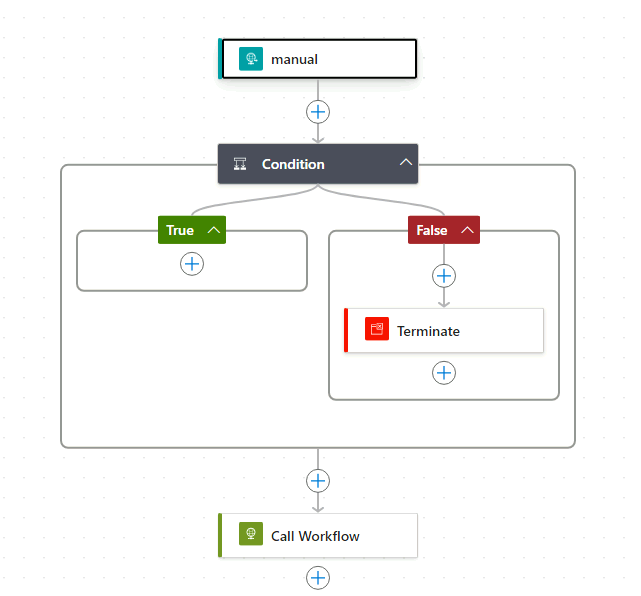
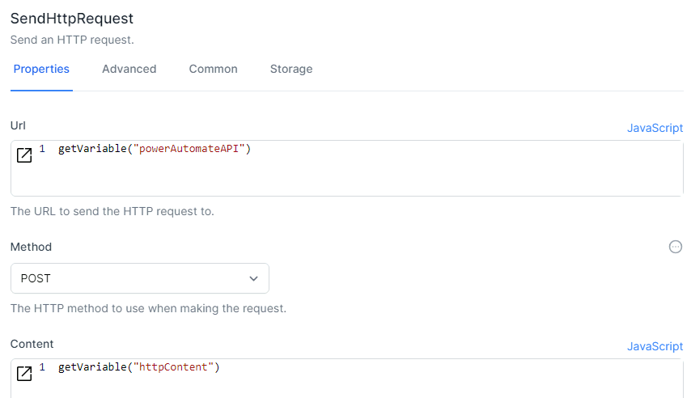
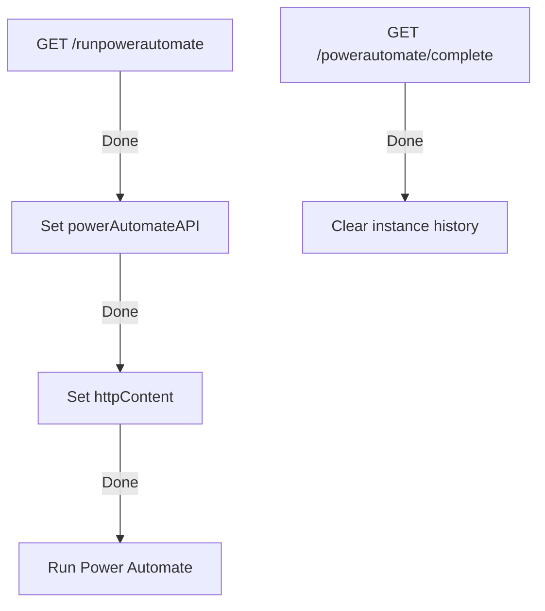

# Interacting with Power Automate from World of Workflows

## Summary

This guide provides a step-by-step tutorial on integrating an World of workflow with Power Automate.
The workflow demonstrates how to trigger a Power Automate flow and wait for its completion using HTTP callbacks.

## Step-by-Step Guide

### Setting Up Power Automate

1. **Create a New Flow**:
   - Start by creating a new flow in Power Automate.
   - Use the **"When an HTTP request is received"** trigger to begin the flow.

2. **Configure the HTTP Request**:
   - Define the JSON schema that will be sent from World of Workflows, such as
   
      ```
      {
         "type": "object",
         "properties": {
            "RunCode": {
                  "type": "string"
            }
         }
      }
      ```

3. **Add Your Logic**:
   - Implement any necessary logic within Power Automate.
   - For example, add conditions or other actions depending on your needs.

4. **HTTP GET Callback**:
   - At the end of the Power Automate flow, add an HTTP action to make a `GET` request back to the World of workflow’s `/powerautomate/complete` endpoint.

5. **Save and Publish the Flow**:
   - Save the flow and copy the HTTP POST URL provided by Power Automate. This URL will be used in your workflow.



### Setting Up the Workflow

Follow these steps to set up your workflow to interact with Power Automate:

#### 1. Define the Power Automate API Endpoint

- **Activity**: `SetVariable`
- **Variable Name**: `powerAutomateAPI`
- **Value**: The Power Automate HTTP POST URL.

```json
{
  "VariableName": "powerAutomateAPI",
  "Value": "As provided by Power Automate"
}
```

#### 2. Set the HTTP Request Content

- **Activity**: `SetVariable`
- **Variable Name**: `httpContent`
- **Value**: JSON content to pass through to the Power Automate flow.

```json
{
    "RunCode": "StartPowerAutomate"
}
```

#### 3. Send HTTP Request to Start Power Automate

- **Activity**: `SendHttpRequest`
- **URL**: `getVariable("powerAutomateAPI")`
- **Method**: `POST`
- **Content**: `getVariable("httpContent")`



#### 4. Wait for Power Automate to Complete

- **Activity**: `HttpEndpoint`
- **Path**: `/powerautomate/complete`
- **Method**: `GET`

This activity initializes the follow-up segment of the workflow.

#### 5. Clean Up Workflow Instances

- **Activity**: `RemoveWorkflowInstances`
- **Workflow Definition Name**: `PowerAutomateWorkflow`
- **Version Selection**: `All`
- **Instance Retention**: `1`

## Workflow: Power-Automate-Workflow

