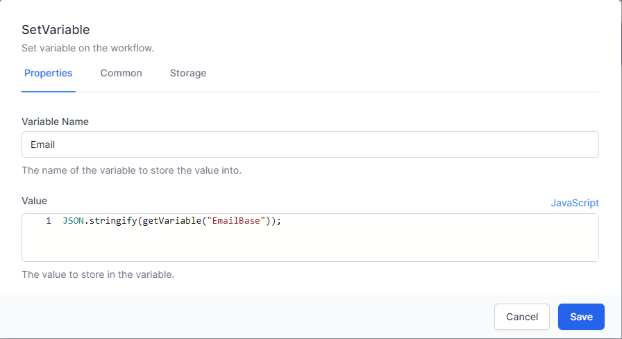
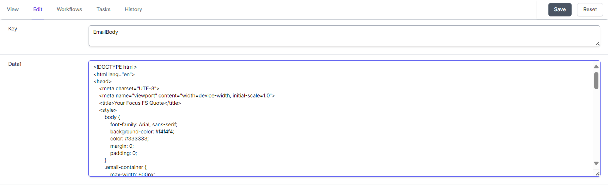
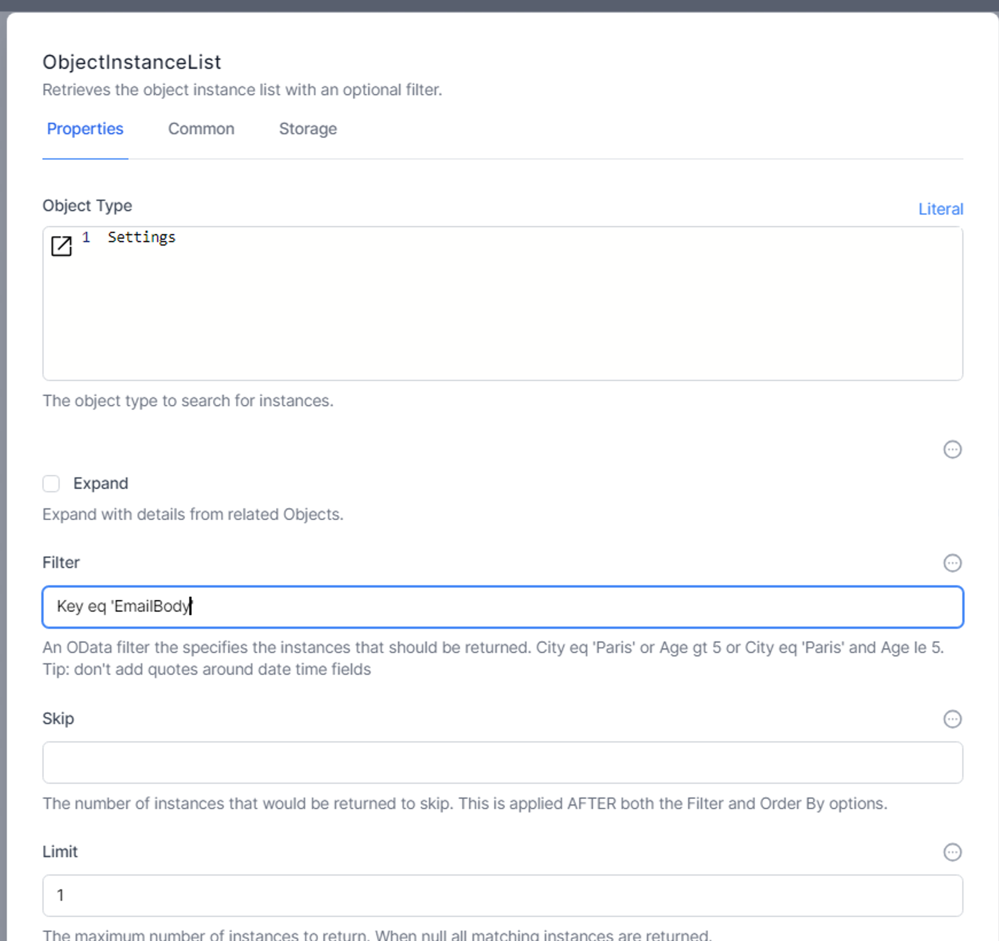
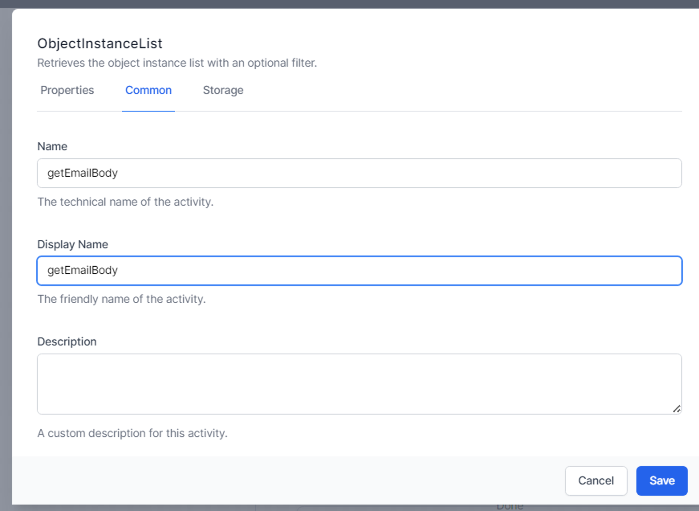
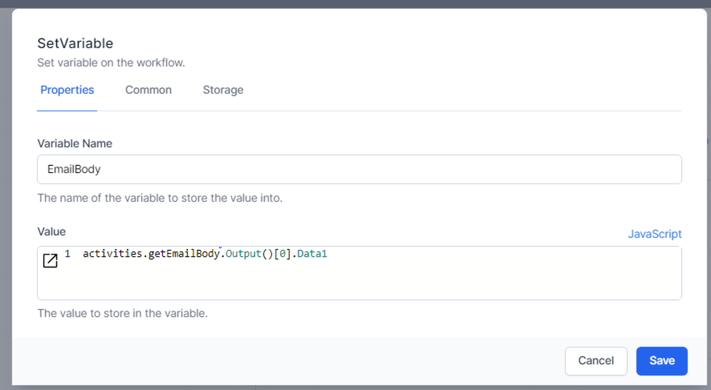
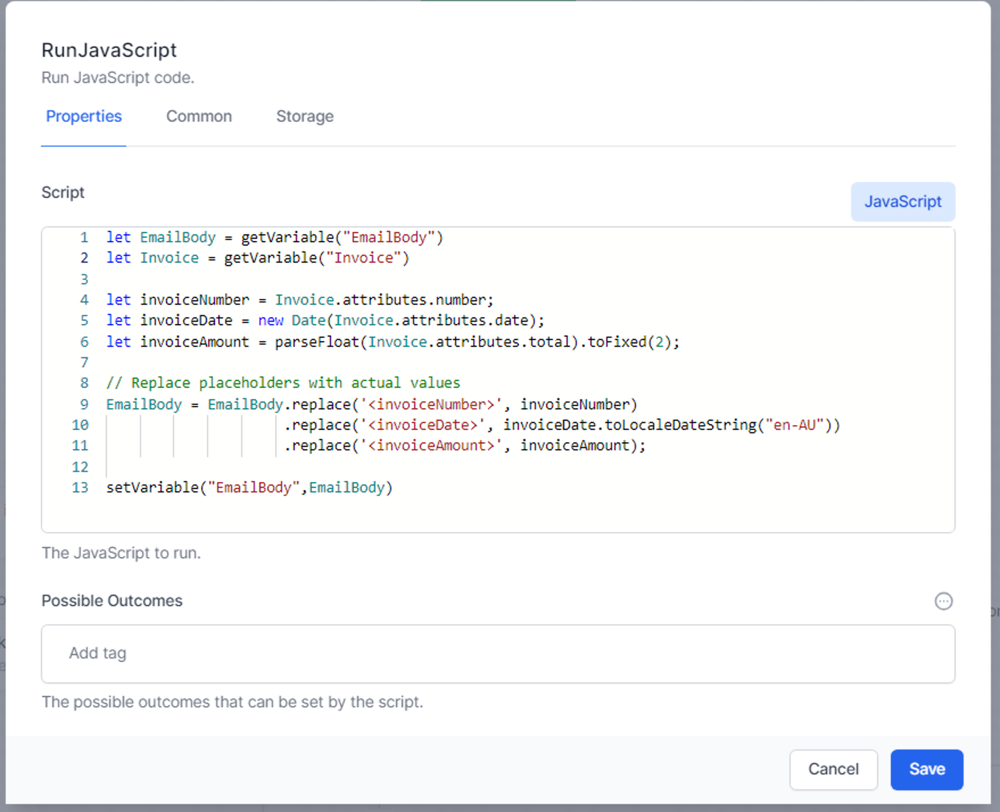
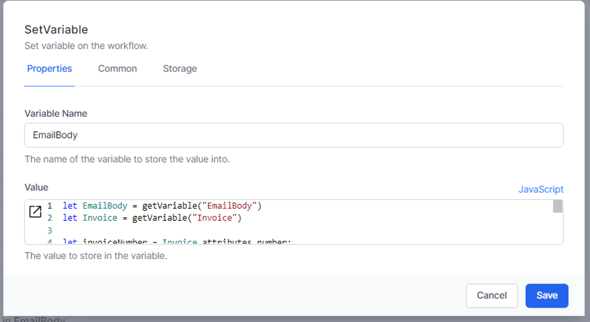
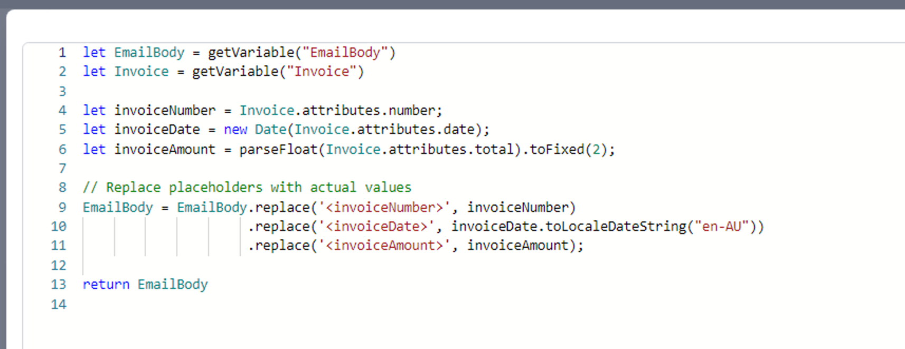

# Send html email using Office 365

World of Workflows can easily send HTML Email using Office 365 with a simple workflow, as follows:

*Please esure you have established Office 365 credentials. See [here](../../20_solutions/sample solutions/AIProspector/register-office365-application.html)*

## Step 1:
> Activity: **SetVariable**

Save the HTML Email to a Variable, called ```EmailBase```


## Step 2:
> Activity: **SetVariable**

Use Javascript to "Stringify" the email, and save this in a new variable, called ```Email```



## Step 3:
> Activity: **Send HTTP Request**

Send an Http request to Microsoft Graph to Send the email

- Url: ```https://graph.microsoft.com/v1.0/me/sendMail```
- Method: ```POST```
- Content:

    ```json
    {
    "message": {
        "subject": "EmailSubject",
        "body": {
            "contentType": "HTML",
            "content": {{ Variables.Email | markup }}
        },
        "toRecipients": [
            {
                "emailAddress": {
                    "address": "<RECIPIENT EMAIL>"
                }
            }
        ],
        "ccRecipients": [
            {
                "emailAddress": {
                    "address": "<CC EMAIL>"
                }
            }
        ]
    },
    "saveToSentItems": "true"
    }
    ```

Content Type: ```application/json```

Read Content: ```Checked```

Response Content Parser: ```Auto Select```

Supported Status Codes: ```202```

On the ```Advanced``` tab, select the M365 credentials under ```Authorization```

## Other ideas to set the content

Here is another example of setting a variable to hold the data to be sent in the email.

First, we set up our standard Setting to contain Key and Data1 fields. The `Key` will be to 'EmailBody', the text we want in the email will go in `Data1`.




Then we get the data from the database:




and add it to a variable.


{: .key }
Note the use of `.Output[0]` in the formula.  `ObjectInstanceList` returns an array of entries.  The first entry will be `[0]`, the 2nd will be `[1]` and so on.  We know that we will have only one entry returned, so we don't need to loop through the results: we can confidently access the Data1 field from the first entry.

We can use replaceable values in the `Data1` field and substitute these using this type of JavaScript:


This example uses a JavaScript activity and the `setVariable` command.  It can also be achieved using a **SetVariable** activity:




