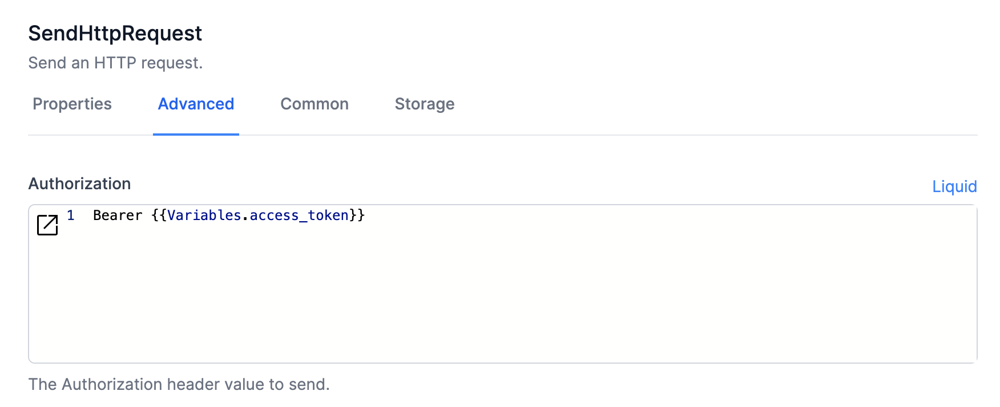
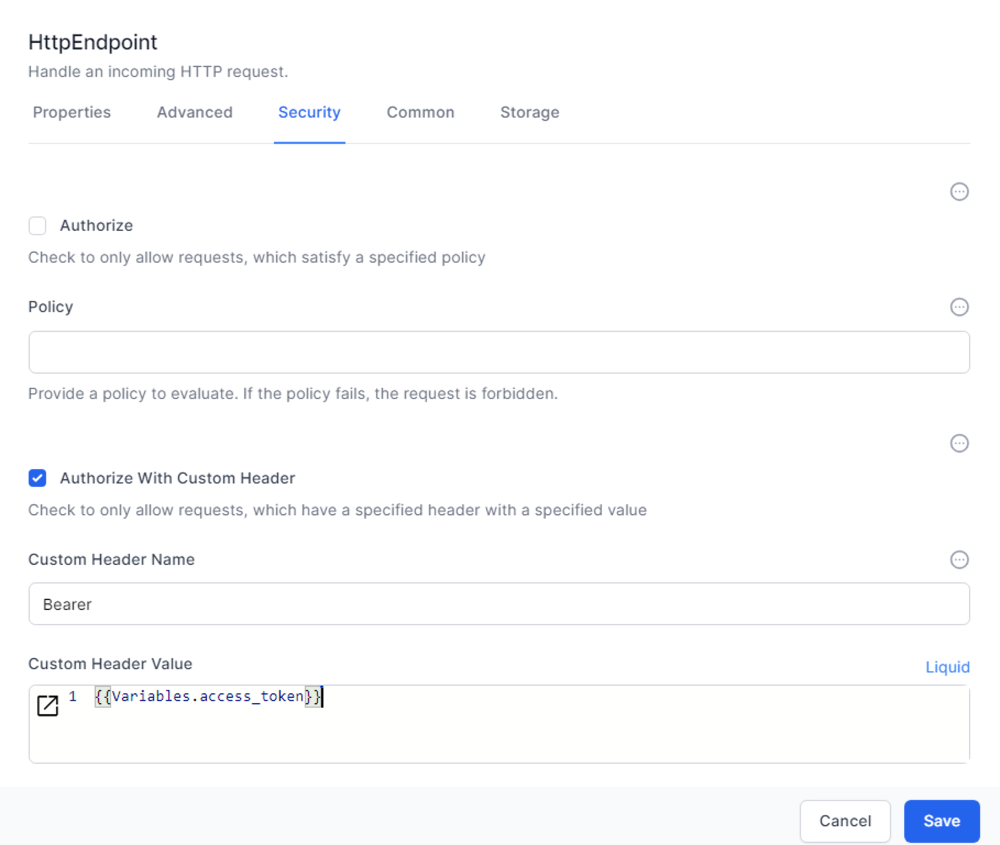

# Refreshing an Access Token

## Passing an Access Token to an HTTP API
Some APIs require an access token to be supplied in the header.  That is simple enough:  we just add it to thre `HTTP Request` activity, like this:



In this case we have set up our variable `access_token` to have a value, and prefixed it with the text 'Bearer '

## Changing Access Tokens
Some HTTP APIs have an access token that is valid for a limited time only.  This means we need to determine if the access token is valid (and refreshing it if needed) before using it.

The architecture for managing a changing access token involves:
   
1. Creating a place to store an access token and its expiry Date
   1. Our standard is to use a Table named `Settings`, which needs at least these 3 string fields:
   - Key
   - Data1
   - Data2
2. Checking if it is expired, and if so getting a new token and storing it  
   - There will be a credential required to obtain the access token from an authentication server, and these credentials need to be stored as well. 

## Build your `getChangingAccessToken` workflow

Here is a <a href="./get-changing-access-token-authentication.json" download>sample workflow </a> that can be imported and tailored to your needs.  

The workflow named "GetChangingAccessTokenAuthentication" is designed to handle the process of obtaining and managing an access token for authentication. Here's a detailed breakdown of the workflow:

1. **HTTP Endpoint /getAccessToken**: The workflow starts with an HTTP endpoint that listens for GET requests at the path "/getAccessToken".

2. **Correlate - starting**: This activity logs the start of the process with the message "starting to get access token".

3. **Get setting instance for token cache (ObjectInstanceList)**: This activity retrieves the setting instance for the token cache with the key 'AccessToken'.

4. **Get TransEliteAccessToken (ObjectInstanceGet)**: This activity fetches the AccessToken object using the ObjectId from the previous step.

5. **If access token expired**: An 'If' condition checks if the access token has expired by comparing the current date and time with the expiration date stored in the AccessToken.

   - **True (Expired)**:
     1. **Get setting instance for credentials (ObjectInstanceList)**: Retrieves the setting instance for credentials with the key 'AccessTokenCreds'.
     2. **Get Creds (ObjectInstanceGet)**: Fetches the credentials object using the ObjectId from the previous step.
     3. **get access token (SendHttpRequest)**: Sends an HTTP POST request to get a new access token using the fetched credentials.
     4. **If we have an authToken**: Checks if a new access token (authToken) is received.
        - **True**:
          1. **Set access_token**: Stores the new access token in a variable.
          2. **Set access_token_expiry**: Sets the expiration time for the new access token.
          3. **Update AccessToken instance (ObjectInstanceUpdate)**: Updates the AccessToken object with the new token and expiration time.
          4. **Correlate - new access token saved**: Logs that a new access token has been saved.
        - **False**: Handles the case where no authToken is received.
          1. **Correlate - new access token is blank**: Logs that the new access token is blank.
          2. **Finish and return error**: Ends the workflow with an error message indicating that the new access token was blank.
   - **False (Not Expired)**:
     1. **Set access_token**: Uses the existing access token.
     2. **Correlate - using existing access token**: Logs that the existing access token is being used.

6. **Finish and return access_token**: Ends the workflow successfully, returning the access token.

Throughout the workflow, various correlation activities log the status and progression, ensuring traceability and error handling.

### Connections:
- The workflow includes multiple connections that define the flow from one activity to another based on the outcomes of conditions and successful completions.

### Error Handling:
- The workflow includes specific activities to handle errors and log appropriate messages if issues arise while fetching or updating the access token.

This workflow ensures that an access token is always available and valid, updating it as necessary and handling errors appropriately.

## Using your getChangingAccessToken workflow

Whenever you are about to make a call to your API that requires the access token you need to check that it is valid.  

Here is a <a href="./call-my-api.json" download>sample workflow </a> that can be imported and tailored to your needs.  


The workflow named "CallMyAPI" is designed to call an API that requires a refreshing token. Here is a detailed breakdown of the workflow and its interaction with the access token workflow:

### Workflow Steps:

1. **get setting instance for APIBaseURL (ObjectInstanceList)**:
   - Retrieves the setting instance for the API base URL with the key 'APIBaseURL'.

2. **Get BaseURL (ObjectInstanceGet)**:
   - Fetches the API base URL object using the ObjectId from the previous step.

3. **If access token expired (If)**:
   - Checks if the current access token has expired by comparing the current date and time with the expiration date stored in the AccessToken.

4. **Set access_token (SetVariable)**:
   - Stores the current access token in a variable.

5. **Run Workflow GetChangingAccessTokenAuthentication (RunWorkflow)**:
   - Runs the sub-workflow "GetChangingAccessTokenAuthentication" to obtain a new access token if the current one is expired.

6. **Set access_token (SetVariable)**:
   - Stores the new access token retrieved from the sub-workflow in a variable.

7. **Correlate - failed to get new access token**:
   - Logs a failure message if unable to get a new access token.

8. **HTTP Response - not found (WriteHttpResponse)**:
   - Responds with "not found" if the sub-workflow fails to get a new access token.

9. **get setting instance for token cache (ObjectInstanceList)**:
   - Retrieves the setting instance for the token cache with the key 'AccessToken'.

10. **Get AccessToken (ObjectInstanceGet)**:
    - Fetches the AccessToken object using the ObjectId from the previous step.

11. **Send HTTP Request - api (SendHttpRequest)**:
    - Sends an HTTP request to the API using the stored access token.

    - **200 (Success)**:
      - **Correlate - finished**: Logs a success message.
      - **Finish and return data (Finish)**: Ends the workflow successfully, returning the API response data.
      
    - **Unsupported Status Code**:
      - **Set ErrorResponse**: Stores the error response.
      - **Set ErrorResponseContent**: Stores the content of the error response.
      - **Correlate - finished - bad**: Logs an error message.
      - **Finish and return error (Finish)**: Ends the workflow with an error message, returning the error response data.

{: .key }
You will notice that the call to the HTTP API uses 3 variables.  These can be obtained in the first activity of the workflow with this JavaScript activity:
```js
let parameters = input;
setVariable("api",parameters.api)
setVariable("Method",parameters.method2)
setVariable("Content",parameters.content2)
```

### Interaction with the Access Token Workflow:

The "CallMyAPI" workflow interacts with the "GetChangingAccessTokenAuthentication" workflow primarily through the `RunWorkflow` activity. Here's how the interaction works:

1. **Run Workflow GetChangingAccessTokenAuthentication (RunWorkflow)**:
   - This activity runs the "GetChangingAccessTokenAuthentication" workflow to fetch a new access token if the current token is expired.
   - The `RunWorkflow` activity is configured to run in blocking mode, meaning it waits for the sub-workflow to complete before proceeding.

2. **Handling Success and Failure**:
   - If the sub-workflow successfully retrieves a new access token, it is stored in the `access_token` variable.
   - If the sub-workflow fails to retrieve a new access token, the workflow logs the failure and responds accordingly.

3. **Continuing the API Call**:
   - With a valid access token (either existing or newly retrieved), the "CallMyAPI" workflow continues to send an HTTP request to the target API.

This design ensures that the API call is always made with a valid access token, refreshing the token as necessary and handling any errors appropriately. The interaction between the two workflows is crucial for maintaining the validity of the access token and ensuring successful API calls.

## Using an access token to secure your own HTTP APIs

An access token can be passed between your own HTTP workflows.  This ensures that the HTTP endpoint will be secure.

### Setting up the calling HTTP Request

Add your access token like this to the HTTP Request:


### Setting up the HTTP Endpoint

Create the same access_token variable (with the same value) in your workflow with the HTTP Endpoint, and set it like this:



