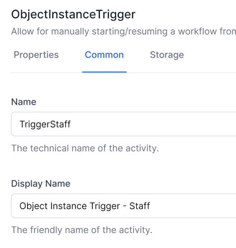
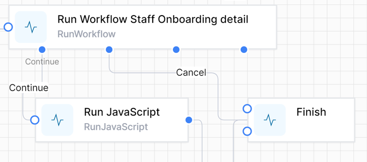
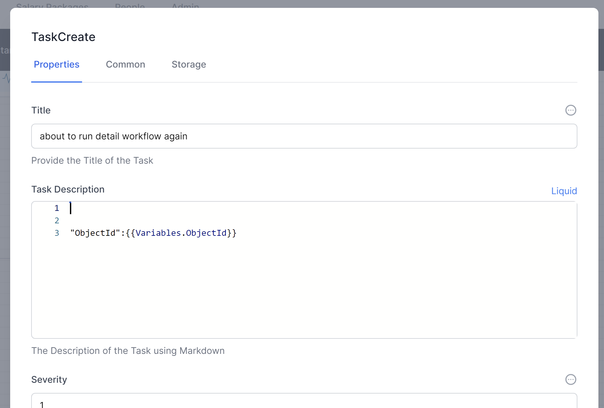
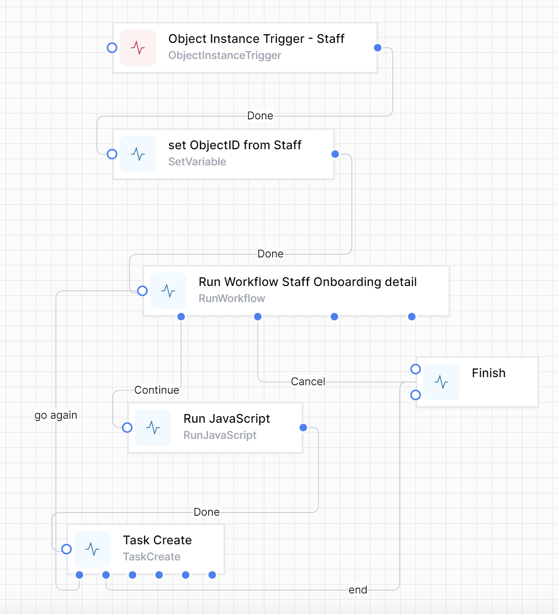
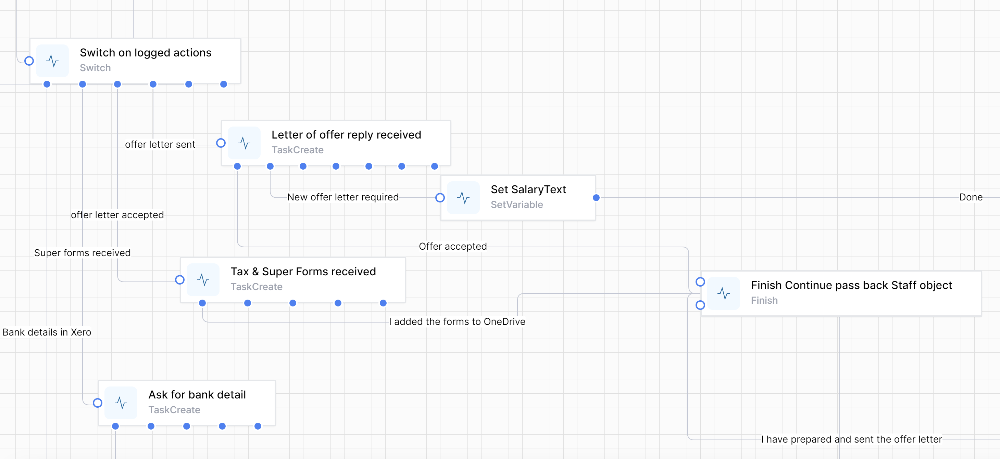
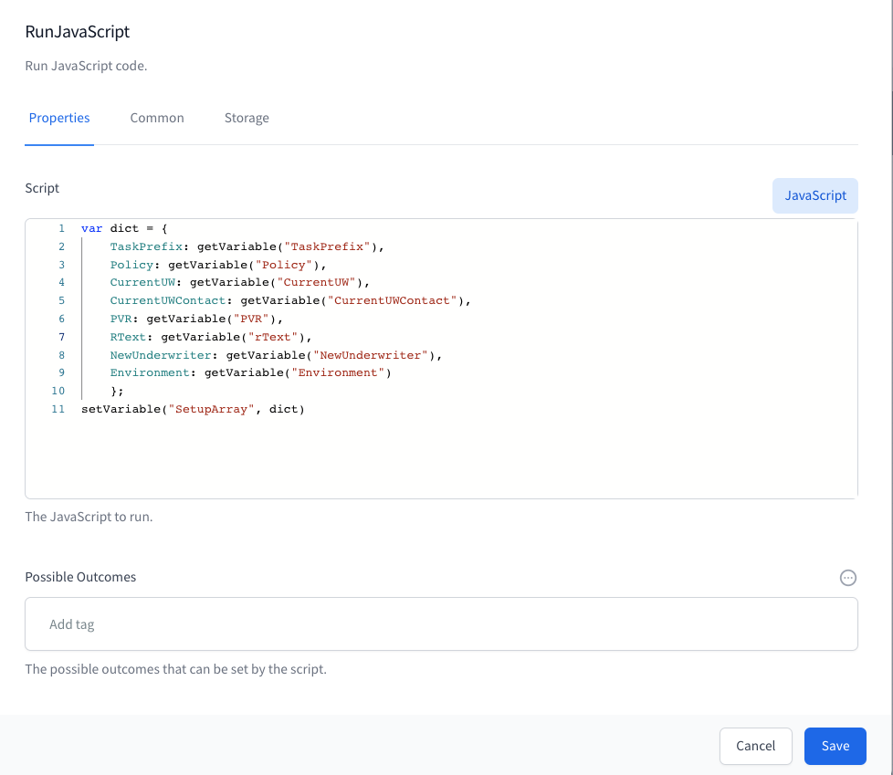


# Examples

This section contains packaged examples of how to solve certain business problems. These are meant to be taken, modified and used by you to solve your own business problems.

## Designing long-running workflows

As you develop your workflows, you will have workflows in production which you need to change. It is easy to make these changes and they will apply to all future instances of your workflows. However, if you have a workflow that started before your change was made and has not yet completed, Workd Of Workflows will execute your old workflow.

This diagram describes this scenario:

The workflow engine will continue to run your workflows as they were designed until they complete. This maintains the integrity of your design, and you can be confident that the workflow will continue to run the way you design it, even if changes are subsequently made to that workflow.

This can become a problem if you expect your workflows to run for an extended period of time.

For example, your company has a process that manages your employee HR process - from recruitment, onboarding, pay rises and eventual termination of employment.

You could write this as a single workflow, and each time an employee starts with the company a new instance of the workflow would be created. The effect of this is that you would have one instance for Jane Smith’s employment, a second instance for John Doe’s employment and so forth.

You would expect that your employment process would change during the period of a specific employee’s employment. However, the instances that are still running will not inherit any design changes you make to the workflow. We hope and expect that employees will be with us for many years, and change to the workflow during this time is inevitable.

So, how do we manage this?

Firstly, break up your workflows into manageable pieces. Design your workflows so that each one can be completed in a ‘reasonable’ period of time. This might be a day, a week or month, depending on the workflow and the likelihood of change.

Here is an example of one way to break up this sample workflow.

Each workflow could call the next. For example, changes made to the Pay Rise workflow would now apply to an employee currently being processed by the Onboarding workflow.

#### What if you have a complex workflow and breaking it into small flows does not suit? 

A more challenging example might be a workflow to manage thousands of insurance renewals, where a complex process must run for months and there is a high likelihood of making process improvements whilst thousands of workflow instances are running.

We can imagine breaking your workflows into smaller pieces. Part 2 could be called from Part 1. In Part 2 you may need 20 tasks, some asked in only specific scenarios.

However, changes to Part 2 might need to impact the existing long-running workflow instances. We have developed the Overview workflow concept to manage this.

### Implementing an Overview workflow

One way to have a single workflow run for the entire process and still be able to make changes along the way is to use a simple workflow we will call an Overview workflow.

Here is how to design this workflow.

1.  Create a workflow, give it a suitable name, such as *HR Overview.*

2.  Implement a method to start your *HR Overview* workflow (eg from a data object or a timer)

3.  Set up any variables you need to pass to the main workflow, such as the ObjectID of the triggering object instance

4.  Add a *Run workflow* activity to kick off your main workflow

5.  Add a *Run JavaScript* activity to grab the outcome of your main workflow

6.  (optional, and recommended for debugging) add a *TaskCreate* activity to provide you with the ability to stop your workflow

7.  Join everything up.

You will notice that there is almost nothing in this workflow that will ever need to change. All it does is to call another workflow. The simpler you make your Overview workflow, the less likelihood that it will ever need changes.

Here are the activities in detail

1.  The workflow is called *StaffOnboardingOverview*

2.  I chose an *Object Instance Trigger* to start this workflow. It is run from within a *Staff* instance:  
      
    

3.  Set a variable called **<span class="smallcaps">ObjectId</span>** to contain the ObjectId of the initiating Staff object:  
      
      
    Note: we use JavaScript to get the value, using the **<span class="smallcaps">Name</span>** of the trigger activity to get the ObjectID, using this formula:

```js
activities.TriggerStaff.InstanceId()
```


1.  This is the *Run Workflow* activity:  
      
      
      
    The workflow definition uses a Liquid Filter to allow us to use the name of the workflow we are calling (rather than it’s ID)  
      
    The Input is the JSON we will be passing to our main workflow  
      
    The branches ***Continue*** & ***Cancel*** are the text entered into Possible Outcomes.  
      
    Note the **<span class="smallcaps">Name</span>** on the next page:  
      
    You will use this name in the next activity.

2.  The *Run JavaScript* activity  
    

> Note how the name of the *Run Workflow* activity is used in the *Run JavaScript*.

```js
var parameters = JSON.parse(activities.runDetailWorkflow.Output().workflowOutput)

for(const property in parameters)

{

    setVariable(property.toString(),parameters\[property\]);

}
```

1.  (Optional) Create a Task to allow you to stop the Overview workflow at will. Note the branches  
      
    …  
    

2.  Add a Finish activity and connect the activities like this:  
    

### Implementing the main workflow

The main workflow can now be designed to be called as many times as needed to ensure that it does not run for too long.

###### Accept parameters from the Overview workflow

Create this as the first activity in your main workflow:


Use this JavaScript to take the JSON passed from the Overview workflow and convert it to dot-notation variables.

```js
var parameters = JSON.parse(input)

setVariable("Parameters",parameters)

If the JSON passed in is

{

“ObjectId”:123

}
```

This allows you to reference the passed in ObjectId in Liquid as

```liquid
{{Variables.Parameters.ObjectId}}
```

And in JavaScript as

```js
getVariable(“Parameters”).ObjectId
```

###### Use Status fields as starting points of your main workflow

Use a Switch to direct the flow, using data saved in your object to determine where the flow is up to. For example:


In this switch statement you first want to match the last checkpoint in your workflow then the next-to-last checkpoint, and so on.



###### Return to the Overview workflow frequently

This is the Finish activity.


It passes back the ObjectId so that the Overview workflow can use it to call the main workflow again. It also passes back the ‘Continue’ Outcome, which is used to determine whether to run the main workflow again. (If we pass back ‘Cancel’, the Overview workflow will stop).

Notice that the main workflow does the minimum amount of processing between the switch statement and the finish statement, ideally just enough to prepare and process one *Task Create* activity. This is where the magic occurs: now the main workflow only has to be in existence for one task at a time. As soon as this task is complete, a new instance of the main workflow is created, and continued from this checkpoint.

###### Ensure variables are available

Note that you will need to ensure the variables you set in your main workflow are available when the workflow is restarted. This can be done by calling a ‘set variables’ workflow, or specifically in the main workflow.

Example of a ‘set variables’ workflow:


We pass in a suitable ObjectID that we are always going to know.

Note that *Mode* is **<span class="smallcaps">Blocking</span>**, waiting for the *SetupVariables* workflow to complete.

The first activity in the *SetupVariables* workflow is to get the database object using the passed in ObjectId. For example:  


The rest of the variables are then set up

The last 2 activities in the SetupVariables workflow are to set up and send back the variables to the calling workflow





Another method of setting variables in the main workflow is to build up the variables from the known data. For example, in this case, if the Staff already has a SalaryPackage we can get the SalaryPackage object from the Staff object. Otherwise we can create the SalaryPackage object and save the relationship back to the Staff object


