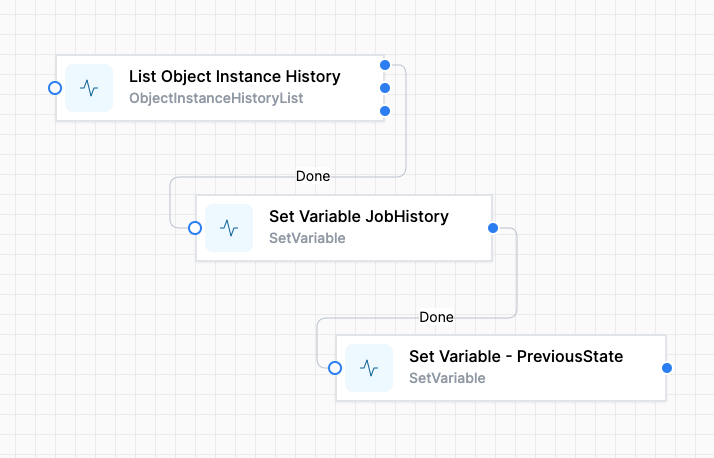



# Getting an Object's history

The <a href="./get-object-history.json" download>**getObjectHistory** </a> workflow snippet is designed to show you how to retrieve and manage the historical status of an object within the World of Workflows.  This allows a workflow to analyze past statuses and transitions for that object. This can be useful for tracking progress, debugging issues, or generating reports. 

This example uses a **Job** object, obtained with the variable `jobid`

## Overview of the Workflow

1. **Key Components**:
   - **Activities**: The workflow snippet consists of three main activities:
     - **List Object Instance History (GetJobStatusHistory)**: This activity retrieves the history of a job's status based on the provided `InstanceId`. It fetches previous versions of the job and their corresponding states.
     - **Set Variable (Set Variable JobHistory)**: After fetching the job status history, this activity sets a variable (`JobHistory`) to store the retrieved historical data for later use within the workflow.
     - **Set Variable (Set Variable - PreviousState)**: This activity extracts the most recent state of the job from the retrieved history and assigns it to a variable (`PreviousState`). This allows the workflow to access the last known state of the job easily.

2. **Flow of Execution**:
   - The workflow begins by executing the **List Object Instance History** activity to get the historical data for a job specified by its `InstanceId`.
   - Once this activity completes successfully (indicated by the "Done" outcome), it triggers the **Set Variable JobHistory** activity, storing the fetched data.
   - Finally, it sets the `PreviousState` variable with the latest status from the job history.

