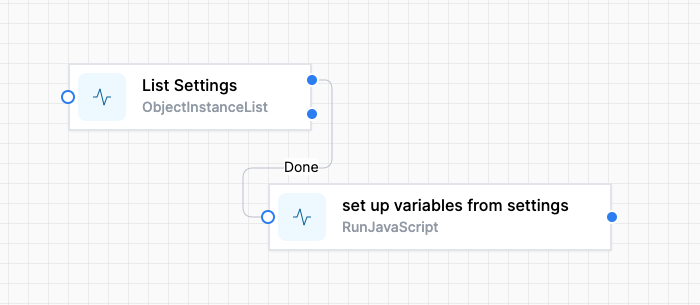



# Settings Variables

Almost all World of Workflows workflows will have a way to hold configuration data.  We recommend using a `Settings` Table with these fields 

1. Key (string)) 
2. Value (string)
3. Active (true/false) (optional)
4. Comments (optional)

The <a href="./get-settings.json" download>**Get Settings** </a> snippet workflow is designed to streamline the process of retrieving and managing configuration settings within an application. 

These two activities provide a simple mechanism for dynamically retrieving and managing configuration settings within an application. Its structured approach combines data retrieval and processing through JavaScript, allowing for a flexible and adaptable solution that can respond to changes in settings and requirements efficiently. This makes it a crucial component in environments where configuration management is essential for operational success.



## Overview of the Workflow

1. **Purpose**:
   - The workflow's primary goal is to fetch configuration settings from a defined data source and dynamically set corresponding variables for use within the application or subsequent processes. This enables a flexible and dynamic setup where configuration can easily adapt to changes in the underlying data.

2. **Key Components**:
   - **Activities**: The workflow consists of two main activities:
     - **List Settings**: This activity is responsible for retrieving settings from a data source (like a database or a settings file). It defines the type of objects to retrieve and can include filters or sorting options, though these are currently not configured.
     - **Run JavaScript**: After fetching the settings, this activity processes the data using JavaScript. It maps the retrieved settings to specific application variables, ensuring that the application can use these settings effectively in its operations.

3. **Flow of Execution**:
   - The workflow begins by executing the **List Settings** activity. Upon successful completion (indicated by the "Done" outcome), it triggers the **Run JavaScript** activity to process the fetched data.
   - This sequential flow ensures that the application is always working with the most current settings available.

4. **Dynamic Variable Management**:
   - The workflow's use of a JavaScript activity allows for flexibility in how settings are handled. By defining key-variable mappings within the script, it can easily accommodate changes to the settings structure without requiring extensive modifications to the workflow logic.

5. **Configuration and Reusability**:
   - The design enables easy updates to the workflow, as the settings retrieval and variable assignment logic are separated into distinct activities.

## The JavaScript that does the work

This is the JavaScript that allows the selection of Settings that are relevant to the workflow, ignoring all others.

```js
// Define an array of key-value pairs
const keyVariableMappings = [
    { variableName: "PoweredBy", key: "PoweredByWoW" },
    { variableName: "Logo", key: "Logo" },
    { variableName: "LogoWhite", key: "LogoWhite" },
    { variableName: "Style", key: "Style" },
    { variableName: "authjs", key: "auth.js" },
    { variableName: "PDFButton", key: "PDFButton" },
    { variableName: "PDFButtonJS", key: "PDFButtonJS" },
    { variableName: "StandardHeaderMatter", key: "StandardHeaderMatter" }
];

// Function to get value by title from the JSON data
function getValueByTitle(jsonData, key) {
    for (let item of jsonData) {
        if (item.Title === key) {
            return item.Value;
        }
    }
    return null; // Handle "key not found" as needed
}

// Loop through the array to set variables dynamically
const jsonData = activities.ListSettings.Output();
keyVariableMappings.forEach(mapping => {
    setVariable(mapping.variableName, getValueByTitle(jsonData, mapping.key));
});

```

