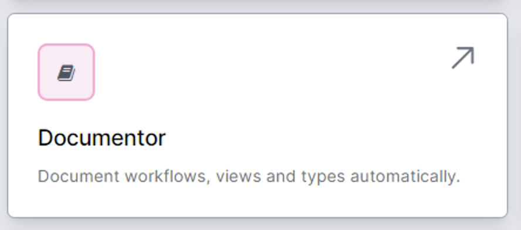
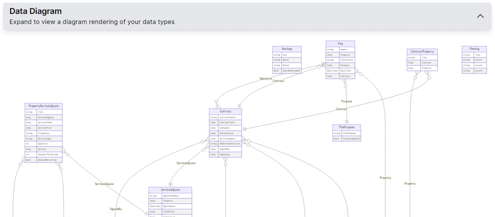
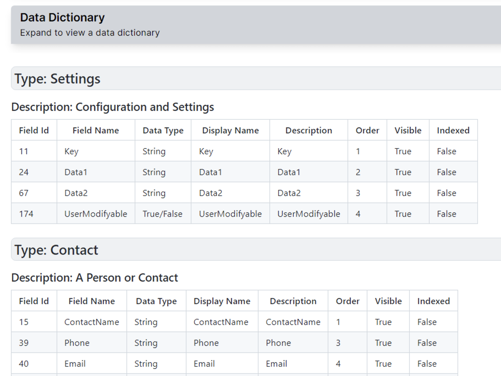
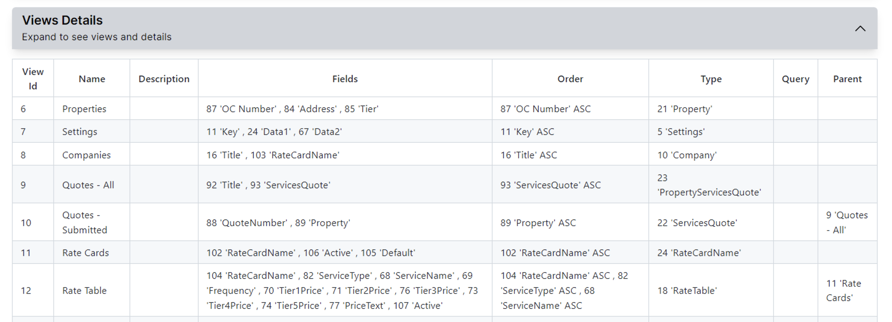
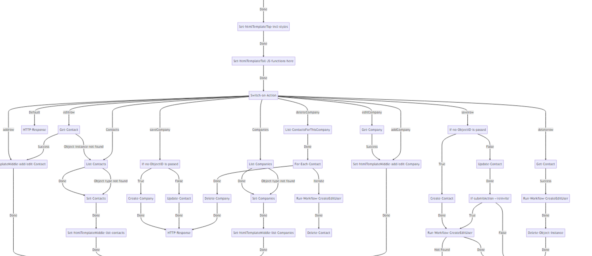

# Documentation in World of Workflows

World of Workflows includes comprehensive documentation features that help you maintain an organized and well-documented system. By automatically generating crucial documentation such as data diagrams, data dictionaries, views dictionaries, and detailed workflow information, World of Workflows ensures that your team can easily understand and manage your processes.

This chapter will cover the key aspects of documentation in World of Workflows.  You will find a link to the Documentor in the `Admin` page of your instance.

## Data (ERD) Diagram

An Entity Relationship Diagram (ERD) is a visual representation of the tables and relationships within your User Configurable Database. World of Workflows automatically generates an ERD for your database, enabling you to quickly grasp the structure and connections between tables. This visualization is invaluable for understanding the overall data architecture and identifying areas for optimization or expansion.  

{: .key }
You will need Internet access for the first time you open the documentor.  

Here is an example:

## Data Dictionary

The data dictionary is a comprehensive reference of all tables and columns within your User Configurable Database. It includes information such as table and column names, data types, descriptions, and any constraints or relationships. World of Workflows generates a data dictionary to facilitate a clear understanding of the database structure and enable efficient management and development of your data.

Here is an example:

## Views Details

The views details is a catalog of all the views defined within World of Workflows. It includes information such as view names, descriptions, parent views, and associated fields. The views dictionary aids in managing and understanding the different perspectives and hierarchies of your data, allowing you to create more effective views and improve overall user experience.

Here is an example:

## Workflow Diagrams

A visual representation of the workflow's structure, displaying the flow of activities and branching logic. This diagram helps users understand the workflow's design and execution path, making it easier to optimize and maintain.

Here is an example:

## Workflow Details

World of Workflows provides detailed documentation for each workflow, including the Activities List: a comprehensive list of all activities used in the workflow, along with their descriptions and configurations.

## Summary

By offering these robust documentation features, World of Workflows empowers your team to manage and develop your systems effectively. Comprehensive documentation not only promotes a clear understanding of your data and workflows but also helps to ensure that your organization can adapt and scale efficiently as your needs evolve.

## Extending Documentation with OpenAI

The workflows are saved in .json files in the World of Workflows database.  OpenAI has been trained to understand the World of Workflows format, and gives a very good explanation of the functionality of a workflow.

To ask ChatGPT to document a specific workflow:
1. Export the .json file from the workflow designer.  See [here](../10_ManagingWorkflows/duplicatingWorkflows.html) for detailed instructions on exporting a workflow.
2. Upload the .json file to ChatGPT and ask this question:  
    'Explain this workflow'

