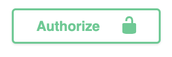
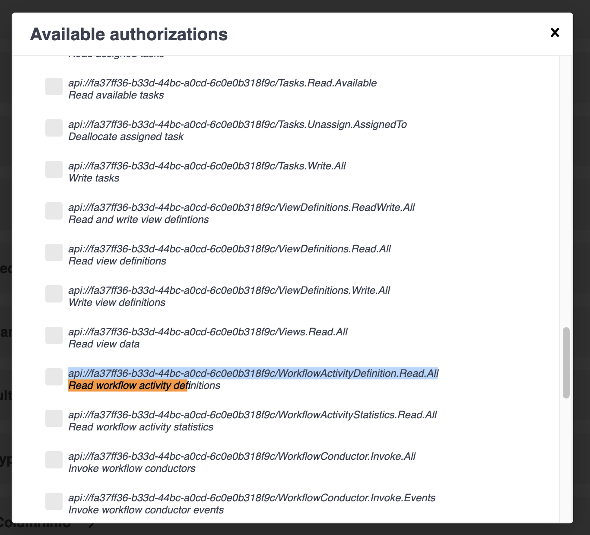
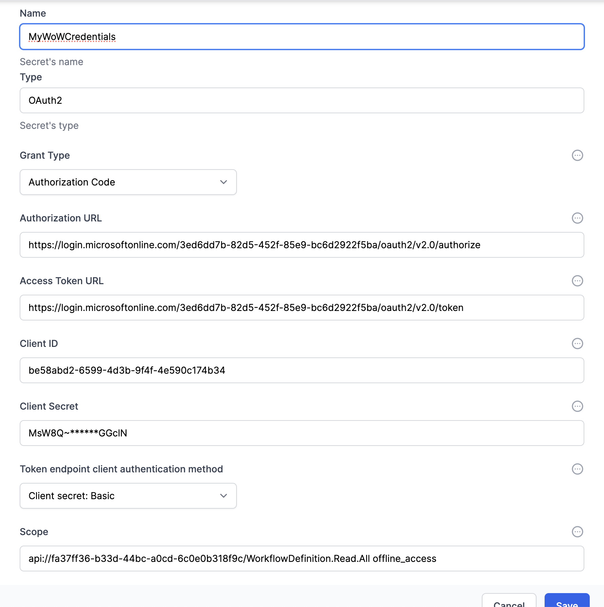

# Create the credentials to your World of Workflows instances

1. Navigate to `Admin` -> Workflows. 
2. Open `Credential Manager`
3. Click `Add New`
4. Select `OAuth2 credentials` and give it a suitable name (eg MyWoWCredentials)

5. Navigate to `Admin` -> `Swagger' This will open a new window showing all of the APIs which your World of Workflows instance has available.  You will recognise your Types etc.
6. Click the `Authorize` button at the top, 
7. Use your browser's Find function, search for `read workflow activity def`  
  
     
8. Copy the whole line of text above the search result.  eg 
`api://fa37ff36-b33d-44bc-a0cd-6c0e0b318f9c/WorkflowActivityDefinition.Read.All`
Add this to the Scope field
    
> Your api scope will differ from this example.
1. Complete the rest of the fields using [this](../24_reference/access-graphapi.html/#required-information) guide.
