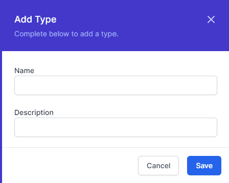
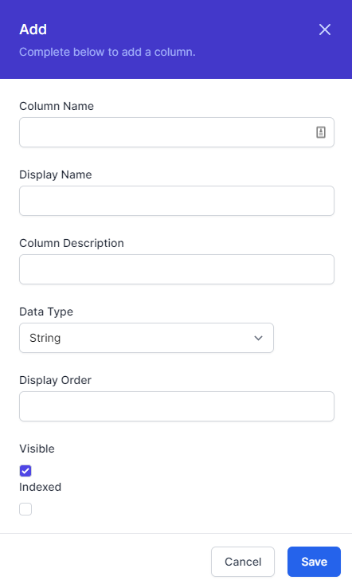

# Working with Data

World of Workflows comes with a highly performant and extensible data engine. This allows you to store data in a variety of ways, and to use that data in your workflows.

Data is stored as types. These are like a spreadsheet. Rows are instances of the data and columns are properties of the data.

## To create a new type

1. Navigate to **Admin** then **Types**
2. Click **Add Type**
   
   
4. Give the Type a **Name** and **Description**
5. Click **Save**

## To Create a new Column
1. Navigate to **Admin** then **Types**
2. Click **Columns** on the type you wish to add a column for
3. Click **Add Column**
   
   
   
   Enter the following information:
   1. **Column Name** - This should ideally have no spaces and use uppercase and lowercase letters only
   2. **Display Name** - This should be a human-readable name for the column
   3. **Description** - This should describe what you want to store in this column
   4. **Data Type** - World of Workflows understands several data types, which ensure your data is formatted and stored correctly. Enter one of the following data types:
      1. **Reference** - This is a reference to another type. This is useful for creating relationships between types.
      2. **Big Integer** - This is a whole number. It can be positive or negative and be between -9,223,372,036,854,775,808 to 9,223,372,036,854,775,807.
      3. **Integer** - This is a whole number. It can be positive or negative and be between -2,147,483,648 to 2,147,483,647.
      4. **Decimal 2** - This is a decimal number with 2 decimal places useful for storing currency values.
      5. **Decimal 5** - This is a decimal number with 5 decimal places useful for floating point numbers.
      6. **True/False** - This is a boolean value. It can be either true or false.
      7. **String** - This is a string of text. It can be any length.
      8. **DateTime** - This is a date and time value, stored as UTC and presented in local time.
      9. **Url** - This is a string that is presented as a hyperlink.
      10. **Embed** - This is a string that is presented as an embedded object.
   5. **Display Order** - This determines which order the fields are shown.
   6. **Visible** - This determines whether or not the field will be visible in the data editor.
   7. **Indexed** - This determines whether the system will index the field to make it quicker to search and filter.