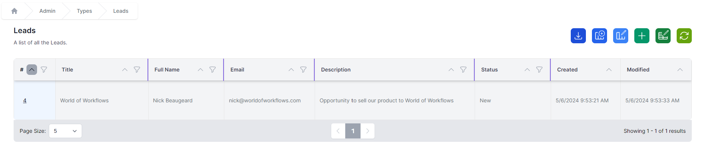
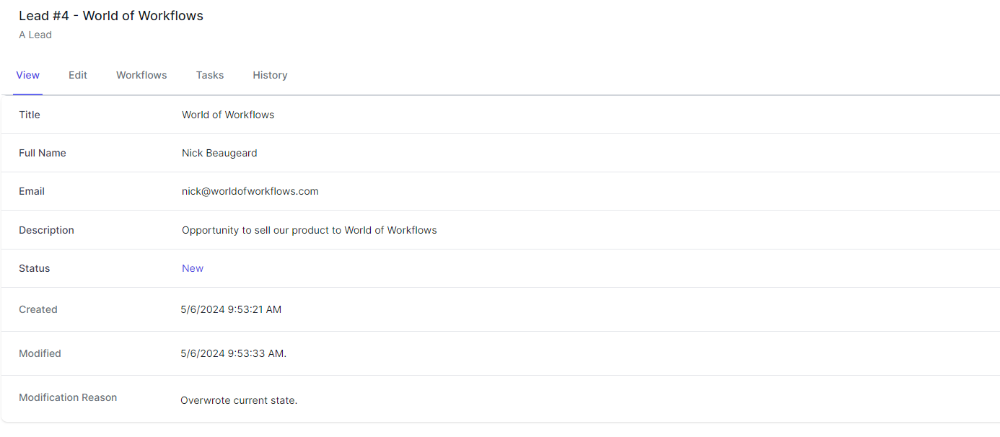
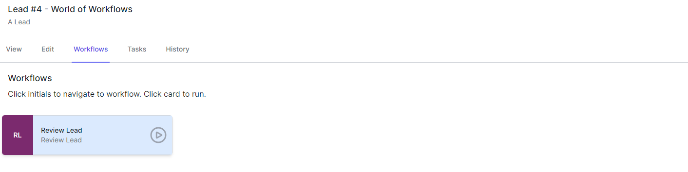
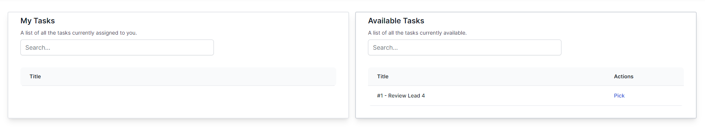
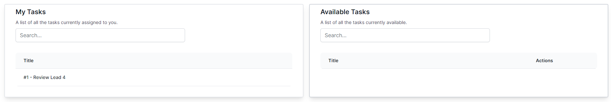
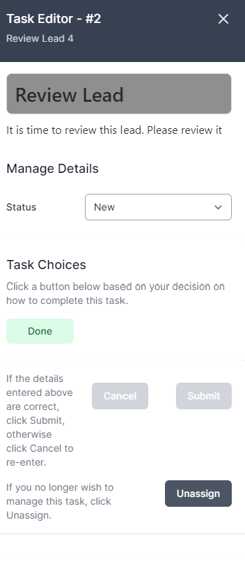

# Try it Out

1. Navigate to **Admin** --> **Types** --> **Lead**
   
2. Click the Id for the Lead (In this case 4)
   
3. Click the Workflows Tab
   
4. Click **Review Lead**
5. Navigate to **Tasks**
   
6. Click **Pick** next to the task. This moves the task from the available queue into your queue.
   
7. Click the Task in the **My Tasks** queue.
   
8. Here you can change the status of the lead, click **Done** and Submit to save. You can also **Unassign** the lead if you wish.

**Congratulations.** You have now completed our first getting started guide. You have created a lead management system that allows for task-based reviews of leads.