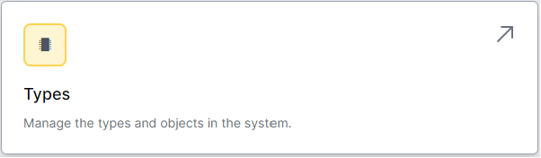
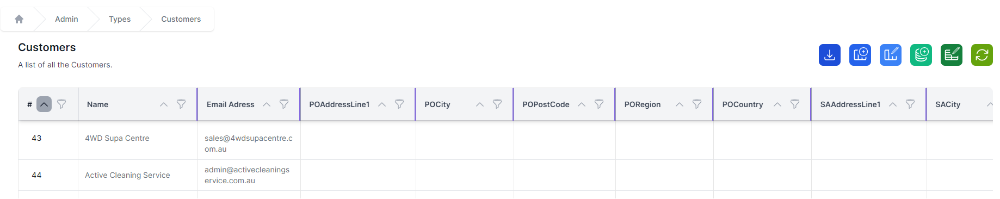
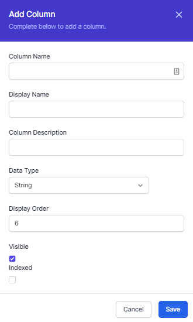

# The Database

*Click to watch the video*

Welcome to this module on the World of Workflows database. In this section, you'll learn the basics of World of Workflows database design and management. 

The World of Workflows database is a relational database which is a collection of data organized in tables with columns and rows, allowing for easy access and manipulation of the data. You'll learn about the different types of data types, the rules of good database design, and how to use the user interface and workflows to interact with the database. By the end of this course, you'll have a solid foundation in the principles of World of Workflows databases and be able to use them effectively in your work. Let's get started.

# Tables
A **type** in the workflows database and a spreadsheet are similar in that they both organize data into rows and columns. However, there are some key differences between the two. A spreadsheet is typically used for storing and analyzing small amounts of data, while a table in the workflows database is designed for storing and managing large amounts of data. 

Additionally, a spreadsheet is limited in the number of rows and columns it can have, whereas a table in a relational database can have an almost unlimited number of rows and columns. 

Furthermore, a spreadsheet is typically used for simple data analysis, whereas a table in a relational database can be used to create complex queries and perform advanced data analysis.

We consider spreadsheets commonly store quite **unstructured** data whereas the database in workflows is designed to store **structured** data.

- To create a new type, follow the procedure 
  [here](procedures/create-type.md)

Managing Data in World of Workflows allows you to create, edit and delete types, columns and data to meet your exact business needs.

## Data Tables
Each column in a workflows database **type** has a specific data type. The data types determine what kind of data can be stored in the column, and how the data can be used.

For example, we can store currency values, dates, strings as simple types but also store email addresses, phone numbers, and URLs as more complex types.

## Relationships
In spreadsheets, making tables of related data is difficult, but in workflows it's really simple. You can define a relationship between a column in one **type** that references another **type**.

Workflows also allows you to export your data, edit it outside of workflows and **import** it back in. See the [module on import](import) for more information.

## Working with the database
When considering how you will configure your database, it's important to think about how you will use it. A session planning what data you will need and how you will use it is important to ensure you don't have to spend time redoing your work.

When one works with the database, you normally:

1. Create the types you need. [See here](procedures/create-type.md)
2. Create the columns you need. [See here](procedures/create-column.md)
3. Test with some initial data
4. Refine where necessary

## Exporting Data
Exporting data to CSV (comma-separated values) is a common way to transfer data between systems or to save data in a format that can be easily read and understood by other programs. CSV is a simple, widely-supported format that can be opened and read by a variety of different programs, including spreadsheet applications like Microsoft Excel, Google Sheets, and OpenOffice Calc.

Exporting data to CSV has several benefits. First, it allows you to save data in a format that is easy to read and understand, which can be especially useful when sharing data with others who may not be familiar with the source system. Second, it allows you to transfer data between different systems or platforms, which can be useful if you need to work with the same data in different programs or on different devices. Finally, it allows you to create backups of your data, which can be useful for ensuring that your data is safe and secure in case of any problems with the original source.

To export data to CSV, follow the procedure [here](procedures/export-data.md). You can then open the CSV file in a program that supports the CSV format, such as a spreadsheet application, to view and work with the data.

## Creating a Data Diagram
A data diagram is a visual representation of a database schema that shows how different pieces of data are related to each other. This is useful because it allows people to understand the structure of a database at a glance, which can be especially helpful for people who are not familiar with databases or who are trying to understand a complex database system.

A data diagram can help to identify potential problems or inconsistencies in a database schema, and it can also be used to communicate the design of a database to others, such as other members of a development team or stakeholders in a project. By providing a clear and concise visual representation of a database, a data diagram can help to ensure that everyone is on the same page when it comes to understanding the structure and organization of the data.

You can create a diagram by following the procedure [here](procedures/data-diagram.md)

## Best practices
There are a few limits to consider in the workflows database: 

- You can currently have a maximum of 2,000 columns in a type and we would recommend you go nowhere near this. 
- Use relationships where you can to improve performance.
- Don't store large amounts of data in a single column. If you need to store a large amount of data, consider using a relationship to another type.

## Sample Database Structures
The following are some sample database structures we have created to demonstrate certain scenarios:

Previous [Introduction](introduction-module.md) | Next [Views](views.md)
=======
To access the database configuration you need to be an administrator or be running the personal edition. If you can see the **admin** tab in the menu, you're good to go.

You access the database by clicking **types** from the Admin Page.

Unless you have already created some types or installed a **Solution**, there will be no types in your system

You can create a new Table by clicking the **Add Table** button

A type is like a table of data which includes **rows** and **columns**, just like a spreadsheet.

The first thing you need to do is give your type a name. This is the name that will be used to refer to the type in the system. You can add a description to remind you (and others) what this type is all about. Click **Save** to save your type.

The example we will work through in this course is to create a simple CRM or Customer Relationship Management system.

To do this, we will need to create four types;

- Customer
- Contact
- Lead
- Opportunity

Go ahead and create these types.

> Each type begins with a single string column called **title**. This is important and is used when referencing your type from other types. You can change the name and description of the **title**. 

We've now and hopefully successfully added four types of data. Next we need to add columns to describe the data.

Each type has a column created for you, called Title. This is what we call the title field and is used when linking tables together. For a customer, this should be the name of the company. For a contact it could be the first and last name. You are free to choose what goes in the title field and can also change it later.

Follow along the next section and add the columns we need to get started with our CRM.

To add a column, go back to Tables and click **properties** on the type you wish to add a column to.

To add a column to this type, click **Add column** and enter the data as follows:

- The **Column Name** is the internal name of the column. It's a good idea to make this meaningful and have no spaces. You can use underscores or hyphens to separate words.
- The **Display Name** is used to show to the user in lists and forms. This can be any text and needs to be meaningful to your users.
- The Column **Description** is a description you can use to understand the column in the future so you know what it was for.
- The **Data Table** is the Table of data that will be stored in this column. You can choose from a number of different types. We'll cover these in the next section.
- **Visible** chooses whether the column is visible or invisible to the end user. Invisible columns can be used by workflows to store data but are not shown to the user.
- **Indexed** means that the column will be indexed for faster searching. This is useful for columns that are used to search for data.

This next section takes about five minutes and over the next five minutes, you're going to set up all the data needed for a CRM environment to manage your sales team.

World of Workflows can store all sorts of data and solve any number of business problems, but in this course we focus on managing your customers and leads.

Clicking Properties on a type allows you to add columns. You add a column by clicking the Add Column button.

To Customers we are going to add an address which is street address, city, state and postal code.

We'll then add the website of the customer. Notice we make this a You Are Ell data type instead of a string. Once done. Customers are complete.

The fields for Customers are shown below:

| Name | DataType | Display Name | Description | Order | Visible |
| -- | -- | -- | -- | -- | -- |
| Title | String | Customer Name | The Name of the Customer | 1 | True |
| StreetAddress| String | Street Address | The street address of the customer | 2 | True |
| City | String | City | The city of the customer | 3 | True |
| State | String | State | The state of the customer | 4 | True |
| PostalCode | String | Postal Code | The postal code of the customer | 5 | True |
| Website | URL | Website | The website of the customer | 6 | True |

Next we setup Contacts. Contacts are people who work for a customer, and are the ones we contact directly. 

Let's navigate back to types and then click Properties on Contacts. Feel free to use the top menu if you get it wrong. 

In this case we'll add FirstName and LastName as strings.

Next we'll add the contact's email address and phone number. 

If we want to send them a birthday card, lets add their date of birth. <break time="8s"/> 
Finally, lets add a link or relationship to a customer so we can see where each user works. Notice I do this by making the data type a big Integer, clicking Foreign Key and choosing the type this is related to.

Here are the fields for Contacts:

| Name | DataType | Display Name | Description | Order | Visible |
| -- | -- | -- | -- | -- | -- |
| Title | String | Full Name | Name of the Contact | 1 | True |
| FirstName | String | First Name | The first name of the contact | 2 | True |
| LastName | String | Last Name | The last name of the contact | 3 | True |
| Email | String | Email | The email address of the contact | 4 | True |
| Phone | String | Phone | The phone number of the contact | 5 | True |
| BirthDate | DateTime | Birth Date | The birth date of the contact | 6 | True |
| Customer | BigInteger - Foreign Key - Customer | Company | The customer the contact works for | 7 | True |

Next, we're going to add columns to the Leads type. Leads are special in that they are not going to be related to customers or contacts unless we qualify them, so we seem like we are duplicating some columns.

Leads have the CustomerName, the FirstName and LastName of the contact along with their phone and email address and finally a location for notes.

We expect our sales team will update a lead until qualified. Once qualified they will commonly create Customer, Contact and Opportunity Records. We'll use workflows to do this automatically later on, but for now, we're just creating enough columns to work with our data as we need it for our simple solution.

Here are the columns for Leads:

| Name | DataType | Display Name | Description | Order | Visible |
| -- | -- | -- | -- | -- | -- |
| Title | String | Company Name | The name of the company | 1 | True |
| FirstName | String | First Name | The first name of the contact | 2 | True |
| LastName | String | Last Name | The last name of the contact | 3 | True |
| Phone | String | Phone | The phone number of the contact | 4 | True |
| Email | String | Email | The email address of the contact | 5 | True |
| Notes | String | Notes | Notes about the lead | 6 | True |
| Qualified | True/False | Qualified | Whether the lead has been qualified | 7 | True |

Finally, lets add columns to Opportunities. We'll add links to the Company, Contact, and Original Lead first.

Next, lets add a deal value using the Decimal 2 type for money.

Let's add a Close Date using the DateTime type

Finally we'll add some true/false items to represent whether we won or whether the deal is closed or open.

Here are the columns for Opportunity:

| Name | DataType | Display Name | Description | Order | Visible |
| -- | -- | -- | -- | -- | -- |
| Title | String | Opportunity Name | The Name of the opportunity | 1 | True |
| Company | BigInteger - Foreign Key - Company | Company | The company the contact works for | 2 | True |
| Contact | BigInteger - Foreign Key - Contact | Contact | The contact for the opportunity | 3 | True |
| OriginalLead | BigInteger - Foreign Key - Lead | Original Lead | The original lead for the opportunity | 4 | True |
| Value | Decimal 2 | Value | The value of the opportunity | 5 | True |
| CloseDate | DateTime | Close Date | The date the opportunity closes | 6 | True |
| Won | True/False | Won | Whether the opportunity was won | 7 | True |
| Closed | True/False | Closed | Whether the opportunity is closed | 8 | True |

So, you can see how easy it is to represent all types of data in the database of types in World Of Workflows. In the next module we'll look at actually working with data in the user interface and the module after that will deal with views and showing this data to users in a meaningful way.

Previous [Introduction](introduction-module.md) | Next [Views](views.md)

