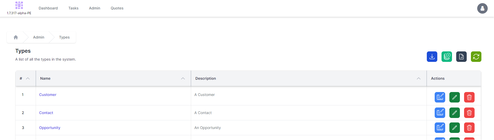
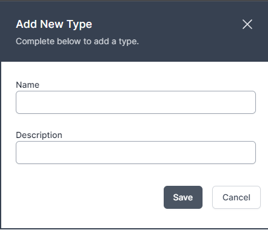
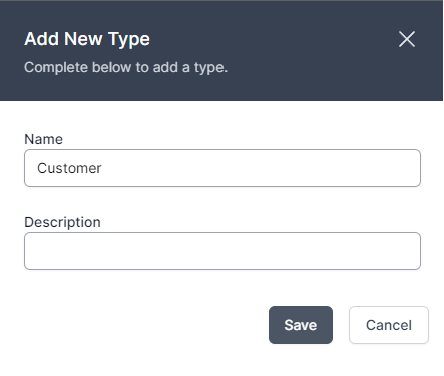
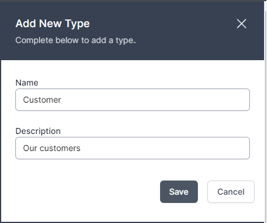

# Creating a Table

__Description:__ 
Creating a type in the world of workflows is simple. Follow the six steps below to create a new type.

### 1. [Go to Dashboard | World of Workflows](https://localhost:7063/)

### 2. Click on 'Manage types'

### 3. Click on  'Add Table'

### 4. Table "Customer"

### 5. Table "Our customers"

### 6. Click on Save
