# Workflows

[](https://youtu.be/ExPy_Ov6JD0)


Welcome to the training module on workflows. In this module, you'll learn about workflows and how to use them to automate business processes. A workflow is a graphical representation of a business process, showing the steps and activities involved in completing a task or achieving a goal. Our system provides a rich set of activities that you can use to design and automate your workflows. You'll learn how to create and manage workflows, and how to use the system's tools and features to make your business processes more efficient and effective. By the end of this module, you'll be able to use our workflow system to its full potential and help your business thrive. Let's get started.

## What is a workflow?
A workflow is a set of instructions that you would like World of Workflows to Perform. These instructions are comprised of **activities**. You connect activities together to describe the **flow** of your workflow.

## How do you start a workflow?
You start a workflow by creating a **trigger**. A trigger is an event that causes a workflow to start. For example, you can create a trigger that starts a workflow when a new email arrives in your inbox. You can also create a trigger that starts a workflow when a file is added to a folder on your computer. You can even create a trigger that starts a workflow when a button is clicked in a web page.

## What are activities?
Activities are the building blocks of a workflow. They are the instructions that you would like World of Workflows to perform. For example, you can create an activity that sends an email, or an activity that creates a new file. You can also create an activity that opens a web page, or an activity that runs a program on your computer.

To create a new Workflow:

1. Click **Admin**
2. Click **Workflows**
   
3. You will then be in the Workflow Dashboard, and can see workflow definitions (or templates), workflows that are running or have run (instances) and also see system workflows in the Workflow Registry.

For this section we'll work with Workflow Definitions.

To create a workflow, click the **Create Workflow** button.

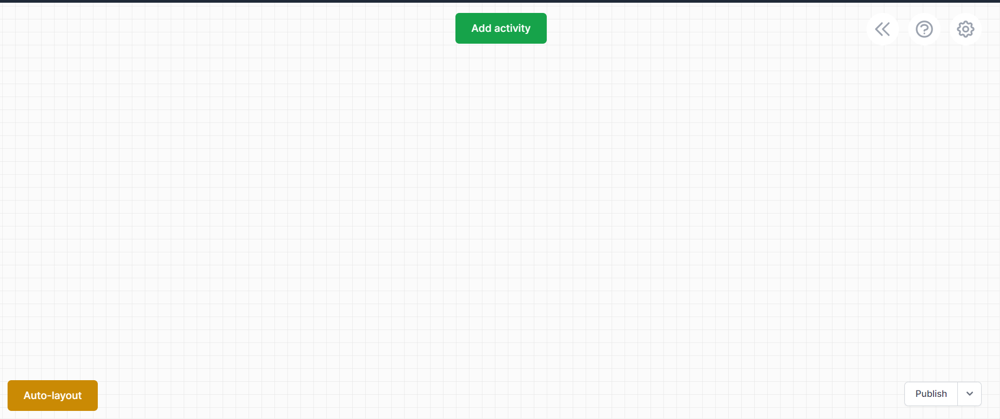

The **Workflow Designer** appears. It has the following options:

1. **Auto Layout** on the bottom left, lays out the workflow in a nice way automatically.
2. The **Publish** drop down on the bottom right, allows you to publish the workflow definition and also allows you to **Import** and **Export** workflow definitions.
3. The **<<** button on the top right shows information on your workflow definition and its versions.
   
4. The **?** button on the top right shows the **Workflow Designer Help**.
   
5. The **Cog** button on the top right allows you to **name** your workflow, define variables and define other technical information about your workflow.
   

To add an activity to the surface, click the green **Add Activity Button**. The activity picker will appear.

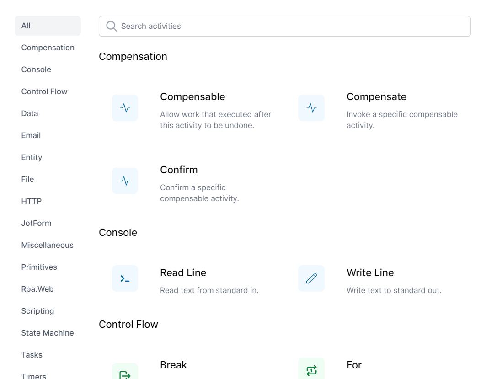

Below are the activities that can be used to start a workflow:

1. **Wait for Created Object** - This activity waits for an instance or object to be created in the [database](database.md).
2. **Wait for Updated Entity** - This activity waits for an instance or object to be updated in the [database](database.md).
3. **Object Instance Trigger** - This activity is used to preset a button when editing an instance in either a view or the database type editor.
4. **Watch Directory** - This activity watches a directory for changes and triggers a workflow when a file is added, deleted or modified.
5. **HTTP Endpoint** - This activity creates an HTTP endpoint that can be used to trigger a workflow when you or another application calls the endpoint.
6. **Cron** - This activity triggers a workflow based on a cron expression. Cron expressions enables you to schedule tasks to run periodically at a specified date/time.
7. **Timer** - This activity triggers every time specified, which can be seconds, minutes, days weeks or any time value.
8. **Start at** - This activity triggers once at a time in the future.
9.  **Signal Received** - This activity triggers once another workflow sends a signal to it.

When building workflows for the first time, one commonly uses the **HTTP Endpoint** or **Object Instance trigger** to get started.

*To learn how to use workflows, we'll mainly use the **Object Instance Trigger***

# Learning to Create Workflows
## Pre-requisites
As we are using the **Object Instance Trigger**, we will need at least on type and instance. 

1. Go to **Admin** -> **Tables**
2. Click **Add Table**
3. Enter the **Name** as ```Customer``` and **Description** as ```Paying customer```.
   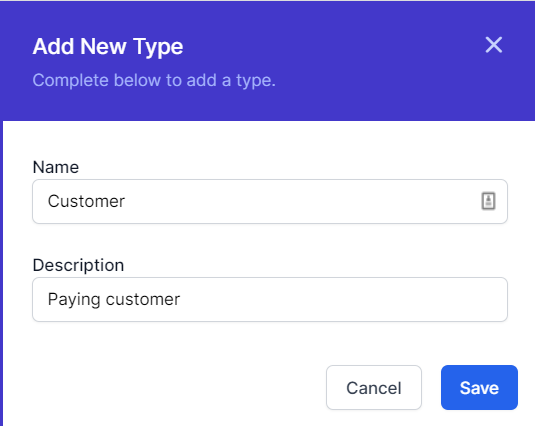
4. Click **Save**
5. Click **Customer** to add an instance and click the **Add Customer** button.
   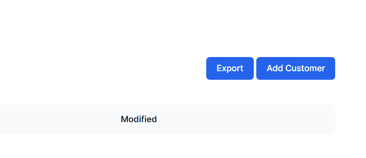
6. Enter the **Name** as ```John Smith``` and click **Save**.
   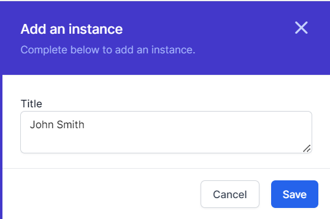

> *If you wished, at this point you could create a **view** which would make navigation quicker.*

## Create a Workflow
1. Go to **Admin** -> **Workflows**
2. Click **Create Workflow**
3. Click **Add Acivity**
4. On the left, click the **Data** category and choose **Object Instance Trigger**
   
5. The **Object Instance Trigger** will appear on the surface.
   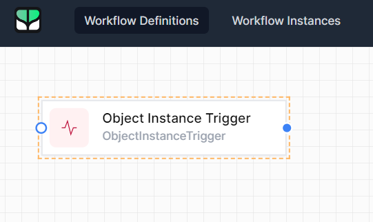
6. Right Click and choose **Edit**
   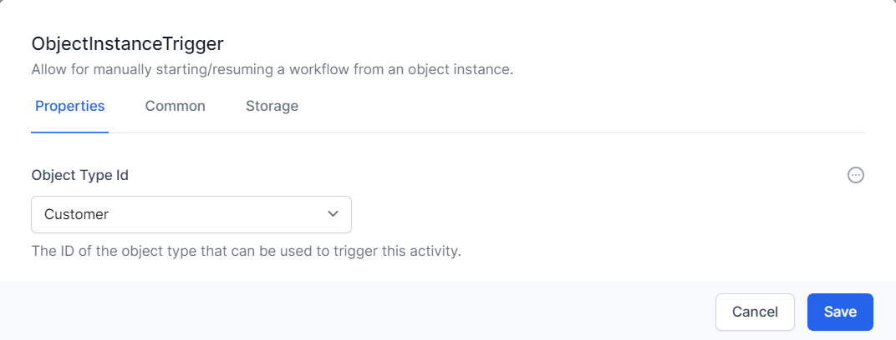
7. Ensure the Object Type UId is Customer and Click **Common**
8. Enter the **Name** as ```OIT``` and **Display Name** as ``Trigger on customer```.
   
9. Click **Save**
10. Click the **Cog** (Top Right). Enter the **Name** as ```CustomerWorkflow``` and the **Display Name** as ```Customer Workflow```.
    
11. Click **Save** then  **Publish**.

## Test the Workflow
1. Go to **Admin** -> **Tables**
2. Click **Customer**
3. Click **John Smith**
4. Click the **Workflows Tab**
   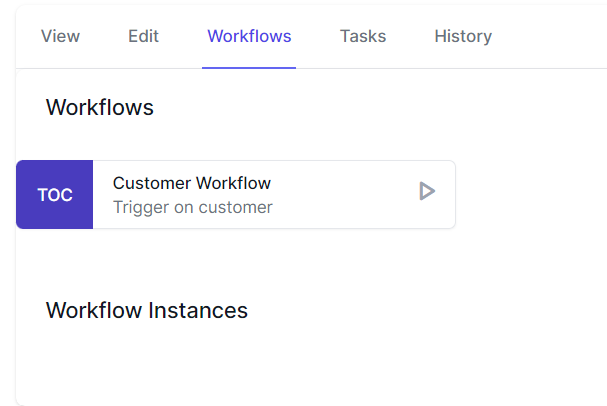
5. Click the **Play** button
6. Navigate to **Admin** -> **Workflows** -> **Workflow Instances**
7. You will see a workflow instance. Click on it
   
8. You will see the activity in gree, showing it ran successfully.
   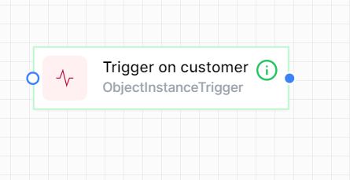
9. Right Click the Activity to see statistics
    
10. Click the **<<** button to see more information:
    1.  **General** shows inofmration on the worfklow instance itself.
    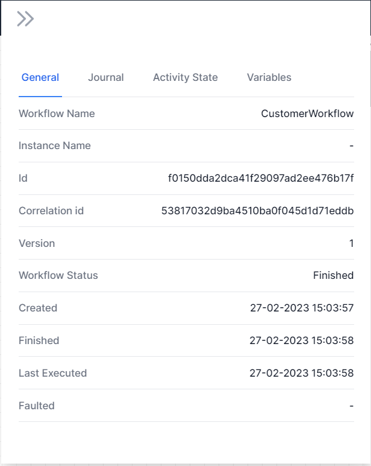
    2. **Jounal** shows step-by-step what happened, how it worked and any errors.
    
    3. **Activity State** shows details on any activity when you click the activity.
    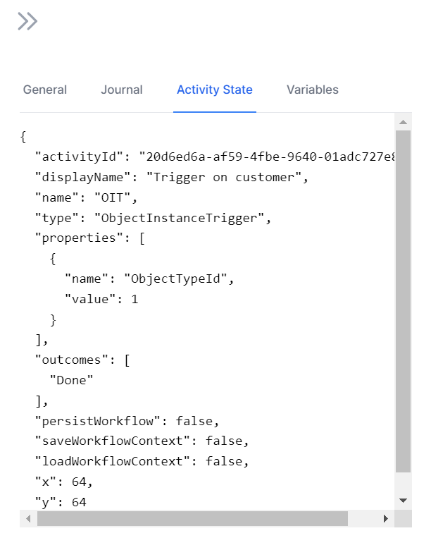
    4. **Variables** shows the variables that were used in the workflow.
    

## Conclusion
Workflows are extremely powerful. Take some time to work through them. We will deliver more advanced modules on workflow development but for now, you can read the activity guide to learn about each activity.

[Activity Guide](../activity-guide.md)