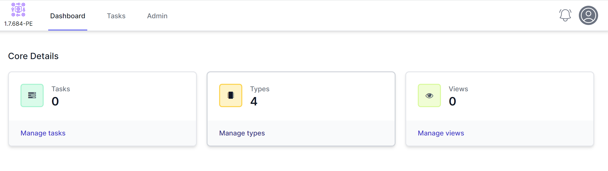
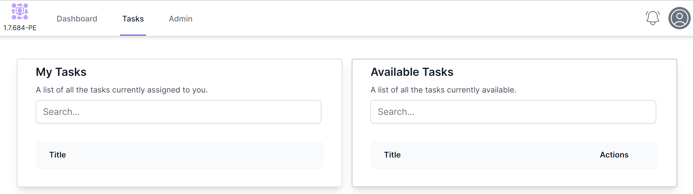
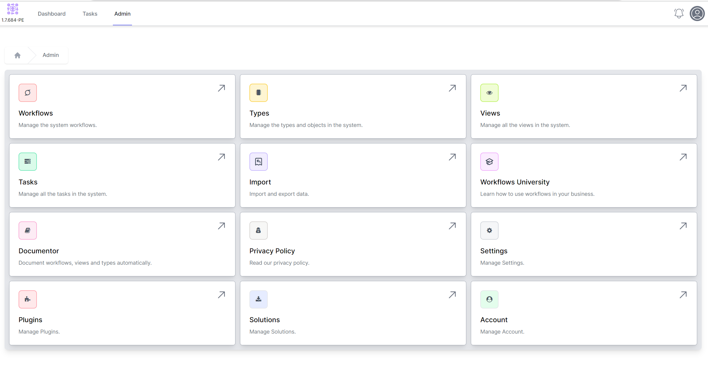

# Navigation

## Home Page

The home page has three **tiles** which show the number of Tasks, Types and Views. You can use these tiles to navigate to these icons.

The top navigation includes the **Dashboard** or home page. **Tasks** takes you to the task page and Admin is the rest of the navigation.

*This will change when you add **views**.*

## Tasks

The tasks page consists of two columns. The **left** hand column shows tasks you have picked and are in your queue. The **right** hand column shows the current available tasks to pick.

## Admin

The admin page allows you to navigate betweeen the various aspects of the system and manipulate data, workflows, tasks and more.

The sections of the Admin page are defined below:

### Workflow9
