# Object Workflows

This guide shows how to create a workflow that can be executed from within the Object Editor Screen.

The process is as follows
1. Create a Type
2. Create an Instance
3. Create a Workflow with the Object Instance Trigger activity
4. Execute and test the workflow

The instructions below show how to do this:

## 1. Create a Type
1. Go To Workflows
2. Login
3. Navigate to Admin -> Types
4. Click **Add Type**
5. Type the Name and Description and click **Save**
   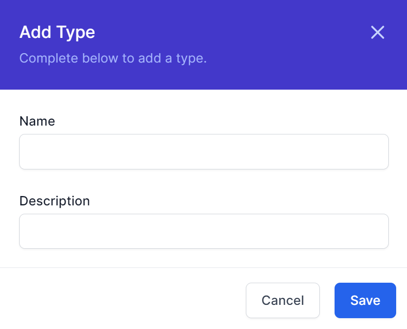
6. The example below shows the new type. Make note of the Title of your Type, in my case ```MyNewType```
   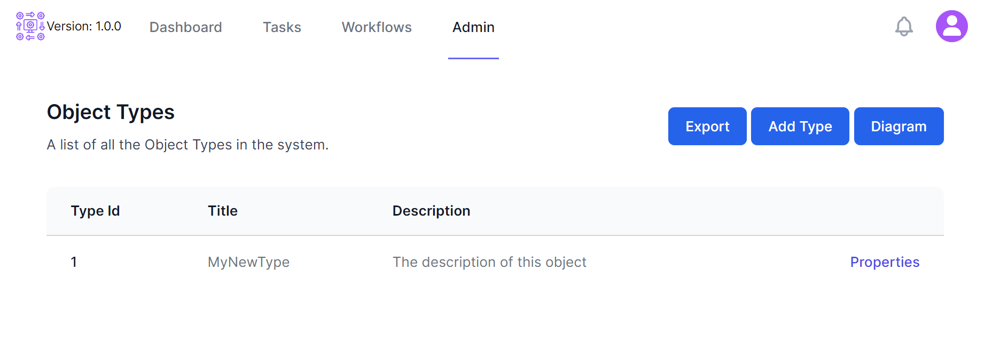

## 2. Create an Instance
1. Click the Title of the Type you created above
2. Click **Add**
3. Enter the attributes of the new instance (in my case, this is just the title) and click **Save**
   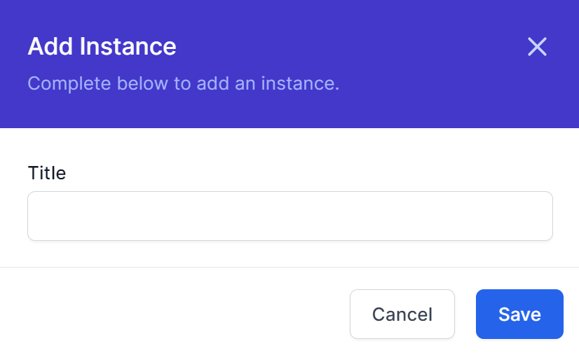
4. The example below shows the new instance.
   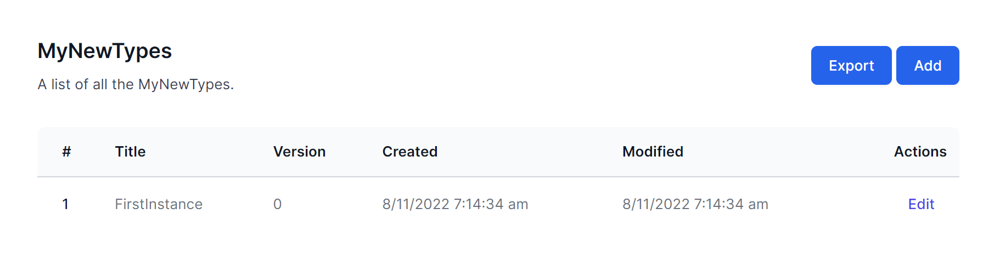

## 3. Create a Workflow with the Object Instance Trigger activity
1. Navigate to Workflows - Workflow Definitions
2. Click **Create Workflow**
3. Click the Cog and enter details as follows:
   1. Enter an appropriate name name for the workflow, such as ```TypeName_Workflowname``` where the type name was chosen in step 1 above, in our case ```MyNewType``` Therefore our name would be ```MyNewType_FirstWorkflow```
   2. DisplayName is what you want to appear in the user interface. In our case I will use ```First Workflow for Testing```
      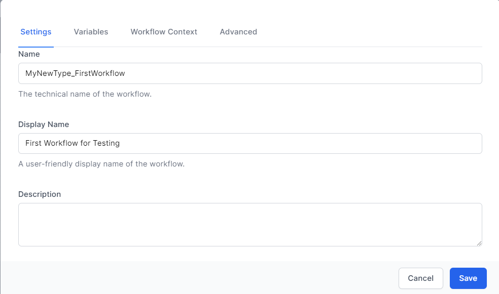
   3. Click **Save**
4. Click **Start** and add the Activity **Object Instance Trigger** from the **Data** Section
   1. In the Object Type Id drop down, select the Type we have just created, in our case ```MyNewType```
      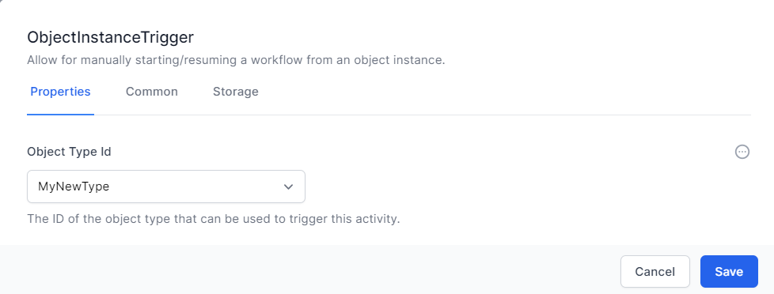
   2. In the Common tab, give the Activity a friendly name, in our case we will give it the same name as the workflow ```First Workflow for Testing```
      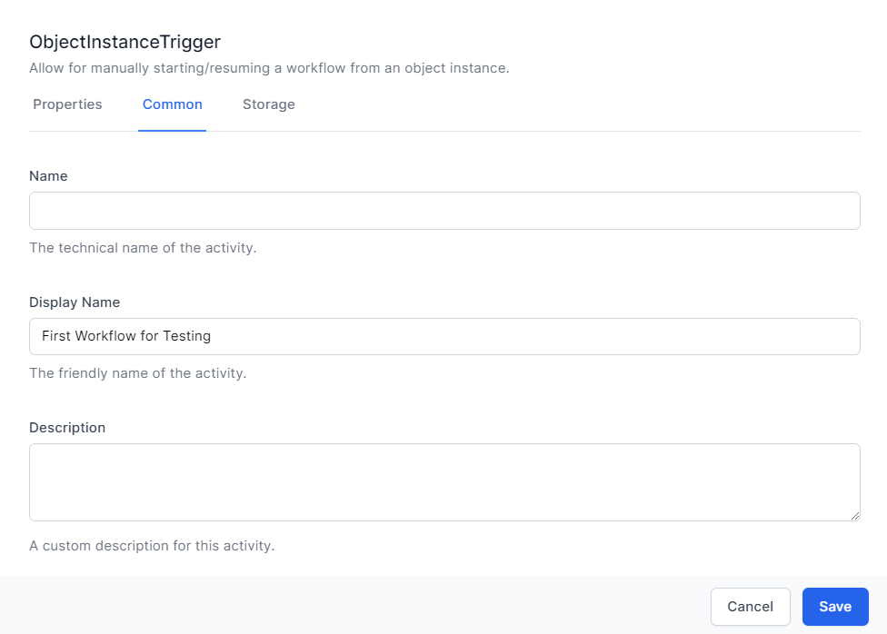
   3. Click **Save**
5. Add a new activity **List Object Instances** from the **Data** Section
   1. Select our object type from the Object Type drop down, in our case ```MyNewType```
   2. Set the Limit to 1
      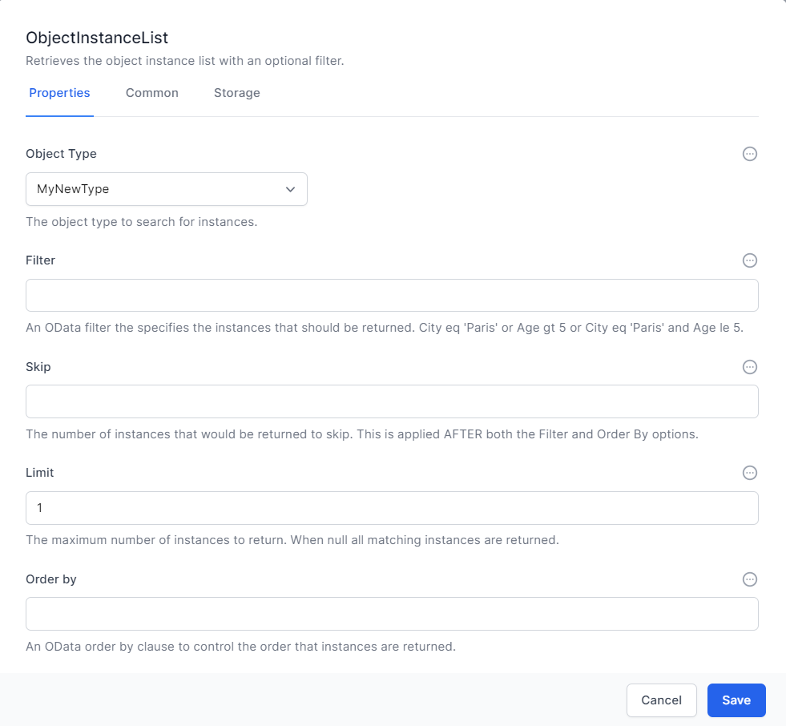
   3. In the Common tab, give the activity a name, in our case ```FirstObject```
      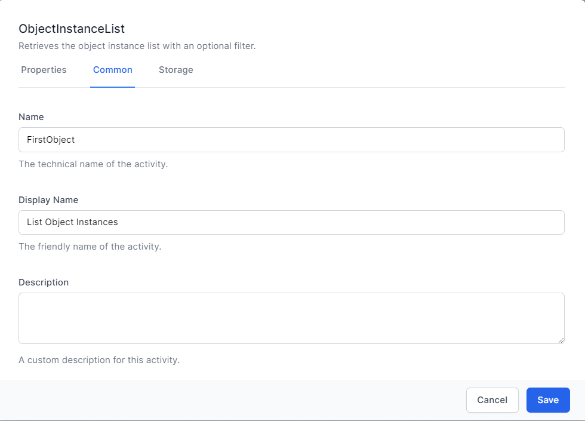
   4. Click **Save**
   5. Add a link it to the **Object Instance Trigger** activity
      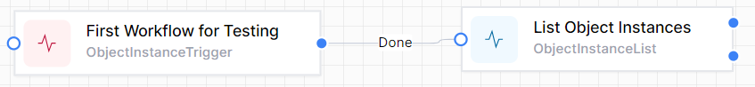
6. Click **Publish**

## 4. Execute and Test Workflow
1. Navigate to Admin -> Data
2. Click the Name of the New Type created in Step 1
3. Click Edit in the FirstInstance
4. Click Workflows, and click the Play icon
   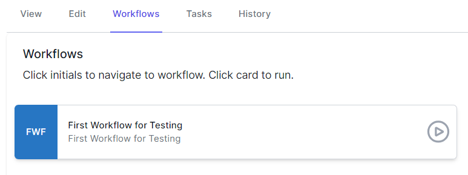
5. Navigate to Admin -> Workflows -> Workflow Instances
6. Choose the top instance
7. Click the **List Object Instances** Activity
   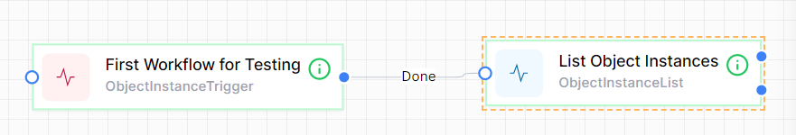
8. Click **Journal** and scroll down to **List Object Instances**
   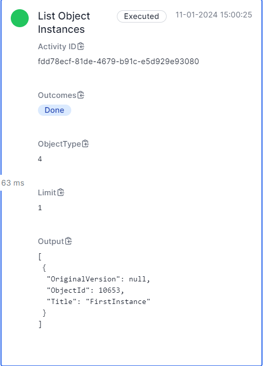
9. Ensure the details reflect the object you chose

> Congratulations, you have created a workflow that can be executed from within the Object Editor Screen.