# AI prospector

> Available for Workflows Versions 1.3.440 and above
> Supports Workflows Business, Enterprise and PE

## Prerequisites
1. Open AI Developer Account - To create a new Open AI Developer Account, see [here](open-ai-account.md)
2. Office 365 Registered Application - To register a new office 365 application for World of Workflows, see [here](register-office365-application.md)

## Installation
### 1. Create Data Types and Date
1. Open World of Workflows
2. Navigate to Admin
3. Click Import
4. Choose the file `Leads.csv` from [here](files/Leads.csv)
   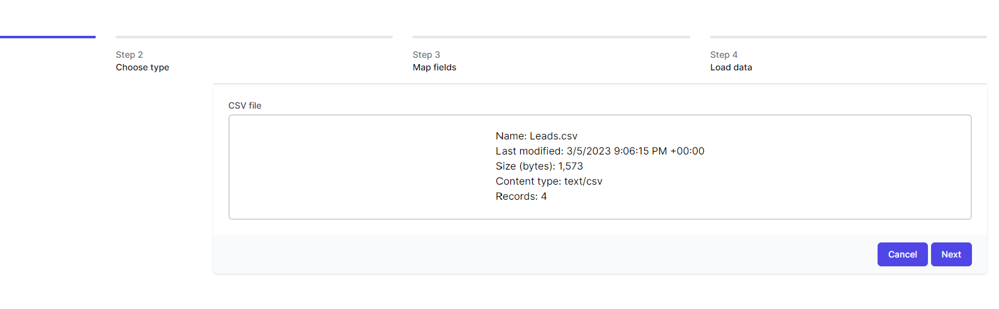
5. Click **Next**
   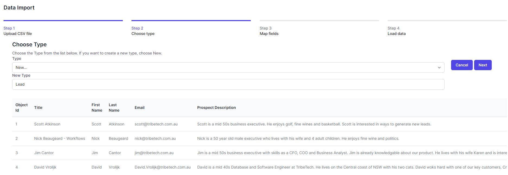
6. Accept the defaults and click **Next**
7. Click New for the following fields (and ensure Title has Is Title checked) 
   1. Title
   2. FirstName
   3. LastName
   4. Email
   5. Prospect Description
   6. Value
   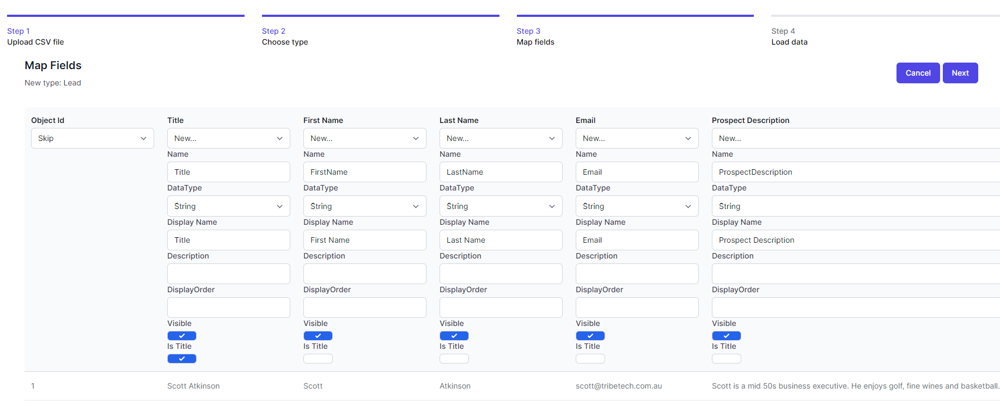
8. Click **Next**
   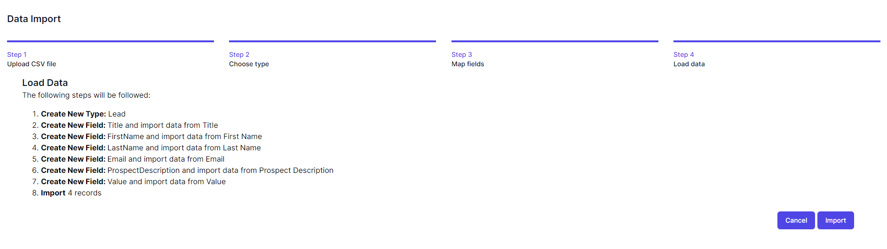
9. Click **Import**

### 2. Create the Workflow
1. Open World of Workflows
2. Navigate to Admin
3. Click **Workflows**
   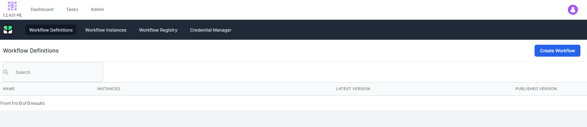
4. Click **Create Workflow**
5. Select the **Publish** drop down (bottom right) and click **Import**
6. Choose the file `AI Prospector.json` from [here](files/ai-prospector-workflow.json)
   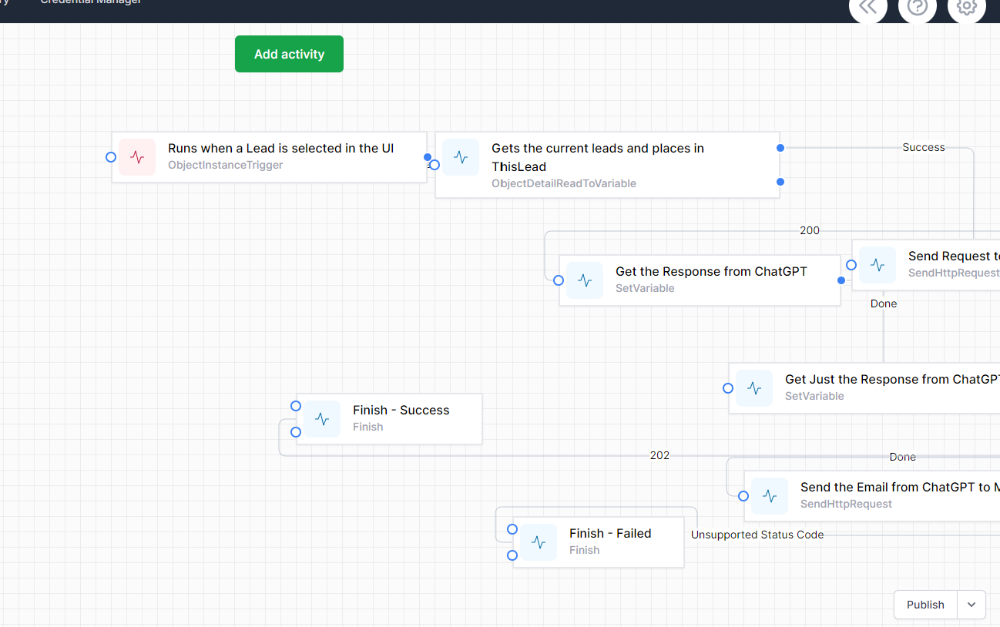
7. Click **Publish**

### 3. Create Credentials
1. Open World of Workflows
2. Navigate to Admin
3. Navigate to Workflows
4. Click Credential Manager

#### Chat GPT Key

1. Click **Add New**
   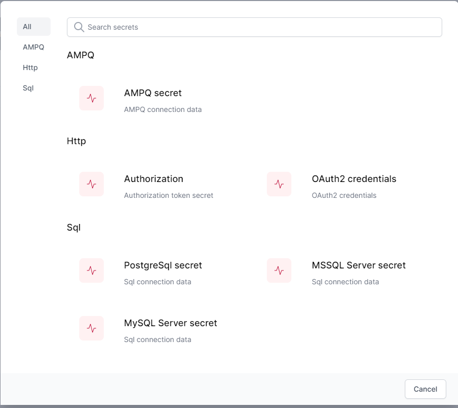
2. Choose **Authorization**
3. Enter the following:
   1. **Name:** GPTIII
   2. **Authorization:** ```Bearer xxx``` where xxx is your Open AI API Key available here: https://platform.openai.com/account/api-keys
   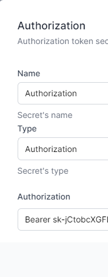
4. Click **Save**

#### Office 365 Credentials
1. Click **Add New**
   
2. Choose **OAuth2 credentials**
3. Enter the following:
   1. **Name:** Office 365
   2. **Type:** OAuth2 credentials
   3. **Grant Type:** Authorization Code
   4. **Authorization URL:** Your authorization URL from [here](register-office365-application.md)
   5. **Access Token URL:** Your access token URL from [here](register-office365-application.md)
   6. **Client ID:** Your client Id from [here](register-office365-application.md)
   7. **Client Secret:** Your client secret from [here](register-office365-application.md)
   8. **Scope** offline_access mail.read mail.send
4. Click **Authorize**
5. Enter your credentials and follow the prompts
6. Click Save

**Connect Workflow to Credentials**
1. Open World of Workflows
2. Navigate to Admin
3. Navigate to Workflows
4. Click **RunGPT3**
5. Find the Activity **Runs when a lead is selected in the UI**
6. Right Click and Choose **Edit**
   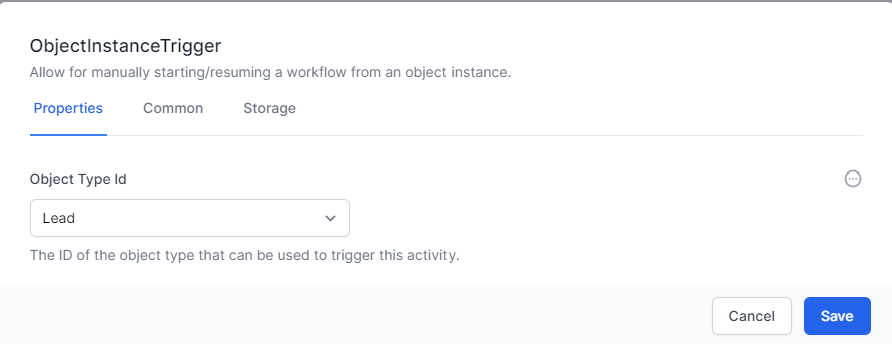
7. Ensure the object Type Id is Lead
8. Click **Save**
9. Find the Activity **Send Request to ChatGPT**
10. Right Click and Choose **Edit**
11. Click the **Advanced** tab
12. Drop down Authorization and change to GPTIII
   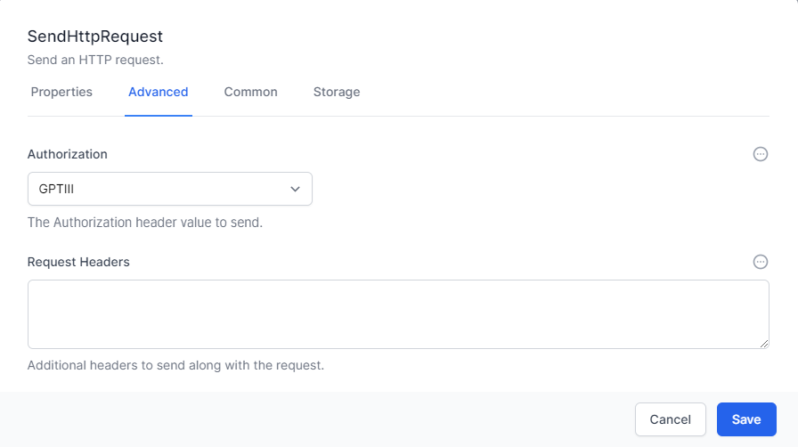
13. Click **Save**
14. Find the activity **Send the Email from ChatGPT...**
15. Right Click and Choose **Edit**.
    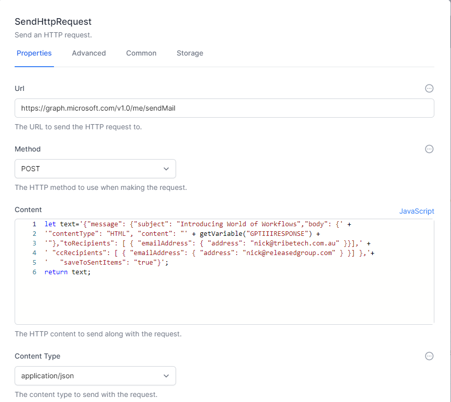
16. Repalce ```nick@tribetech.com.au``` and ```nick@releasedgroup.com``` with your own email address
17. Click the **Advanced Tab**
18. Change **Authorization** to **Office 365** and click **Save**
19. Click **Publish**

# Run a workflow
1. Open World of Workflows
2. Navigate to Admin
3. Navigate to **Types**
4. Click **Lead**
5. Cick Lead 1
6. Navigate to the **Workflows** Tab
7. Find RunGPT3 and click **Play**
8. Check your email for an email from yourself with a message about World of workflows.