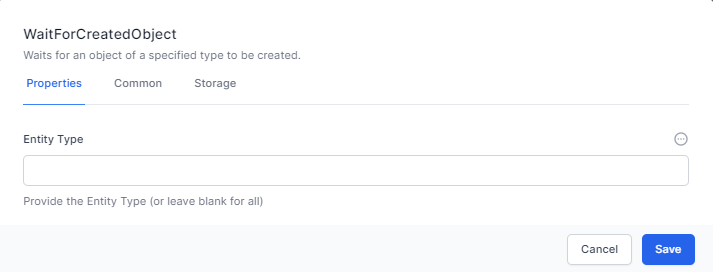
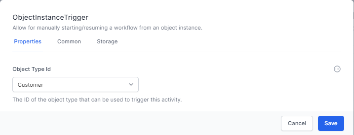
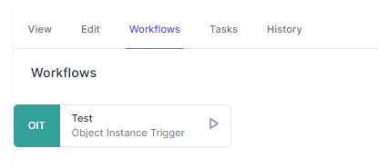
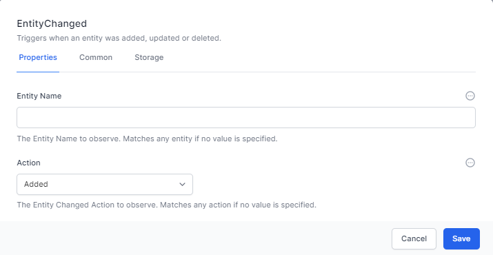
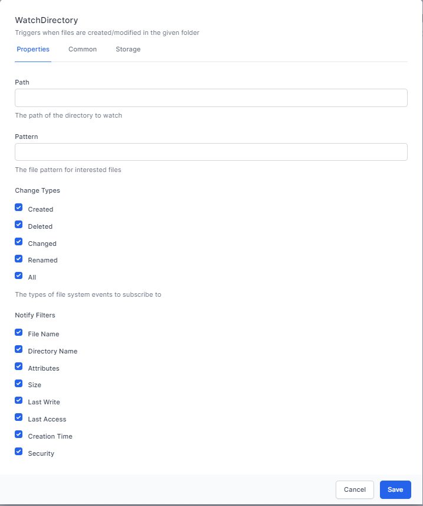

# Starting Workflows

Workflows are started with a trigger activity. The following types of triggers are available:

 - [Wait for Created Object](#wait-for-created-object) - Waits for an object to be created before starting
 - [Wait for Updated Entity](#wait-for-updated-entity) - Waits for an object to be updated
 - [Object Instance Trigger](#object-instance-trigger) - Starts or waits for a user to click the UI to run the workflow.
 - [Entity Changed](#entity-changed) - Runs when an entity is changed
 - [Watch Directory](#watch-directory) - Starts when a file changes in a watched directory
 - [HTTP Endpoint](#http-endpoint) - Creates and monitors a HTTP endpoint allowing the creation of a full API.
 - [Cron](#cron) - Starts every specific time interval
 - [Timer](#timer) - Starts on a timer
 - [Start at](#start-at) - Starts at a specific time
 - [Signal Recieved](#signal-recieved) - Runs when a signal is recieved

These are described below:

## Wait for Created Object

Waits for a specified Entity Type to be created. EntityKey is the output variable when the Entity has been created.

## Wait for Updated Entity

Waits for a specified entity type to be updated. EntityKey is the output variable when the Entity has been updated.

## Object Instance Trigger

Allows you to manually start or resume a workflow from the onbject instance page. For example setting the workflow as above and setting the **Name** and **DisplayName** to **Test** will deliver the following in the UI



## Entity Changed

This runs whenever an entity is added, updated or deleted.

It outputs the entity details to the ```output``` variable.

## Watch Directory

This activity watches a folder on the server system for files changing based on the notify filters. 

The ```Output``` variable is the file itself

## HTTP Endpoint

## Cron

## Timer

## Start at

## Signal Recieved